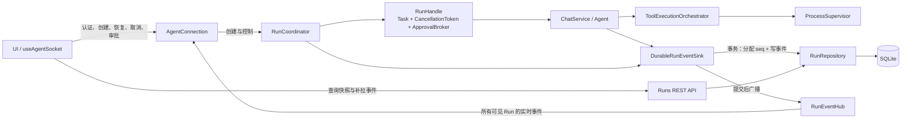
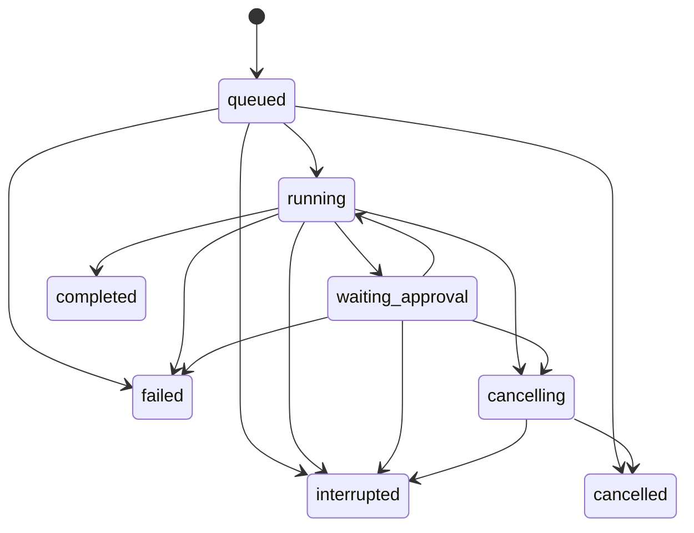
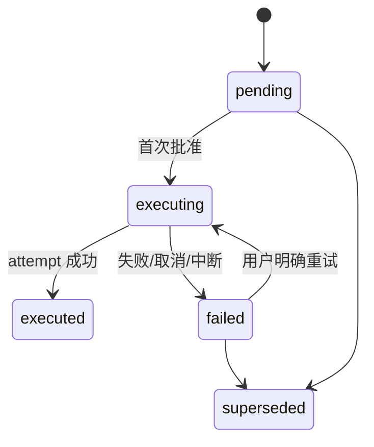

# Agent Run 持久化、断线恢复、Plan 重试与安全迁移设计方案

> - 状态：Implemented
> - 设计日期：2026-07-17
> - 实施完成：2026-07-17
> - 代码基线：`7b48f26`
> - 前置方案：[Agent 执行安全 MVP 设计方案](./agent-execution-safety-mvp-design.md)
> - 关联方案：[Agent Run Trace Sidequest 设计方案](../agent-run-trace-sidequest-design.md)

## 1. 文档目的

第一阶段已经完成 API 隔离、同会话单 Run、审批、取消和进程树清理，但 Run 仍是 WebSocket 连接内的内存对象：

- WebSocket 断开会立即取消当前任务；
- 页面刷新后无法知道旧 Run 的准确状态；
- 已发送但客户端未收到的事件无法重放；
- API 重启后，内存 Run 与审批上下文全部消失；
- Plan 执行失败后仍停在 `approved`，无法合法重试；
- 数据库识别到旧消息结构时仍会删表重建。

本方案把 Run 提升为可持久化、可查询、可恢复订阅的应用级执行实体，并同步补齐 Plan 尝试历史和版本化数据库迁移。

本阶段解决的是“执行过程如何在断线和升级中保持事实完整”，不是跨进程自动续跑或通用工作流引擎。

---

## 2. 当前实现基线

### 2.1 Run 属于 WebSocket 连接

当前相关代码：

- `api/automata_api/services/connection.py`
- `api/automata_api/agent/execution/runs.py`
- `api/automata_api/services/chat.py`

`AgentConnection` 持有单个 `active_run`。`ActiveRunRegistry` 只在内存记录：

- `run_id`
- `session_id`
- `owner_connection_id`
- `CancellationToken`
- `ApprovalBroker`
- 异步任务

因此“同 Session 只允许一个活跃 Run”只在当前 API 进程内成立。

### 2.2 断线等同于取消

连接退出时会调用 `_cancel_active_run("WebSocket disconnected.")`，触发取消令牌、取消任务、清理子进程并释放内存注册。

这能避免孤儿进程，但也会把网络抖动、页面刷新和桌面窗口重载解释成用户主动停止。

### 2.3 前端只重连连接，不恢复 Run

`ui/src/hooks/useAgentSocket.ts` 已有重连退避，但连接关闭时会立即：

- 把流式响应标记为错误；
- 清除活跃 Run；
- 结束流式 UI。

客户端没有 Run 游标、事件去重或缺口恢复协议。

### 2.4 Plan 失败后无法再次执行

当前生命周期是：

```text
pending -> approved -> executed
                 \-> 执行失败后仍为 approved
```

`approve_plan()` 在执行前提交 `approved`，只有成功才调用 `mark_plan_executed()`。失败后再次批准会因状态不再是 `pending` 而被拒绝，也没有 attempt 历史。

### 2.5 数据库升级有破坏性路径

`api/automata_api/db/schema.py` 在识别到旧版 `messages` 表后会调用 `reset_app_tables()`。该路径会删除会话、消息、Plan 等本地数据，没有：

- 迁移版本与校验和；
- 升级前一致性备份；
- 逐迁移事务与回滚；
- 未知结构的失败关闭策略。

---

## 3. 目标与非目标

### 3.1 目标

1. **Run 状态持久化**：异步任务启动前写入数据库，状态变化可查询。
2. **可重放事件流**：事件有单调递增序号，先落库后发送。
3. **后台执行与前端焦点解耦**：切换 Session、页面刷新或 WebSocket 断开都不改变 Run 状态。
4. **跨 Session 并发**：每个 Session 最多一个非终态 Run，不同 Session 的 Run 可以同时执行。
5. **全局实时推送与重放**：所有有权观察的运行中 Run 都向已认证前端推送事件，重连后按各自游标补发。
6. **重启后状态确定**：旧进程非终态 Run 标记为 `interrupted`，不自动续跑。
7. **Plan 显式重试**：每次尝试创建新 Run，独立记录并重新审批。
8. **安全数据库迁移**：版本化、校验、备份、事务执行并保留旧数据。
9. **不削弱第一阶段边界**：认证、审批、显式取消、工具编排、进程监管保持有效。

### 3.2 非目标

- API 崩溃后从模型 token 或工具步骤中间点继续；
- 自动重试任何可能产生副作用的工具；
- 普通聊天 Run 的一键自动重跑；
- 通用 DAG、分布式 Worker 或多机调度；
- 跨设备或云端同步；
- 持久化 API Token、审批票据或 `allow_for_run` 授权；
- 回滚已经发生的文件、Shell 或 MCP 副作用；
- RunTrace 阶段面板、`report_progress`、制品系统；
- 模型设置、MCP/Skills 管理、Markdown 或完整 Run Inspector。

---

## 4. 核心原则

### 4.1 Run 属于应用，不属于连接

WebSocket 可以创建、订阅、恢复、取消 Run 和提交审批，但不能直接拥有 Run 的生命周期。

### 4.2 `activeSession` 只是界面焦点

前端的 `activeSessionId` 只表示当前正在展示哪个会话、下一条用户输入发往哪个会话，不表示：

- 后端当前只能执行这个 Session；
- 其他 Session 的 Run 应暂停；
- 切换 Session 应取消或解除 Run；
- 非当前 Session 的事件可以丢弃。

后端保持“每 Session 一个活跃 Run”，但允许不同 Session 的 Run 并发。前端必须按
`session_id + run_id` 路由事件，不能根据当前 `activeSessionId` 猜测事件归属。

### 4.3 连接恢复不等于执行恢复

- **连接恢复**：API 进程仍存活，Run 继续执行，客户端补齐事件后恢复实时订阅。
- **进程恢复**：API 已重启，只恢复数据库事实，把旧 Run 标记为 `interrupted`。

未经用户确认重新调用工具不是恢复。

### 4.4 数据库保存事实，内存保存执行能力

数据库持久化 Run、事件、Plan attempt、公开错误与消息关联。

内存只持有当前进程有效的：

- `asyncio.Task`
- `CancellationToken`
- `ApprovalBroker`
- 子进程句柄

不得序列化 Future、任务、审批票据或进程句柄。

### 4.5 事件先落库，再广播

```text
生成公开事件
  -> 数据库分配 sequence 并提交
  -> 广播给所有有权观察该 Run 的已认证连接
```

交付语义是 **at-least-once**，前端按 `(run_id, seq)` 去重。

### 4.6 连接数量不参与 Run 终止判定

Run 没有前端观察者时仍照常执行和落库。正常业务流程中，只有以下行为能结束 Run：

- Run 自身完成或确定失败；
- 前端发送明确的 `cancel_run`；
- 后端进程退出，下一次启动将其恢复为 `interrupted`。

Session 切换、取消选中、组件卸载、WebSocket 关闭和重连失败都不是取消信号。

### 4.7 重试创建新历史

失败 Run 不回退到 `running`。Plan 重试必须创建新 attempt 和新 Run，旧记录保持不可变。

---

## 5. 总体架构



### 5.1 `RunCoordinator`

建议新增：

```text
api/automata_api/agent/execution/coordinator.py
```

职责：

- 创建并登记持久化 Run；
- 持有当前进程的 `RunHandle`；
- 将取消和审批响应路由到正确 Run；
- 幂等提交终态；
- 启动时处理遗留非终态 Run。

```python
@dataclass
class RunHandle:
    run_id: str
    session_id: str
    task: asyncio.Task[None]
    cancellation_token: CancellationToken
    approval_broker: ApprovalBroker
```

`RunHandle` 只是当前进程可控制的执行句柄，不是数据库 Run 的替代品。

### 5.2 `AgentConnection`

收缩为：

- 认证后的命令入口；
- `RunEventHub` 中的已认证事件接收端；
- 事件发送队列；
- 恢复握手执行者。

一个 `AgentConnection` 不再持有单个 `active_run`，可以创建和控制不同 Session 的多个并发 Run。
WebSocket 关闭只从 `RunEventHub` 移除连接，不修改任何 Run 状态。

### 5.3 `RunEventHub`

建议新增：

```text
api/automata_api/agent/execution/event_hub.py
```

职责：

- 保存当前已认证 WebSocket 连接；
- 将每个已提交事件广播给所有有权观察该 Run 的连接；
- 不根据前端当前选中的 Session 过滤事件；
- 连接写入失败时移除连接，但不通知 `RunCoordinator` 取消任务；
- 新连接完成认证后发送所有非终态 Run 的快照，随后分别恢复事件游标。

### 5.4 `RunRepository`

建议新增：

```text
api/automata_api/repositories/runs.py
```

主要接口：

```python
create_run(...)
get_run(run_id)
list_session_runs(session_id, ...)
transition_status(run_id, expected, target, ...)
append_event(run_id, event_type, payload)
list_events(run_id, after_sequence, through_sequence, limit)
mark_stale_runs_interrupted(current_instance_id)
begin_plan_execution(...)
complete_plan_execution(...)
fail_plan_execution(...)
```

所有状态更新使用事务和条件更新，不能无条件覆盖并发结果。

### 5.5 `DurableRunEventSink`

建议新增：

```text
api/automata_api/agent/execution/events.py
```

职责：

- 把内部事件转换为公开 DTO；
- 脱敏并限制大小；
- 合并高频 token；
- 分配序号并写库；
- 提交成功后广播；
- 保证重放和实时发送使用同一 JSON。

---

## 6. Run 状态模型

### 6.1 Run 类型

| `kind` | 含义 |
|---|---|
| `chat_act` | Act 模式的一次对话与执行 |
| `chat_plan` | Plan 模式下生成 Plan |
| `plan_execution` | 首次批准或重试一个已保存 Plan |

`mode` 继续保留 `act` / `plan`；`kind` 描述 Run 的实际用途。

### 6.2 状态

| 状态 | 终态 | 含义 |
|---|---:|---|
| `queued` | 否 | 已落库，执行任务尚未启动 |
| `running` | 否 | 模型、工具或上下文处理进行中 |
| `waiting_approval` | 否 | 等待当前进程内的用户审批 |
| `cancelling` | 否 | 已请求取消，等待任务和子进程退出 |
| `completed` | 是 | 最终结果已提交 |
| `failed` | 是 | 确定失败 |
| `cancelled` | 是 | 收到明确取消指令后完成清理 |
| `interrupted` | 是 | 进程退出导致执行上下文丢失 |

“当前是否有前端连接”和“当前前端正在展示哪个 Session”都不是 Run 状态，也不持久化为 Run
生命周期字段。



约束：

- 终态不可重新进入非终态；
- `completed` 与最终消息或 Plan 完成状态同事务提交；
- `waiting_approval` 只表示当前进程存在未决审批；
- 启动恢复只能把旧实例非终态 Run 转为 `interrupted`；
- 重试必须创建新 Run。

---

## 7. 数据库设计

### 7.1 `agent_runs`

```sql
CREATE TABLE agent_runs (
    id TEXT PRIMARY KEY,
    session_id TEXT NOT NULL,
    kind TEXT NOT NULL CHECK (
        kind IN ('chat_act', 'chat_plan', 'plan_execution')
    ),
    mode TEXT NOT NULL CHECK (mode IN ('act', 'plan')),
    status TEXT NOT NULL CHECK (
        status IN (
            'queued', 'running', 'waiting_approval', 'cancelling',
            'completed', 'failed', 'cancelled', 'interrupted'
        )
    ),
    request_message_id TEXT,
    response_message_id TEXT,
    plan_id TEXT,
    owner_instance_id TEXT NOT NULL,
    last_sequence INTEGER NOT NULL DEFAULT 0,
    error_code TEXT,
    public_error TEXT,
    created_at TEXT NOT NULL,
    started_at TEXT,
    finished_at TEXT,
    heartbeat_at TEXT,
    FOREIGN KEY (session_id) REFERENCES sessions(id) ON DELETE CASCADE,
    FOREIGN KEY (request_message_id) REFERENCES messages(id) ON DELETE SET NULL,
    FOREIGN KEY (response_message_id) REFERENCES messages(id) ON DELETE SET NULL,
    FOREIGN KEY (plan_id) REFERENCES session_plans(id) ON DELETE SET NULL
);
```

### 7.2 数据库级单 Run 约束

```sql
CREATE UNIQUE INDEX ux_agent_runs_one_active_per_session
ON agent_runs(session_id)
WHERE status IN ('queued', 'running', 'waiting_approval', 'cancelling');
```

内存检查用于快速返回，部分唯一索引是最终约束。冲突映射为：

```json
{
  "type": "error",
  "code": "session_busy",
  "session_id": "...",
  "run_id": "当前活跃 Run ID"
}
```

### 7.3 `agent_run_events`

```sql
CREATE TABLE agent_run_events (
    run_id TEXT NOT NULL,
    sequence INTEGER NOT NULL,
    category TEXT NOT NULL DEFAULT 'runtime'
        CHECK (category IN ('runtime', 'trace')),
    event_type TEXT NOT NULL,
    payload_json TEXT NOT NULL,
    payload_bytes INTEGER NOT NULL,
    created_at TEXT NOT NULL,
    PRIMARY KEY (run_id, sequence),
    FOREIGN KEY (run_id) REFERENCES agent_runs(id) ON DELETE CASCADE
);

CREATE INDEX ix_agent_run_events_created_at
ON agent_run_events(created_at);
```

`category='trace'` 为后续 RunTrace 预留，避免再创建重复的 Run 表。

### 7.4 序号分配

事件序号在同一事务中分配：

```sql
BEGIN IMMEDIATE;

UPDATE agent_runs
SET last_sequence = last_sequence + 1,
    heartbeat_at = :now
WHERE id = :run_id
RETURNING last_sequence;

INSERT INTO agent_run_events (..., sequence, ...)
VALUES (..., :returned_sequence, ...);

COMMIT;
```

若当前 SQLite 适配层不使用 `RETURNING`，则在同一事务内用 `last_sequence=:previous` 条件更新。受影响行数不是 1 时重新分配，不复用已提交序号。

### 7.5 `plan_execution_attempts`

```sql
CREATE TABLE plan_execution_attempts (
    id TEXT PRIMARY KEY,
    plan_id TEXT NOT NULL,
    run_id TEXT NOT NULL UNIQUE,
    attempt_no INTEGER NOT NULL,
    request_id TEXT NOT NULL,
    created_at TEXT NOT NULL,
    FOREIGN KEY (plan_id) REFERENCES session_plans(id) ON DELETE CASCADE,
    FOREIGN KEY (run_id) REFERENCES agent_runs(id) ON DELETE CASCADE,
    UNIQUE (plan_id, attempt_no),
    UNIQUE (plan_id, request_id)
);
```

attempt 结果直接读取关联 `agent_runs.status`，不维护第二份易漂移状态。`request_id` 是客户端生成的幂等键。

### 7.6 Plan 状态

`session_plans.status` 调整为：

```text
pending
executing
failed
executed
superseded
```

不再把 `approved` 作为稳定状态：

- 首次批准与创建 attempt 在同一事务完成；
- Plan 从 `pending` 直接进入 `executing`；
- `approved_at` 继续记录首次批准时间；
- 旧 `approved` 迁移为 `failed`，公开原因是 `legacy_approved_without_attempt`；
- 其他旧状态原样保留。

失败详情读取最新 attempt 的 Run，不在 Plan 表复制错误字段。迁移得到、尚无 attempt 的旧 `failed`
Plan 由 API 返回固定的 `legacy_approved_without_attempt` 兜底原因；用户重试后即由新 attempt 的 Run 接管错误展示。

---

## 8. 事件协议

### 8.1 兼容现有事件

不增加强制 `run_event.data` 外壳。现有 Run 事件统一增加：

```json
{
  "type": "token",
  "session_id": "session-uuid",
  "run_id": "run-uuid",
  "seq": 42,
  "schema_version": 1,
  "content": "..."
}
```

实时和重放使用完全相同的结构。所有 Run 事件必须携带 `session_id + run_id + seq`；
前端不得用 `activeSessionIdRef` 或其他当前界面状态补猜 Session。

### 8.2 持久化范围

需要持久化：

- `started`
- `agent_step`
- `context_compressed`
- `tool_call`
- `tool_result`
- `tool_approval_required`
- `tool_approval_resolved`
- `token`
- `plan_ready`
- `plan_approved`
- `plan_execution_started`
- `run_cancelling`
- `run_cancelled`
- `done`
- `error`
- `run_interrupted`

连接认证、ping/pong、`run_resume_started`、`run_resume_complete` 和非 Run 参数错误不进入 Run 序列。

### 8.3 Token 合并

逐 token 写 SQLite 会放大写入量。满足任一条件时刷新 token 块：

- 达到 `AUTOMATA_RUN_EVENT_TOKEN_CHUNK_CHARS`，默认 4096；
- 距上次刷新达到 100ms；
- 即将发送非 token 事件；
- Run 即将进入终态。

客户端不依赖模型原始 token 边界。

### 8.4 工具结果

大型工具结果不整份复制到事件表：

- 先按现有机制保存工具消息；
- 事件保存公开摘要、状态、工具名和 `message_id`；
- 小型安全摘要可内联；
- 完整 UI 数据仍以工具消息为权威。

### 8.5 脱敏

事件禁止包含：

- API Token、Authorization Header、MCP 认证 Header；
- 环境变量全集；
- 审批票据；
- 未脱敏命令环境；
- 超出当前 UI 可见范围的内部工具参数；
- 模型供应商隐藏推理。

实时与持久化必须使用同一个公开 DTO，不能向 UI 发送原始对象后再单独脱敏存储。

---

## 9. 断线恢复协议

### 9.1 REST

```http
GET /runs?status=non_terminal
GET /runs?limit=500
GET /sessions/{session_id}/runs
GET /sessions/{session_id}/runs/{run_id}
GET /sessions/{session_id}/runs/{run_id}/events?after_sequence=42&limit=500
```

接口复用现有认证，并验证 Run 属于路径中的 Session。全局列表用于前端启动和重连时发现所有后台
Run；不带状态过滤的最近 Run 列表用于发现断线期间已经进入终态、因而不再出现在非终态列表中的
Run；Session 列表用于会话详情。列表按 `created_at DESC`，事件按 `sequence ASC`。

### 9.2 已认证连接接管实时观察

WebSocket 认证成功后，服务端先把该连接放入 catch-up 模式，并发送当前所有非终态 Run：

```json
{
  "type": "active_runs",
  "runs": [
    {
      "session_id": "session-a",
      "run_id": "run-a",
      "status": "running",
      "last_sequence": 57
    },
    {
      "session_id": "session-b",
      "run_id": "run-b",
      "status": "waiting_approval",
      "last_sequence": 12
    }
  ]
}
```

对快照中已有的 Run，`RunEventHub` 暂存认证后产生的新事件，直到该 Run 完成恢复握手；对认证后
新建的 Run，则从 `started` 事件起直接实时推送。不要求 Session 处于前端 active 状态。

客户端还必须恢复“断线前自己认为非终态”的 Run，即使它不在 `active_runs` 中；这类 Run 可能已在
断线期间完成。冷启动没有本地游标时，通过最近 Run 列表、Session 摘要和消息接口恢复终态事实。

如果客户端未在协议规定时间内恢复快照中的 Run，服务端可以关闭这条异常连接或丢弃连接级缓冲，
但不得取消任何后台 Run；全部事件仍可从数据库重新获取。

### 9.3 WebSocket 单 Run 恢复

客户端针对每个 Run 携带自己的游标请求恢复：

```json
{
  "type": "resume_run",
  "session_id": "session-uuid",
  "run_id": "run-uuid",
  "after_sequence": 42
}
```

服务端先返回：

```json
{
  "type": "run_resume_started",
  "session_id": "session-uuid",
  "run_id": "run-uuid",
  "after_sequence": 42,
  "through_sequence": 57
}
```

然后发送 `43..57`，最后：

```json
{
  "type": "run_resume_complete",
  "session_id": "session-uuid",
  "run_id": "run-uuid",
  "status": "running",
  "last_sequence": 57
}
```

如果同时存在多个活跃 Run，客户端分别发送恢复请求；服务端可以并行查询，但每个 Run 内严格有序。

### 9.4 无竞态地切换到实时

恢复期间 Run 可能继续产生事件：

1. 在 Run 级锁内为当前连接建立恢复屏障；
2. 读取 `watermark = last_sequence`；
3. 暂存该连接收到的 `seq > watermark` 新事件；
4. 从数据库发送 `(after_sequence, watermark]`；
5. 顺序发送恢复缓冲；
6. 发送 `run_resume_complete`；
7. 切换为实时投递。

不能先查库再订阅，否则两者之间产生的事件会丢失。

### 9.5 前端游标

```ts
type RunCursor = {
  runId: string;
  sessionId: string;
  lastSequence: number;
  status: RunStatus;
};
```

规则：

- `seq <= lastSequence`：重复，忽略；
- `seq === lastSequence + 1`：正常应用；
- `seq > lastSequence + 1`：暂停实时应用并补拉缺口；
- `session_id + run_id` 与已知 Run 不一致：拒绝事件并记录协议错误；
- 事件属于非 active Session：写入该 Session 的状态仓库并更新后台运行提示，不丢弃；
- 收到终态后更新游标，再清理流式状态。

`sessionStorage` 只作为刷新优化，数据库和 REST 是事实来源。游标按 Run 保存；没有游标时从 0
重放。切换 Session 不删除游标。

### 9.6 游标失效

以下返回 `event_cursor_invalid`：

- `after_sequence < 0`
- `after_sequence > last_sequence`
- Run 不属于 Session；
- 终态 Run 的细粒度事件已按保留策略删除。

已终态且历史已清理时，UI 回退为重新加载消息与 Run 摘要。非终态 Run 不允许清理事件。

---

## 10. 前端焦点、连接与后台执行

### 10.1 生命周期解耦

正常业务控制中，前端状态变化不能隐式控制后台 Run：

| 前端或系统事件 | 对后台 Run 的影响 |
|---|---|
| 从 Session A 切换到 Session B | 无；A 的 Run 继续，B 可启动自己的 Run |
| 创建或打开新 Session | 无 |
| 重命名正在运行的 Session | 无；Run 继续使用同一 Session ID |
| 删除仍有非终态 Run 的 Session | 拒绝并返回 `session_busy`，不得隐式取消后级联删除 |
| 当前对话组件卸载 | 无 |
| WebSocket 暂时断开 | 无；事件继续持久化 |
| 页面刷新 | 无 |
| WebSocket 重连 | 恢复所有非终态 Run 的事件，不重启任务 |
| 前端发送 `cancel_run` | 目标 Run 进入 `cancelling` |
| Run 正常完成或确定失败 | 进入对应终态 |
| API 进程退出 | 下次启动把未完成 Run 标记为 `interrupted` |

不设置“无前端连接自动取消”的 TTL。Run 可以在没有任何前端连接的情况下执行到终态。

### 10.2 全局实时推送

当至少有一个已认证前端连接时，`RunEventHub` 将所有可见运行中 Run 的事件实时推送给该连接，
不以 `activeSessionId` 为过滤条件。

前端收到非当前 Session 的事件时：

- 按 `session_id + run_id` 更新对应 Session 的后台状态；
- 保存流式草稿、工具卡、审批卡和游标；
- 在 Session 列表显示运行中、等待审批、完成或失败提示；
- 不把事件追加到当前正在展示的其他 Session；
- 用户切回该 Session 时直接展示已累计状态。

没有前端连接时，事件仍然先写入数据库。新连接认证后通过 `active_runs` 和恢复协议补齐。

### 10.3 跨 Session 并发

保留数据库级“每个 Session 最多一个非终态 Run”，但不设置进程级或连接级“全局只有一个 Run”。

因此：

```text
Session A / Run A: running
Session B / Run B: waiting_approval
Session C / Run C: running
```

可以同时存在。当前 `AgentConnection.active_run` 和前端全局 `isStreaming` 都必须被替换，不能因为
Session A 正在执行就禁止用户在 Session B 发起任务。

### 10.4 审批

后台 Run 到达审批点时进入 `waiting_approval`：

- 有前端连接时，审批事件全局推送，即使该 Session 当前未选中；
- 无前端连接时，审批请求正常持久化并等待；
- 重连后通过事件重放恢复审批卡；
- 前端可提示用户切换到对应 Session，或通过全局审批入口处理；
- 审批仍校验 `session_id + run_id + approval_id`；
- 断线绝不能自动允许、拒绝或取消审批。

如果保留独立的审批超时，它属于审批安全策略，必须以明确的 `approval_timeout` 结束等待，不能复用
“连接断开”作为超时起点。

### 10.5 显式取消

显式取消：

```json
{
  "type": "cancel_run",
  "session_id": "...",
  "run_id": "..."
}
```

服务端必须：

1. 验证认证与 Session 归属；
2. 条件更新为 `cancelling`；
3. 写 `run_cancelling` 事件；
4. 触发既有 `CancellationToken`；
5. 通过 `ProcessSupervisor` 清理进程树；
6. 原子提交 `cancelled` 与终态事件。

取消只影响请求中的目标 Run。取消 Session A 的 Run 不得取消 Session B 的 Run，也不能关闭全局
WebSocket。

### 10.6 桌面窗口与后端进程边界

上述“断线不取消”以 API 后端进程仍存活为前提。Session 切换、路由变化、页面刷新和 WebSocket
断开都只是前端行为。

当前桌面应用如果在完整退出时主动终止 sidecar，则未完成 Run 会因后端进程退出而在下次启动时成为
`interrupted`。如果产品未来要求“关闭窗口后仍在后台运行”，必须把关闭窗口定义为隐藏到托盘，并让
受监管的后端进程继续存活；不能通过遗留无监管孤儿进程实现。

---

## 11. API 重启恢复

### 11.1 实例身份

API 每次启动生成新的 `instance_id`。Run 创建时写 `owner_instance_id`。

迁移完成后、接受连接前：

```text
把 owner_instance_id != current_instance_id
且状态为 queued/running/waiting_approval/cancelling 的 Run
标记为 interrupted
```

同时追加：

```json
{
  "type": "run_interrupted",
  "code": "api_process_restarted",
  "message": "The previous API process ended before this run completed."
}
```

### 11.2 不自动续跑的原因

进程重启后无法可靠判断：

- 模型响应是否已完成但未落库；
- Shell 是否已经产生外部副作用；
- MCP 请求是否被远端接收；
- 文件写入完成到哪一步；
- 审批是否仍对应同一执行上下文。

自动重放最后一步可能重复副作用，因此 MVP 只恢复事实。

### 11.3 Heartbeat

`heartbeat_at` 用于诊断和未来接管设计，在状态变化、写事件和长时间等待审批时低频更新。

MVP 不按短暂 heartbeat 延迟抢占 Run；只有新 `instance_id` 启动恢复时才中断旧实例 Run。

---

## 12. Plan 执行与重试



### 12.1 首次执行事务

1. 验证 Plan 为 `pending`；
2. 验证 Session 无其他非终态 Run；
3. 写 `approved_at`；
4. 创建 `kind='plan_execution'`、`status='queued'` 的 Run；
5. 创建 `attempt_no=1`；
6. Plan 更新为 `executing`；
7. 提交；
8. 提交成功后启动异步任务。

任务启动失败时，Run 和 Plan 均进入失败状态。

### 12.2 失败映射

Plan execution Run 的 `failed`、`cancelled`、`interrupted` 都把 Plan 聚合状态更新为 `failed`。旧 attempt 与旧 Run 不修改。

### 12.3 重试请求

```json
{
  "type": "retry_plan",
  "session_id": "session-uuid",
  "plan_id": "plan-uuid",
  "request_id": "client-generated-uuid",
  "confirm_possible_duplicate_side_effects": true
}
```

事务：

1. 验证 Plan 为 `failed`；
2. 验证副作用确认；
3. 按 `(plan_id, request_id)` 查幂等记录；
4. 已存在则返回原 attempt 与 Run；
5. 验证 Session 无活跃 Run；
6. 创建 `attempt_no=max+1` 和新 Run；
7. Plan 更新为 `executing`；
8. 提交后启动执行。

### 12.4 每次尝试重新审批

重试不得继承：

- 上一个 Run 的 `allow_once`；
- 上一个 Run 的 `allow_for_run`；
- 旧进程未决审批；
- 任何内存审批结果。

新 Run 创建新的 `ApprovalBroker`，所有工具重新经过风险分类和审批。

### 12.5 外部结果未知

远程 MCP 调用断开时可能无法判断是否已执行，使用：

```text
error_code = mcp_call_outcome_unknown
```

UI 必须提示再次执行可能产生重复副作用，并要求明确确认。本阶段不自动生成远端幂等键，不自动重试。

### 12.6 Plan 内容不可变

重试执行同一份已保存 Plan。需要修改步骤时生成新 Plan，旧 Plan 进入 `superseded`，不得静默修改后继续沿用旧 attempt 历史。

---

## 13. 事务与崩溃一致性

### 13.1 Run 创建

1. 保存用户消息；
2. 创建 `queued` Run 并关联 `request_message_id`；
3. 写第一个 `started` 事件；
4. 提交；
5. 启动任务。

1-3 任一步失败都不启动任务。

### 13.2 Act 成功

同一事务：

- 保存最终 Agent 消息；
- 写 `response_message_id`；
- Run 转为 `completed`；
- 写 `done`。

终态提交必须幂等，重复调用不能创建第二条最终消息。

### 13.3 Plan 生成成功

同一事务：

- 保存最终 Agent 消息；
- 创建 `session_plan(status='pending')`；
- 关联 Run 的消息和 Plan；
- Run 转为 `completed`；
- 写 `plan_ready` 与 `done`。

### 13.4 Plan 执行成功

同一事务：

- 保存最终 Agent 消息；
- Run 转为 `completed`；
- Plan 转为 `executed`；
- 写终态事件。

### 13.5 失败和取消

不伪造成功 Agent 消息，只提交：

- Run 终态；
- `error_code` 与脱敏 `public_error`；
- 终态事件；
- 如为 Plan execution，将 Plan 更新为 `failed`。

工具消息可增量提交；若 Run 随后失败，已发生的工具历史仍保留。

---

## 14. 安全数据库迁移

### 14.1 迁移记录

移除“识别旧结构就删除应用表”的路径，新增：

```sql
CREATE TABLE schema_migrations (
    version INTEGER PRIMARY KEY,
    name TEXT NOT NULL,
    checksum TEXT NOT NULL,
    applied_at TEXT NOT NULL
);
```

建议目录：

```text
api/automata_api/db/migrations/
  0001_adopt_or_upgrade_baseline.py
  0002_add_durable_runs.py
  0003_add_plan_attempts.py
```

### 14.2 v1：采用或升级基础结构

处理三种输入：

1. **空库**：创建当前 sessions/messages/context/summaries/plans 表并登记 v1。
2. **当前未版本化库**：结构指纹完全匹配时只登记 v1，不重写数据。
3. **已知旧版库**：新建目标表、逐列复制、校验后原子换表。

旧消息转换：

- 保留原 ID、Session、role、内容、时间和顺序；
- 缺失 `kind` 时填 `message`；
- 缺失 `metadata_json` 时填 `NULL`；
- Session 缺失 `working_directory`、`backend` 时使用明确迁移缺省值。

未知结构不得猜测或重置，必须备份后终止启动。

### 14.3 v2：持久化 Run

创建：

- `agent_runs`
- `agent_run_events`
- 部分唯一索引
- 查询索引

该迁移只新增结构，不改变旧消息和 Plan 状态。

### 14.4 v3：Plan attempt

创建 `plan_execution_attempts`，安全换表扩展 `session_plans.status` CHECK：

1. 创建 `session_plans_new`；
2. 按规则复制所有行；
3. 校验行数、主键和外键；
4. 删除旧表；
5. 重命名新表；
6. 重建索引；
7. 同事务提交。

### 14.5 升级前备份

结构迁移前：

1. 尚未接受 API 请求；
2. 执行 `PRAGMA wal_checkpoint(FULL)`；
3. 使用 SQLite Backup API 创建一致性备份；
4. 文件名包含时间和版本：

```text
automata.db.backup.20260717T103000.v1-to-v3
```

不能只复制 `.db` 文件，因为 WAL 中可能有未合并数据。

### 14.6 迁移事务与失败

每个迁移独立执行：

```text
BEGIN IMMEDIATE
  -> 结构变更
  -> 数据复制
  -> 迁移内校验
  -> 写 schema_migrations
COMMIT
```

失败时：

- 当前迁移完整回滚；
- 原数据库和备份保留；
- API 失败关闭；
- 输出错误与恢复指引；
- 不继续后续迁移。

迁移实现不依赖可能隐式提交的多语句 `executescript()`。

### 14.7 校验和与版本保护

迁移发布后不可修改，使用固定 SHA-256：

- 数据库版本高于程序支持版本：拒绝启动；
- 名称或校验和不匹配：拒绝启动；
- 版本有缺口：拒绝启动；
- 修复通过新版本迁移完成。

### 14.8 完整性检查

迁移前后执行：

```sql
PRAGMA quick_check;
PRAGMA foreign_key_check;
```

并校验：

- 各迁移表行数和主键集合；
- Session/Message 归属；
- Plan 外键；
- 状态转换数量；
- 不存在孤立 Run、Event、Attempt。

任何失败均回滚。

### 14.9 并发启动与降级

- 进程内继续使用现有数据库锁；
- 进程间由 `BEGIN IMMEDIATE` 串行；
- 获得写锁后重新读取迁移版本；
- 默认保留最近 3 个成功升级备份；
- 失败迁移的备份不自动删除；
- 不在启动时自动 `VACUUM`；
- 不实现自动降级；
- 需要降级时停止应用并恢复升级前备份。

---

## 15. 数据保留

非终态 Run 的事件全部保留。

默认：

```text
AUTOMATA_RUN_EVENT_RETENTION_DAYS=30
AUTOMATA_RUN_EVENT_PAGE_SIZE=500
AUTOMATA_RUN_EVENT_MAX_BYTES=65536
```

终态 Run 超期后可删除细粒度事件，但保留：

- `agent_runs` 摘要；
- 会话消息；
- Plan 与 attempt。

清理不得在迁移事务内执行。单事件超限时保存摘要和消息/制品引用，不能无限写入 `payload_json`。

---

## 16. 前端改造

### 16.1 从单 Run 状态改为多 Run 状态

当前前端的单值：

- `isStreaming`
- `activeRunIdRef`
- `streamingMessageIdRef`
- `streamingSessionIdRef`
- `executingPlanIdRef`
- `toolRunMessageIdsRef`

都不能表达跨 Session 并发。改为：

```ts
type RunClientState = {
  sessionId: string;
  runId: string;
  status: RunStatus;
  lastSequence: number;
  streamingMessageId?: string;
  executingPlanId?: string;
  isReplaying: boolean;
};

type RunStore = {
  runsById: Record<string, RunClientState>;
  activeRunIdBySession: Record<string, string | undefined>;
  messagesBySession: Record<string, ChatMessage[]>;
  approvalsByRun: Record<string, ToolApprovalRequest[]>;
};
```

连接状态单独保存：

```text
connectionState: connecting | connected | reconnecting | disconnected
```

`activeSessionId` 只决定当前渲染哪个 `messagesBySession`，不决定哪个 Run 存活。

### 16.2 事件路由

每个 Run 事件必须直接使用 payload 中的 `session_id + run_id`：

- 不回退到 `activeSessionIdRef.current`；
- 不把非当前 Session 的 token 写入当前消息；
- 不因 Session 未选中而丢弃工具或审批事件；
- 不使用单个 `nextTokenStartsNewAgentMessageRef` 管理所有 Run；
- 工具调用 ID 映射至少按 `run_id + tool_call_id` 分区。

Session 切换只改变视图。它不发送取消、不清理 Run 状态、不关闭 WebSocket，也不解除后台事件推送。

### 16.3 发送能力按 Session 计算

移除全局：

```text
canSend = !isStreaming
```

改为：

```text
canSend(sessionId) = activeRunIdBySession[sessionId] == null
```

效果：

- Session A 运行中时，A 的 Composer 禁止再次发送；
- 用户切到 Session B 后，B 的 Composer 可以发起新 Run；
- 后端数据库唯一索引仍负责最终拒绝同 Session 并发。

### 16.4 重连流程

重新认证后：

1. 接收或查询所有非终态 Run，而不是只查当前 Session；
2. 合并断线前本地仍为非终态的 Run，以及最近 Run 列表中需要补齐的终态 Run；
3. 为每个 Run 读取独立游标；
4. 分别发送 `resume_run`；
5. 按 Run 独立去重、检测缺口和应用事件；
6. 每个 Run 完成恢复后切到实时模式；
7. 当前 Session 切换不影响其他 Run 的恢复。

断线时只把 `connectionState` 设为 `reconnecting`，不把任何 Run 标记为失败，也不调用当前
`finishStreamingWithError("Backend connection closed...")` 路径。

### 16.5 后台状态提示

Session 列表至少显示：

- 运行中；
- 等待审批；
- 已完成但尚未查看；
- 失败或中断。

非当前 Session 的终态事件需要刷新对应 Session 的消息摘要和未读状态，不抢占用户当前页面。

### 16.6 Plan 重试界面

失败卡展示：

- attempt 序号；
- Run 终态；
- 公开错误；
- 是否“外部结果未知”；
- 重试按钮；
- 重复副作用确认。

不能把重试描述成“从失败步骤继续”，因为 MVP 从保存的 Plan 创建新执行。

### 16.7 多窗口

多个窗口可订阅同一 Run，但：

- 必须通过认证并有权读取对应 Session；
- 使用同一事件序列；
- 任一窗口显式取消都会取消整个 Run；
- 审批仍按 `approval_id` 保证只消费一次；
- 数据库唯一索引仍是 Session 单 Run 的最终约束。

---

## 17. 与执行安全能力的衔接

### 17.1 认证

Runs REST API、`resume_run` 和 `retry_plan` 全部复用现有 Token 校验。恢复接口不能绕过认证读取历史命令或工具结果。

### 17.2 审批

只持久化审批请求和结果的公开事件，不持久化可重用授权。每个新 Run 创建新 `ApprovalBroker`。

### 17.3 停止任务

前端只有发送带目标 `session_id + run_id` 的 `cancel_run` 才表示用户要求停止。Session 切换、
WebSocket 关闭和组件卸载不得调用取消路径。

显式取消、内部执行失败以及后端进程关闭时的受控清理仍统一经过协调器，不能直接 `task.cancel()`
绕过取消令牌和进程树清理。

### 17.4 Session 占用

内存检查负责快速拒绝，数据库部分唯一索引负责最终一致性。启动恢复结束后，旧中断 Run 不再占用 Session。

---

## 18. 与 RunTrace 的边界

本方案拥有强制启用的：

- `agent_runs`
- `agent_run_events`
- Run 状态机；
- 事件序号；
- 恢复与订阅协议。

RunTrace 后续复用同一 Run：

- Trace 事件写入 `category='trace'`；
- Runtime 与 Trace 共用 Run 内总序号；
- Trace 可增加制品表和阶段查询投影；
- `AUTOMATA_RUN_TRACE_ENABLED=false` 只关闭 Trace 事件和 UI，不关闭 runtime 持久化。

RunTrace 旧方案中单独创建 Run 表的 SQL 只作为早期概念草案，不应重复实施。

---

## 19. 配置与错误码

### 19.1 配置

```text
AUTOMATA_RUN_EVENT_TOKEN_CHUNK_CHARS=4096
AUTOMATA_RUN_EVENT_RETENTION_DAYS=30
AUTOMATA_RUN_EVENT_PAGE_SIZE=500
AUTOMATA_RUN_EVENT_MAX_BYTES=65536
```

配置有上下限。事件保留为 0 也不能清理非终态 Run。不提供“连接断开后自动取消”的配置项，避免
部署参数重新引入前端连接与 Run 生命周期耦合。

### 19.2 稳定错误码

| 错误码 | 含义 |
|---|---|
| `session_busy` | Session 已有非终态 Run |
| `run_not_found` | Run 不存在或不属于 Session |
| `run_already_terminal` | 对终态 Run 发送非法控制 |
| `run_not_owned_by_instance` | 当前进程没有执行句柄 |
| `event_cursor_invalid` | 恢复游标无效或历史已清理 |
| `api_process_restarted` | 原 API 实例退出 |
| `plan_not_retryable` | Plan 状态不允许重试 |
| `duplicate_side_effect_confirmation_required` | 缺少副作用确认 |
| `mcp_call_outcome_unknown` | 远程调用结果未知 |
| `database_schema_too_new` | 数据库版本过高 |
| `database_schema_unknown` | 数据库结构无法安全识别 |
| `migration_checksum_mismatch` | 已应用迁移被修改 |
| `migration_validation_failed` | 迁移完整性检查失败 |

---

## 20. 可观测性

日志至少包含：

- `run_id`
- `session_id`
- `kind`
- 旧状态与新状态；
- `seq`
- `instance_id`
- 已认证连接数量；
- 事件广播和重放结果；
- 事件所属 Session 是否为当前 UI 焦点只在前端调试日志记录，不影响后端状态；
- Plan attempt；
- 迁移版本与耗时。

不得记录 Token、完整命令环境、原始敏感工具参数、隐藏推理或未过滤输出。

关键事件：

```text
run.created
run.transitioned
client.connected
client.disconnected
run.event_broadcast
run.replay_started
run.replay_completed
run.interrupted_on_startup
plan.attempt_created
migration.started
migration.completed
migration.rolled_back
```

---

## 21. 实施顺序

### Phase 0：安全迁移框架

- 引入 `schema_migrations`；
- 定义当前结构 v1；
- 用数据复制迁移替换 `reset_app_tables()`；
- 引入 SQLite Backup API；
- 增加结构指纹、校验和和完整性检查。

退出标准：空库、当前库、已知旧库都可升级且数据完整；未知结构和失败迁移不修改原库。

### Phase 1：持久化 Run 与事件

- 执行 v2；
- 实现 `RunRepository`；
- 实现状态转换和 `DurableRunEventSink`；
- 为事件增加 `run_id + seq`。

退出标准：Run 在任务前可查询；事件有序可分页；终态和最终消息原子提交；Session 单 Run 有数据库约束。

### Phase 2：协调器与断线语义

- 将任务所有权移到 `RunCoordinator`；
- 移除 `AgentConnection.active_run` 和断线取消；
- 实现 `RunEventHub` 全局实时广播；
- 支持不同 Session 的 Run 并发；
- 保留每 Session 单 Run 的数据库约束；
- 统一显式取消；
- 启动时标记 `interrupted`。

退出标准：切换 Session、刷新或断开连接都不改变 Run 状态；没有前端连接时 Run 仍可完成；显式
取消仍可清理目标 Run 的任务和进程树；重启不重放工具。

### Phase 3：恢复协议与前端

- 增加 Runs REST API 和 `resume_run`；
- 实现 watermark + 缓冲区；
- 前端改为多 Run store；
- 实现按 `session_id + run_id` 路由、游标、去重、缺口检测和恢复 UI；
- Session 列表增加后台运行、审批和完成提示。

退出标准：多个后台 Run 的事件都能无缺口补回，不重复 token、工具卡或消息，也不会串入当前
Session。

### Phase 4：Plan attempt 与重试

- 执行 v3；
- 增加 attempt；
- 更新 Plan 状态机；
- 实现幂等 `retry_plan`；
- 增加副作用确认。

退出标准：失败 Plan 可产生新 Run；重复 request ID 不重复执行；每次尝试重新审批。

### Phase 5：保留与发布验证

- 增加终态事件清理；
- 增加迁移诊断；
- 执行打包版断线、重启和迁移 Smoke Test。

---

## 22. 测试方案

### 22.1 数据库迁移

1. 空库升级；
2. 当前未版本化库无损采用；
3. 已知旧版库无损转换；
4. Session、Message、Plan ID 与内容保持；
5. 旧 `approved` Plan 正确转换；
6. 迁移重复运行不变化；
7. 中途故障完整回滚；
8. 校验和不匹配拒绝启动；
9. 高版本数据库拒绝由低版本打开；
10. 未知结构只备份并失败；
11. quick check / foreign key check 失败时回滚；
12. 两个进程竞争时只应用一次；
13. Session 删除正确级联 Run、Event、Attempt。

现有“旧消息结构会清空数据”的测试必须改为“旧消息结构升级后完整保留数据”。

### 22.2 Repository

- 单 Run 唯一索引冲突；
- 合法和非法状态转换；
- 终态幂等；
- 并发事件序号无重复；
- 事件分页；
- attempt 编号；
- `request_id` 幂等；
- Plan 与 Run 终态原子一致。

### 22.3 WebSocket 与前端

- 断线后 Run 继续；
- 断开时间超过旧 TTL 设想后 Run 仍继续，不存在连接超时取消计时器；
- 没有任何前端连接时 Run 仍可完成并持久化；
- 重连一次发现并补齐多个活跃 Run；
- Run 在断线期间完成时，重连仍能恢复其终态事件和最终消息；
- 重放不重复渲染；
- 恢复期间新事件无缺口；
- 非法游标返回稳定错误；
- 等待审批时断线并恢复审批卡；
- Session A 流式执行时切到 Session B，A 继续运行；
- Session A 与 Session B 可以同时运行各自 Run；
- A 的事件只更新 A 的消息和游标，不写入当前显示的 B；
- 全局 `isStreaming` 不再阻止 B 发起任务；
- 删除仍有非终态 Run 的 Session 返回 `session_busy`，Run 不受影响；
- 非当前 Session 的审批事件可见并能正确处理；
- 只有显式 `cancel_run` 才取消目标 Run 并清理其进程树；
- 取消 A 不影响 B；
- 错误 Token/Session 不能恢复；
- Reducer 正确去重和检测缺口；
- 断线不把任何 Run 标为失败。

### 22.4 重启

- `running`、`waiting_approval`、`cancelling` 变为 `interrupted`；
- 不保留审批授权；
- Session 可创建新 Run；
- 不发生模型、Shell 或 MCP 自动重放。

### 22.5 Plan 重试

- 首次批准创建 attempt 1；
- 失败后 Plan 为 `failed`；
- 重试创建 attempt 2 和新 Run；
- 重复 request ID 返回同一 Run；
- 活跃 attempt 时返回 `session_busy`；
- 高风险工具重新审批；
- `mcp_call_outcome_unknown` 要求确认；
- 非 `failed` Plan 不可重试。

---

## 23. 发布与回滚

### 23.1 发布前

- 用真实旧数据库副本演练；
- 验证备份可独立打开；
- 运行 API/UI 全量测试；
- 执行 Windows 打包；
- 验证打包应用实际数据库路径；
- 记录迁移前后版本和行数。

### 23.2 打包 Smoke Test

1. 创建普通 Run；
2. 流式输出中切换到另一个 Session；
3. 在第二个 Session 启动另一个 Run；
4. 确认两个 Run 并发且事件没有串 Session；
5. 刷新窗口或断开 WebSocket，等待一段时间后重连；
6. 确认后台 Run 未因无连接取消，且重连后无重复 token 和工具卡；
7. 对其中一个 Run 明确发送取消；
8. 确认目标 Run 的进程树清理，另一个 Run 不受影响；
9. 制造 Plan 失败并手动重试，确认创建新 attempt；
10. Run 中强制关闭 API；
11. 重启后确认 `interrupted` 且没有自动续跑；
12. 用旧数据库启动打包版并确认数据和备份。

### 23.3 回滚

旧程序不认识新 Plan 状态时：

1. 停止应用；
2. 保留当前新数据库副本；
3. 恢复升级前备份；
4. 启动旧版本。

不得让旧程序直接写入更高版本数据库，也不得在失败启动时自动覆盖用户数据。

---

## 24. 验收标准

- [x] Run 在异步任务前持久化；
- [x] 同 Session 单活跃 Run 有数据库约束；
- [x] 不同 Session 可以并发运行；
- [x] 所有客户端 Run 事件有稳定 `seq`；
- [x] 所有 Run 事件明确携带 `session_id + run_id`；
- [x] 事件先落库后广播；
- [x] `activeSessionId` 只控制前端展示，不控制 Run 生命周期；
- [x] Session 切换、页面刷新、组件卸载和 WebSocket 断开都不取消 Run；
- [x] 没有前端连接时 Run 仍能执行到终态；
- [x] 已认证前端实时收到所有可见运行中 Run 的事件；
- [x] 非当前 Session 的事件不会串入当前会话；
- [x] 重连可恢复多个 Run，且无缺口、可去重；
- [x] 只有明确 `cancel_run` 才触发用户取消和进程树清理；
- [x] API 重启把旧非终态 Run 标为 `interrupted`；
- [x] 重启不自动重放模型或工具；
- [x] 失败 Plan 可创建新 attempt；
- [x] 重试请求幂等；
- [x] 每次重试重新审批；
- [x] 不确定远程结果有明确警告；
- [x] 当前及已知旧数据库升级不丢数据；
- [x] 未知结构和迁移失败均安全停止；
- [x] 升级前使用 SQLite Backup API；
- [x] 事件不持久化认证信息或秘密；
- [x] API、UI、迁移和打包 Smoke Test 全部通过。

实施验证记录：

- API 全量测试：`253 passed`；
- UI 生产构建：`tsc && vite build` 通过；
- PyInstaller sidecar 与 Tauri release：`run.ps1 build -ForceSidecarBuild` 通过；
- 打包 sidecar：独立数据目录启动成功，`quick_check=ok`，迁移版本为 `1,2,3`；
- 桌面端到端：Tauri 启动 sidecar 后 `/health=ok`，正常关闭窗口后 sidecar 同步退出。

---

## 25. 后续开发方向

完成本方案后，按原路线继续：

1. 补模型设置、MCP/Skills 管理、Markdown 渲染、真实 Diff 与 Run Inspector。
2. 补前端测试体系、CI 和完整桌面打包 Smoke Test。
