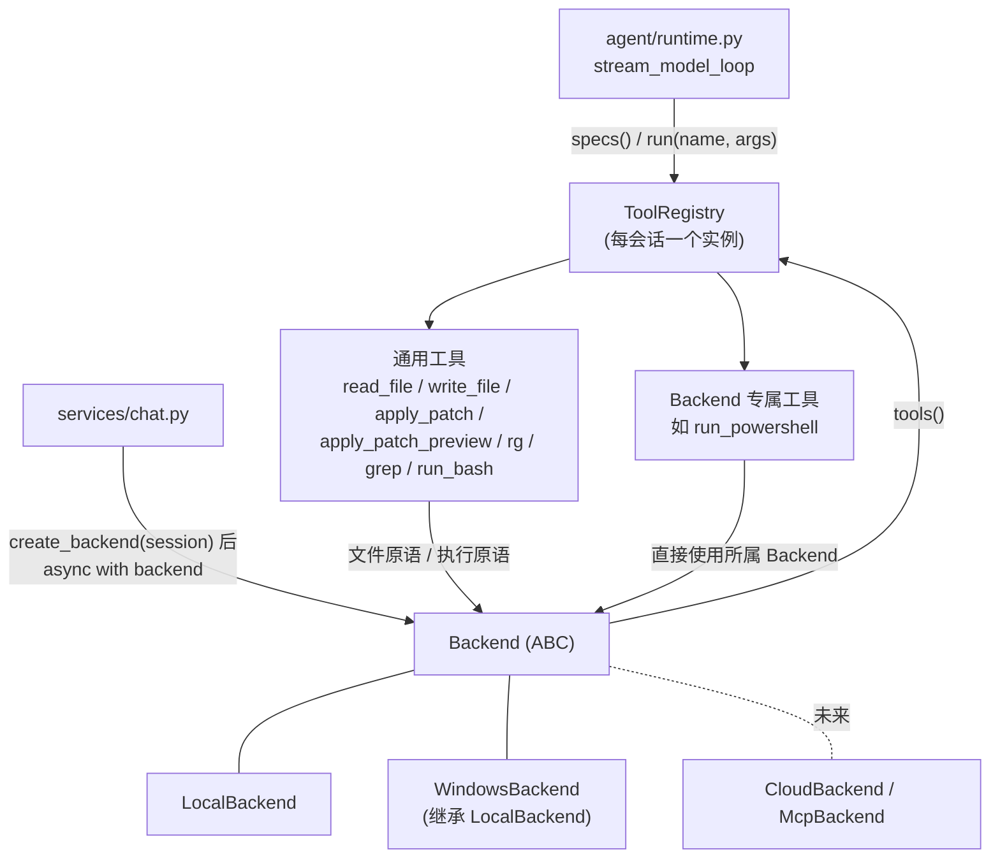

# 工具系统 Backend 抽象层重构方案

## 背景

当前工具系统把"本地执行"焊死在了三个位置：

- `api/automata_api/agent/tools/registry.py` 中 `REGISTERED_TOOLS` 是模块级全局元组，import 时固定，没有按会话或按执行环境切换工具集的入口。
- `api/automata_api/agent/tools/base.py` 中 `AgentTool.run(arguments, workspace: str)` 的 `workspace` 是本地文件系统路径字符串，签名本身携带本地语义。
- `api/automata_api/agent/tools/_core.py` 中全部工具实现直接调用本地文件系统 API 和 `asyncio.create_subprocess_exec`。

这导致无法支持"不同后台提供不同能力"的需求：例如云端后台提供远程文件读写与远程命令执行，本地 Windows 后台额外提供 PowerShell 等平台专属能力。

本次重构引入 **Backend 抽象层**：Backend 同时拥有"原语接口"（文件读写、命令执行等底层操作）和"工具组装权"（决定向 LLM 暴露哪些工具）。通用工具（读写文件、补丁、搜索）只写一次、基于原语实现；各 Backend 在通用工具之外追加自己的专属工具。Agent 层（runtime）只面向工具注册表，不感知任何实现细节。

### 为什么不是"每个 Backend 各自提供一套工具"

`read_file` / `write_file` / `apply_patch` / `rg` 的 LLM function-call spec、参数校验、错误格式化、输出截断对所有后台完全一致；`apply_patch` 的 unified diff 解析与 hunk 应用逻辑（约 600 行）与"文件存在哪"无关。如果每个 Backend 重新实现这些工具，等于把与后台无关的逻辑复制 N 份。因此采用两层设计：**原语属于 Backend，通用工具逻辑属于工具层，工具清单由 Backend 决定。**

## 目标

1. 定义 `Backend` 抽象基类：文件原语 + 执行原语 + 生命周期 + `tools()` 工具组装。
2. 实现 `LocalBackend`，行为与现有本地工具完全一致，全部既有测试语义保持不变。
3. 通用工具改为构造时注入 Backend，`run()` 不再接收 `workspace` 参数。
4. 工具注册表从模块级全局变为按会话构建的 `ToolRegistry` 实例。
5. Plan 模式的工具过滤从硬编码名单（`runtime.py` 的 `PLAN_TOOL_NAMES`）改为工具自声明的 `read_only` 能力标记，任何 Backend 新增的工具自动正确分类。
6. `sessions` 表持久化每个会话使用的 backend 类型，API 与前端透传该字段。
7. 实现 `WindowsBackend`（含 `run_powershell` 工具）作为验证抽象正确性的第一个差异化后台。
8. 保持 agent 包边界：`api/automata_api/agent` 不依赖 FastAPI、WebSocket、service、router。

## 非目标

- 不在本次实现云端 Backend（仅保证接口为其留好位置）。
- 不接入 MCP 协议（接口设计保持可被 `McpBackend` 适配器包装的形态即可）。
- 不改变 WebSocket 事件协议（`tool_call` / `tool_result` 等事件格式不变）。
- 不改变工具结果 JSON 的字段约定（`simulated` / `ok` / `stdout` 等保留）。
- 不提供跨 Backend 的安全隔离承诺：`LocalBackend` 的路径限制是防误操作而非防恶意（`run_bash` 内可以 `cd` 离开 workspace），文档照实说明。
- 前端本次只做最小改动（创建会话时可选 backend、会话列表展示 backend），不做完整的 backend 管理 UI。

## 总体架构



调用链变化：

- 现在：`runtime → run_tool(name, args, workspace) → 全局 TOOLS_BY_NAME → _core 本地实现`
- 之后：`service 构建 backend 与 registry → runtime → registry.run(name, args) → tool.run(args) → backend 原语`

## 核心接口设计

### Backend 抽象基类（新文件 `api/automata_api/agent/backends/base.py`）

```python
@dataclass(frozen=True)
class ExecResult:
    exit_code: int | None
    timed_out: bool
    stdout: str
    stderr: str
    stdout_truncated: bool
    stderr_truncated: bool


@dataclass(frozen=True)
class FileStat:
    exists: bool
    is_file: bool
    is_dir: bool
    size_bytes: int


class BackendError(RuntimeError):
    """原语级失败（路径越界、文件不存在、无法启动进程等）。"""


class Backend(ABC):
    kind: ClassVar[str]               # "local" / "windows" / 未来 "cloud"

    # ---- 标识 ----
    @property
    @abstractmethod
    def workspace_label(self) -> str:
        """显示给 LLM 与 UI 的工作区标识（本地为路径，云端可为远程会话 ID）。"""

    # ---- 文件原语 ----
    @abstractmethod
    async def read_file(self, path: str) -> str: ...
    @abstractmethod
    async def write_file(self, path: str, content: str, *, mode: str = "overwrite",
                         create_dirs: bool = True) -> int: ...
    @abstractmethod
    async def delete_file(self, path: str) -> None: ...
    @abstractmethod
    async def stat(self, path: str) -> FileStat: ...

    # ---- 执行原语 ----
    @abstractmethod
    async def exec_shell(self, command: str, *, cwd: str | None = None,
                         timeout_seconds: float) -> ExecResult: ...

    # ---- 高层操作：提供默认实现，Backend 可覆写 ----
    async def search(self, pattern: str, *, path: str | None, cwd: str | None,
                     timeout_seconds: float, prefer: str = "rg") -> SearchResult:
        """默认基于 exec_shell 的 rg→grep 链实现；LocalBackend 覆写为原生进程链。"""

    # ---- 工具组装 ----
    def tools(self) -> tuple[AgentTool, ...]:
        return default_tools(self)     # 通用七件套，子类追加专属工具

    # ---- 生命周期：云端后台需要连接/释放，本地为空操作 ----
    async def __aenter__(self) -> "Backend":
        return self

    async def __aexit__(self, *exc: object) -> None:
        return None
```

设计要点：

- **原语签名只接收 workspace 相对（或绝对）路径字符串**，路径合法性检查（现有 `resolve_file_path` / `resolve_tool_cwd` 的 `resolve()` + `relative_to()` 逻辑）下沉到 `LocalBackend` 原语内部；越界以 `BackendError` 抛出，由通用工具层转换为现有格式的错误 JSON。
- **`search` 是带默认实现的高层操作而不是纯工具层逻辑**：现有搜索实现包含"原生 rg → 原生 grep → bash 兜底"的尝试链（`_core.py` 的 `run_search_tool`），这依赖本地进程能力；云端后台可能有索引化搜索 API。默认实现走 `exec_shell` + 现有 `bash_search_command` 的 rg/grep 自选链，`LocalBackend` 覆写为现有原生链，保证行为与 `attempts` 字段完全不变。
- **补丁逻辑不属于 Backend**：unified diff 解析与 hunk 应用是纯文本算法，留在工具层（迁往 `tools/patching.py`），只通过 `read_file` / `write_file` / `delete_file` / `stat` 原语触达文件。
- `exec_argv`（不经 shell 的进程执行）不进入抽象接口——它只有 `LocalBackend` 的原生搜索链需要，作为 `LocalBackend` 的私有方法存在，避免接口最小公倍数被本地细节污染。

### AgentTool 基类变更（`tools/base.py`）

```python
class AgentTool(ABC):
    name: ClassVar[str]
    read_only: ClassVar[bool] = False   # 新增：Plan 模式按此过滤

    @abstractmethod
    def spec(self) -> dict[str, Any]: ...

    @abstractmethod
    async def run(self, arguments: dict[str, Any]) -> ToolResult: ...   # 移除 workspace 参数
```

通用工具统一改为 `def __init__(self, backend: Backend)`。`read_only` 标记：`read_file` / `rg` / `grep` / `apply_patch_preview` 为 `True`，与现有 `PLAN_TOOL_NAMES` 完全一致；`run_bash` / `write_file` / `apply_patch` / `run_powershell` 为 `False`。

### ToolRegistry（新文件 `tools/registry.py` 重写）

```python
class ToolRegistry:
    def __init__(self, tools: Iterable[AgentTool]) -> None: ...   # 校验重名，建索引

    def specs(self, *, read_only_only: bool = False) -> list[dict[str, Any]]: ...
    def allowed_names(self, *, read_only_only: bool = False) -> set[str]: ...
    async def run(self, name: str, raw_arguments: str | dict | None) -> ToolResult: ...
```

`run()` 吸收现有 `tools/__init__.py` 中 `run_tool` 的参数解析与未知工具处理。现有 `build_tool_index` 的重名/类型校验逻辑保留。

### Backend 工厂（新文件 `backends/factory.py`）

```python
BACKEND_KINDS = {"local": LocalBackend, "windows": WindowsBackend}

def create_backend(kind: str, *, workspace: str) -> Backend: ...
def default_backend_kind() -> str:
    return "windows" if os.name == "nt" else "local"
def available_backend_kinds() -> tuple[str, ...]: ...
```

未知 kind 抛出 `BackendConfigurationError`（service 层转为 WebSocket error 事件，HTTP 层转 422）。

### runtime 变更（`agent/runtime.py`）

- `stream_agent_loop` / `stream_plan_loop` / `stream_model_loop` 的 `workspace: str` 参数替换为 `registry: ToolRegistry`（runtime 不需要 Backend 本体，只需要工具入口；系统提示词所需的 workspace 标识由调用方从 `backend.workspace_label` 取出传入 prompt 构建函数，维持 agent 包内依赖单向）。
- 删除 `PLAN_TOOL_NAMES` 常量；plan 循环用 `registry.allowed_names(read_only_only=True)` 与 `registry.specs(read_only_only=True)`。
- `stream_execute_tool_call` 中 `run_tool(name, arguments, workspace)` 改为 `registry.run(name, arguments)`；`blocked_tool_result` 的 `allowed_tools` 字段取自 registry。

### service 与持久化变更

- `services/chat.py`：`stream_agent_reply` / `stream_plan_reply` 开头改为

  ```python
  session = fetch_session_record(session_id)          # 含 working_directory 与 backend
  backend = create_backend(session["backend"], workspace=session["working_directory"])
  async with backend:
      registry = ToolRegistry(backend.tools())
      ... stream_agent_loop(..., registry=registry, workspace_label=backend.workspace_label)
  ```

- `db/schema.py`：`sessions` 表新增列 `backend TEXT NOT NULL DEFAULT 'local'`；新增 `migrate_sessions_backend(db)`，模式与现有 `migrate_sessions_working_directory` 相同（`ALTER TABLE ADD COLUMN` + 回填默认值），不触发 `reset_app_tables`。
- `repositories/sessions.py`：`create_session` 接收并校验 `backend` 参数（缺省取 `default_backend_kind()`）；`list_sessions` / `fetch_session` 返回该列。
- `schemas.py`：`CreateSessionRequest` 增加 `backend: str | None`；`SessionSummary` 增加 `backend: str`。
- `routers/sessions.py`：创建会话时校验 backend 合法性，非法返回 422。

### 系统提示词

`agent/prompts.py` 当前把工具用法写死在提示词文本中（"You can use run_bash..."）。工具集随 Backend 变化后，提示词与工具清单会失配。处理方式：

- `agent_system_prompt(workspace, tool_notes)` / `plan_system_prompt(...)` 增加 `tool_notes: str` 参数；
- `Backend` 增加 `def prompt_notes(self) -> str`，默认返回现有通用工具说明文本，`WindowsBackend` 追加 PowerShell 工具说明；
- Plan 模式提示词中的允许工具名列表改为由 registry 生成，不再手写。

### WindowsBackend 与 run_powershell（验证用差异化后台）

- `WindowsBackend(LocalBackend)`：`kind = "windows"`，文件原语全部继承；`tools()` 返回 `(*super().tools(), RunPowershellTool(self))`。
- `RunPowershellTool`（新文件 `tools/powershell.py`）：`read_only = False`；执行方式为 `powershell.exe -NoProfile -NonInteractive -Command <command>`（通过 `WindowsBackend` 新增的 `exec_powershell` 方法），cwd 限制、超时上限、输出截断复用与 bash 相同的基础设施；结果 JSON 字段与 `run_bash` 对齐（`shell` 字段为 powershell 路径）。
- `create_backend("windows", ...)` 在非 Windows 平台直接抛 `BackendConfigurationError`。

## 文件改动清单

| 文件 | 动作 |
| --- | --- |
| `api/automata_api/agent/backends/__init__.py` | 新增，导出 Backend、LocalBackend、factory |
| `api/automata_api/agent/backends/base.py` | 新增，Backend ABC + ExecResult/FileStat/SearchResult + BackendError |
| `api/automata_api/agent/backends/local.py` | 新增，LocalBackend；吸收 `_core.py` 中文件读写、bash 执行、路径解析、原生搜索链 |
| `api/automata_api/agent/backends/windows.py` | 新增，WindowsBackend + exec_powershell |
| `api/automata_api/agent/backends/factory.py` | 新增，create_backend / default_backend_kind |
| `api/automata_api/agent/tools/base.py` | 修改，`run()` 去掉 workspace；新增 `read_only` |
| `api/automata_api/agent/tools/registry.py` | 重写为 ToolRegistry 类 + `default_tools(backend)` |
| `api/automata_api/agent/tools/_core.py` | 拆解：执行/文件/搜索实现迁入 LocalBackend；diff 逻辑迁入 `patching.py`；参数解析与结果格式化迁入 `results.py`；最终删除 |
| `api/automata_api/agent/tools/patching.py` | 新增，unified diff 解析与 hunk 应用（纯文本算法，原 `_core.py` 724-997 行） |
| `api/automata_api/agent/tools/results.py` | 新增，ToolResult、错误 JSON 构造、截断、参数读取辅助 |
| `api/automata_api/agent/tools/{bash,files,patch,search}.py` | 修改，注入 backend、补 `read_only`、模块级单例改为工厂函数 |
| `api/automata_api/agent/tools/powershell.py` | 新增 |
| `api/automata_api/agent/tools/__init__.py` | 修改，删除全局 `run_tool` / `tool_specs`，导出 ToolRegistry / default_tools |
| `api/automata_api/agent/runtime.py` | 修改，registry 注入、删除 PLAN_TOOL_NAMES |
| `api/automata_api/agent/prompts.py` | 修改，tool_notes 参数 |
| `api/automata_api/services/chat.py` | 修改，构建 backend 与 registry，`async with backend` |
| `api/automata_api/db/schema.py` | 修改，backend 列迁移 |
| `api/automata_api/repositories/sessions.py` | 修改，backend 字段读写与校验 |
| `api/automata_api/schemas.py`、`routers/sessions.py` | 修改，API 透传 backend |
| `ui/src/App.tsx` | 修改（最小），SessionSummary 类型加 backend，新会话草稿可选 backend，会话列表展示 |
| `api/tests/*` | 见测试计划 |

## 分阶段实施计划

每个阶段结束时全部测试保持通过，可独立提交。

### 阶段 1：建立 Backend 层，行为零变化

1. 新增 `backends/base.py`（ABC 与数据类型）与 `backends/local.py`。`LocalBackend` 的原语实现直接搬移/委托 `_core.py` 现有函数，路径校验逻辑随之下沉。
2. 新增 `tools/patching.py` 与 `tools/results.py`，从 `_core.py` 平移对应代码（纯搬移，不改逻辑）。
3. 此阶段保留 `tools/__init__.py` 的 `run_tool(name, args, workspace)` 旧签名：内部临时构造 `LocalBackend(workspace)` 完成调用，使全部既有测试不改一行即通过。

验收：`pytest -q` 145 个测试全绿。

### 阶段 2：工具注入 Backend，registry 实例化

1. `AgentTool.run()` 改签名；七个通用工具改为构造注入 backend；`default_tools(backend)` 取代 `REGISTERED_TOOLS`。
2. `ToolRegistry` 落地；runtime 改为接收 registry；`tools/__init__.py` 删除全局入口。
3. 更新测试：`tests/test_tools.py`、`test_agent_tools_unit.py`、`test_agent_runtime_unit.py` 等将 `tools.run_tool(name, args, str(tmp_path))` 替换为 `ToolRegistry(default_tools(LocalBackend(str(tmp_path)))).run(name, args)`（可在 conftest 中提供 `make_registry(tmp_path)` 辅助 fixture，改动收敛为一行）。

验收：全部测试通过；`grep -rn "workspace: str" api/automata_api/agent/tools/` 无 run 签名残留。

### 阶段 3：read_only 取代 PLAN_TOOL_NAMES

1. 工具补 `read_only` 类属性；runtime 删除 `PLAN_TOOL_NAMES`，plan 循环改用 registry 过滤；`blocked_tool_result` 的 `allowed_tools` 来源同步切换。
2. `prompts.py` 的 plan 提示词允许工具列表改为由 registry 生成。
3. `tests/test_agent_plan_mode_unit.py` 断言从名字集合改为对 `read_only` 过滤行为的验证，并新增"带写工具的自定义工具集在 plan 模式被拦截"用例。

验收：plan 模式行为与现状一致（允许集相同），新增用例通过。

### 阶段 4：backend 持久化与 API 透传

1. `db/schema.py` 迁移 + `repositories/sessions.py` 字段读写 + 工厂校验。
2. `schemas.py` / `routers/sessions.py` / `services/chat.py` 接入 `create_backend`，service 层用 `async with backend` 包裹两个流式入口；`BackendConfigurationError` 在 WebSocket 路径转 error 事件、HTTP 路径转 422。
3. UI 最小改动：类型与展示、创建会话时传 backend（默认值由后端决定，UI 可先不提供选择控件，仅透传字段，避免本阶段引入 UI 复杂度）。
4. 测试：`test_sessions.py` 增加 backend 字段断言与非法 backend 422 用例；`test_chat.py` 验证默认 backend 会话照常工作。

验收：旧数据库文件升级后既有会话 backend 为 `local` 且功能不变。

### 阶段 5：WindowsBackend + run_powershell（抽象试金石）

1. `backends/windows.py`、`tools/powershell.py`、工厂注册、`prompt_notes` 追加。
2. 测试：PowerShell 工具单测标注 `@pytest.mark.skipif(os.name != "nt")`；工厂在非 Windows 平台拒绝 `windows` kind 的用例不依赖平台；`WindowsBackend.tools()` 数量与 `read_only` 分布断言跨平台可跑（构造不执行）。

验收标准（同时也是抽象正确性的检验）：实现 WindowsBackend 全程**不需要修改任何通用工具与 runtime 代码**，只新增文件 + 工厂注册一行。如果做不到，说明抽象有漏洞，回头修接口而不是打补丁。

### 阶段 6（后续，不在本次范围）

- `CloudBackend`：实现文件与 exec 原语对接远程 API，`search` 用默认 `exec_shell` 实现或远程索引；本方案接口已预留生命周期钩子。
- `McpBackend` 适配器：将外部 MCP server 的 tool list 包装为 `AgentTool`。
- UI 完整的 backend 选择与能力展示。

## 测试计划汇总

| 测试 | 阶段 | 内容 |
| --- | --- | --- |
| 既有 145 个测试 | 1-4 | 语义不变，阶段 2 起调用方式收敛到 fixture |
| `test_backends_local.py`（新增） | 1 | 原语级：读写/stat/越界 BackendError/exec_shell 超时与截断 |
| `test_tool_registry.py`（新增） | 2 | 重名拒绝、未知工具错误 JSON、read_only 过滤 |
| `test_backend_factory.py`（新增） | 4 | kind 解析、默认值、非法 kind、windows 平台限制 |
| `test_backends_windows.py`（新增） | 5 | PowerShell 工具（Windows-only 执行用例 + 跨平台结构用例） |

## 风险与权衡

1. **搜索行为回归**是最大风险点：`attempts` 字段、rg→grep→bash 链路的退化顺序被现有测试覆盖，迁移时以"先平移后重构"的顺序处理（阶段 1 纯搬移），靠测试锁住行为。
2. **`_core.py` 拆解半径大**（1320 行），但其中 diff 算法（约 270 行）与结果格式化是纯函数，搬移风险低；真正与执行环境耦合的约 500 行集中迁入 `LocalBackend`。
3. **模块级工具单例消失**（`run_bash_tool = RunBashTool()` 等），如有外部代码直接 import 这些单例会断；已确认仓库内只有 `registry.py` 引用它们，测试均走 `run_tool` 入口。
4. **提示词与工具清单联动**引入了 `prompt_notes`，存在文案分散的风险；约定通用工具说明只存在于 `Backend.prompt_notes` 默认实现一处，子类只做追加。
5. **同步 SQLite 在 async 流程中的阻塞问题**（既有问题）本次不处理，但 Backend 生命周期已是 async 形态，未来云端后台不会受该问题牵连。

## 决议记录

- Backend 提供"原语 + 工具组装权"而非纯工具集合，避免通用工具逻辑被各后台复制。
- `search` 定为可覆写的高层操作而非工具层纯逻辑，为云端索引化搜索留位置，同时保住本地原生链行为。
- 补丁算法留在工具层，Backend 只见文件原语。
- Plan 模式过滤依据从工具名单改为 `read_only` 能力声明。
- `workspace` 从工具签名中移除，成为 Backend 构造参数；提示词所需标识经 `workspace_label` 暴露。
