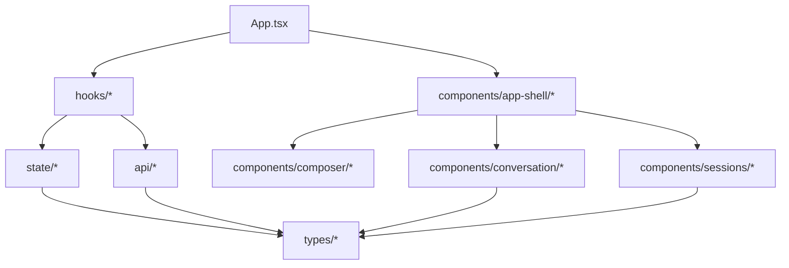

# 前端 App 单文件重构方案

## 背景

当前前端核心逻辑集中在 `ui/src/App.tsx`，单文件承担了过多职责：

- 协议类型定义：`ApiRuntimeConfig`、`SessionSummary`、`ChatMessage`、`SocketPayload` 等。
- API 客户端：会话列表、消息列表、创建/更新/删除会话、运行时配置加载。
- Tauri 桥接：`invoke("api_config")`、`invoke("agent_status")`、目录选择 dialog。
- WebSocket 生命周期：连接、重连、事件解析、流式消息拼接、计划审批、工具运行状态同步。
- 会话状态管理：当前会话、新会话草稿、重命名、删除后的会话切换。
- UI 组件：侧边栏、工作区头部、浮动 Inspector、消息列表、Composer、ToolCard、Plan Bubble。
- 展示辅助函数：计划状态文案、目录名格式化、上下文压缩事件格式化等。

这种结构短期可以快速迭代，但随着 plan mode、streaming、backend 选择、工具详情等能力继续增加，会出现明显维护成本：

- 任意小功能都容易触碰 `App.tsx` 的大量状态和闭包，回归风险高。
- 网络协议、业务状态与 DOM 结构耦合，单元测试很难覆盖。
- UI 组件无法复用，也很难局部重排或替换。
- 类型散落在入口文件里，后端协议变更时缺少清晰的同步边界。
- `App.css` 与单体组件强绑定，样式增长后同样难以定位。

本方案目标是把单文件拆成职责清晰、边界稳定、可渐进迁移的前端结构，同时不引入新的状态库或大型框架。

## 目标

1. `App.tsx` 退化为应用组合层，只负责装配 provider/layout 和少量顶层 shell。
2. 网络协议类型集中到 `src/types`，API 与 WebSocket 客户端集中到 `src/api`。
3. 会话、消息流、计划审批、工具运行状态沉淀为 hook/reducer，降低 UI 组件复杂度。
4. UI 按领域拆分为可读组件：sidebar、conversation、composer、inspector、tool run。
5. 样式从一个巨型 `App.css` 拆为基础样式、布局样式和组件样式。
6. 保持现有行为不变：会话 CRUD、工作目录选择、WebSocket 重连、流式 token、plan approve、tool card 展开等全部保留。
7. 建立可测试的纯函数与 reducer 单元：WebSocket payload 归并、计划状态更新、会话选择策略、格式化函数。

## 非目标

- 不在本次重构中引入 Redux、Zustand、React Query、路由库或组件库。
- 不重做视觉设计，只移动代码与整理样式边界。
- 不改变后端 HTTP/WebSocket 协议。
- 不改变 Tauri 命令名或 Rust 侧实现。
- 不把所有 CSS 迁移为 CSS Modules；可作为后续演进，但本次优先降低迁移风险。
- 不顺手改造移动端布局、主题系统或国际化。

## 目标目录结构

建议使用领域优先的轻量结构：

```text
ui/src/
  App.tsx
  main.tsx
  api/
    client.ts
    config.ts
    sessions.ts
    websocket.ts
  components/
    app-shell/
      AppShell.tsx
      Sidebar.tsx
      Topbar.tsx
      FloatingInspector.tsx
    composer/
      PromptComposer.tsx
      SendModeToggle.tsx
    conversation/
      ConversationPanel.tsx
      MessageList.tsx
      MessageBubble.tsx
      PlanBubble.tsx
      ToolCard.tsx
    sessions/
      SessionList.tsx
      SessionListItem.tsx
      WorkspacePicker.tsx
  hooks/
    useApiConfig.ts
    useAgentSocket.ts
    useAutoScroll.ts
    useSessions.ts
    useTauriBridge.ts
  state/
    chatReducer.ts
    sessionReducer.ts
  styles/
    base.css
    layout.css
    components.css
  types/
    api.ts
    chat.ts
    session.ts
    socket.ts
  utils/
    format.ts
    timing.ts
```

说明：

- `api/` 只做 I/O，不持有 React state。
- `hooks/` 连接 React 生命周期、API 客户端和 reducer。
- `state/` 放纯 reducer 与 action 类型，便于单测。
- `components/` 只接收 props 和回调，尽量不直接调用 fetch、WebSocket、Tauri。
- `types/` 是前后端协议的入口，避免类型藏在组件文件中。
- `styles/` 先按粒度拆分全局 CSS，后续如果需要可以再迁移为组件级 CSS。

## 模块边界



约束：

- `components/*` 不 import `api/*`。
- `api/*` 不 import React。
- `state/*` 不 import React、Tauri 或浏览器对象。
- `hooks/*` 可以 import `api/*`、`state/*`、React hooks。
- WebSocket 原始 payload 只在 `api/websocket.ts` 和 `useAgentSocket.ts` 入口出现，组件只消费归一化后的 `ChatMessage` 状态。

## 类型拆分

### `types/api.ts`

放运行时配置与后端消息形态：

```ts
export type ApiRuntimeConfig = {
  httpBaseUrl: string;
  wsChatUrl: string;
  defaultWorkingDirectory: string;
};

export type ApiMessage = {
  id: string;
  session_id: string;
  role: "user" | "agent" | "tool";
  kind?: "message" | "tool_run";
  content: string;
  sequence: number;
  created_at: string;
  plan_id?: string | null;
  plan_status?: PersistedPlanStatus | null;
  metadata?: ToolRunMetadata | null;
};
```

### `types/session.ts`

```ts
export type SessionSummary = {
  id: string;
  title: string;
  working_directory: string;
  created_at: string;
  updated_at: string;
  message_count: number;
};
```

如果 backend 抽象层重构落地后，`backend` 字段也在这里扩展。

### `types/chat.ts`

放前端渲染用消息模型：

```ts
export type ChatMessage = {
  id: string;
  session_id?: string;
  role: "user" | "agent" | "tool";
  text: string;
  kind?: "normal" | "plan" | "tool_run";
  metadata?: ToolRunMetadata | null;
  plan_id?: string;
  plan_status?: PlanStatus;
  sequence?: number;
  created_at?: string;
};
```

### `types/socket.ts`

放 `SocketPayload` 联合类型。后续后端协议新增事件时，只需要改这个文件和 reducer，而不是进入 UI 组件。

## API 层

### `api/config.ts`

负责读取 Tauri 注入的 API 配置，保留当前 fallback 行为：

```ts
export const DEFAULT_API_CONFIG: ApiRuntimeConfig = {
  httpBaseUrl: "http://127.0.0.1:8765",
  wsChatUrl: "ws://127.0.0.1:8765/ws/chat",
  defaultWorkingDirectory: "",
};

export async function loadApiConfig(): Promise<ApiRuntimeConfig> {
  ...
}
```

### `api/client.ts`

封装通用 JSON 请求：

```ts
export async function requestJson<T>(
  config: ApiRuntimeConfig,
  path: string,
  init?: RequestInit,
): Promise<T> {
  ...
}
```

### `api/sessions.ts`

会话 HTTP API：

```ts
export function fetchSessions(config: ApiRuntimeConfig): Promise<SessionSummary[]>;
export function createSession(config: ApiRuntimeConfig, title: string, workingDirectory: string): Promise<SessionSummary>;
export function updateSession(config: ApiRuntimeConfig, sessionId: string, title: string): Promise<SessionSummary>;
export function deleteSession(config: ApiRuntimeConfig, sessionId: string): Promise<void>;
export function fetchMessages(config: ApiRuntimeConfig, sessionId: string): Promise<ChatMessage[]>;
```

`fetchMessages()` 内部负责把 `ApiMessage` 映射为 `ChatMessage`，让组件不需要理解后端字段名差异。

### `api/websocket.ts`

只封装 WebSocket 创建和 payload 解析，不持有 UI 状态：

```ts
export type AgentSocketHandlers = {
  onOpen(): void;
  onPayload(payload: SocketPayload): void;
  onInvalidPayload(): void;
  onClose(socket: WebSocket): void;
  onError(): void;
};

export function createAgentSocket(url: string, handlers: AgentSocketHandlers): WebSocket {
  ...
}
```

## 状态层

### `state/chatReducer.ts`

把当前散落在 `App.tsx` 的消息变更集中为纯 reducer：

- `userMessageQueued`
- `agentMessageStarted`
- `tokenReceived`
- `planReady`
- `planStatusChanged`
- `toolCallStarted`
- `toolCallCompleted`
- `runEventAppended`
- `streamingFailed`
- `messagesLoaded`
- `messagesCleared`

示例：

```ts
type ChatAction =
  | { type: "tokenReceived"; messageId: string; sessionId?: string; content: string }
  | { type: "planStatusChanged"; planId: string; status: PlanStatus }
  | { type: "toolCallStarted"; payload: ToolCallPayload; sessionId?: string };

export function chatReducer(state: ChatState, action: ChatAction): ChatState {
  ...
}
```

收益：

- WebSocket 事件处理不再直接拼 `setMessages((current) => ...)`。
- 可以对 token 追加、tool result 补偿创建、plan error 标记等复杂逻辑做单元测试。
- UI 组件只读取 `state.messages`。

### `state/sessionReducer.ts`

管理会话列表、当前会话、新会话草稿、重命名草稿：

- `sessionsLoaded`
- `sessionSelected`
- `newDraftStarted`
- `renameStarted`
- `renameCommitted`
- `renameCancelled`
- `sessionDeletedAndNextSelected`
- `draftWorkingDirectoryChanged`

删除会话后的“选下一个会话或进入草稿”逻辑建议放在 hook 中计算，然后通过 action 提交，避免 reducer 直接做异步 I/O。

## Hooks 层

### `useApiConfig`

启动时读取配置，并给其他 hooks 提供稳定值。

返回：

```ts
{
  apiConfig,
  apiConfigRef,
  isConfigReady,
}
```

### `useSessions`

负责会话 HTTP 生命周期：

- 初始化加载 sessions。
- 选择会话时拉取 messages。
- 创建新会话草稿。
- 提交重命名。
- 删除会话并选择下一项。
- 更新工作目录草稿。

返回给组件的数据应接近 UI 需要：

```ts
{
  sessions,
  activeSession,
  activeSessionId,
  isNewSessionDraft,
  draftWorkingDirectory,
  displayedWorkingDirectory,
  editingSessionId,
  editingTitle,
  messages,
  actions: {
    initializeSessions,
    refreshSessionList,
    selectSession,
    startNewSessionDraft,
    commitRename,
    deleteSession,
    setDraftWorkingDirectory,
    setEditingTitle,
  },
}
```

### `useAgentSocket`

负责 WebSocket 连接、重连、发送 prompt、审批计划和流式事件转译。

内部状态：

- `socketStatus`
- `isStreaming`
- `socketRef`
- `streamingMessageIdRef`
- `streamingSessionIdRef`
- `executingPlanIdRef`
- `toolRunMessageIdsRef`
- `reconnectTimerRef`
- `reconnectAttemptRef`

对外暴露：

```ts
{
  socketStatus,
  isStreaming,
  connectSocket,
  sendPrompt,
  approvePlan,
}
```

`useAgentSocket` 不直接渲染 UI，只调用 `chatDispatch` 和 `sessionActions.refreshSessionList()`。

### `useTauriBridge`

封装桌面桥接：

- `runBridgeCheck()`
- `chooseDirectory()`
- `bridgeStatus`

`chooseDirectory()` 返回选中的路径，由 `useSessions` 或组件决定是否写入 draft。

### `useAutoScroll`

封装消息容器自动滚动：

```ts
export function useAutoScroll<T extends HTMLElement>(dependency: unknown) {
  const ref = useRef<T | null>(null);
  useEffect(() => { ... }, [dependency]);
  return ref;
}
```

## 组件拆分

### `App.tsx`

重构后控制在约 80-140 行：

- 初始化 hooks。
- 拼装 `AppShell`。
- 把 action 和状态作为 props 下传。

### `components/app-shell/AppShell.tsx`

顶层布局：

- 左侧 `Sidebar`
- 右侧 `Topbar`
- `FloatingInspector`
- `ConversationPanel`

不包含业务算法。

### `components/sessions/Sidebar.tsx`

组合：

- Brand
- `SessionList`
- `WorkspacePicker`
- footer actions

### `components/sessions/SessionList.tsx`

只负责列表渲染，不管理重命名细节。

Props：

```ts
type SessionListProps = {
  sessions: SessionSummary[];
  activeSessionId: string | null;
  editingSessionId: string | null;
  editingTitle: string;
  disabled: boolean;
  onSelect(sessionId: string): void;
  onStartRename(session: SessionSummary): void;
  onEditingTitleChange(title: string): void;
  onCommitRename(sessionId: string): void;
  onCancelRename(): void;
  onDelete(sessionId: string): void;
};
```

### `components/conversation/ConversationPanel.tsx`

负责空会话、新会话 stage、消息列表和底部 composer 的组合。

### `components/conversation/MessageList.tsx`

负责遍历消息，并根据 `kind` 分发到：

- `MessageBubble`
- `PlanBubble`
- `ToolCard`

### `components/composer/PromptComposer.tsx`

接收 `prompt`、`sendMode`、`isStreaming`、`canSend`、`onSubmit` 等 props。

`renderComposer()` 这个闭包应被替换为独立组件，避免 UI 组件捕获顶层所有状态。

### `components/conversation/ToolCard.tsx`

从 `App.tsx` 迁移即可，保留内部 `isExpanded` 局部状态。

### `components/app-shell/FloatingInspector.tsx`

迁移 `fileChanges` 与 Inspector 展示。`fileChanges` 现在是静态 mock 风格数据，建议移动到组件内部或 `constants/demo.ts`，并在后续产品化时替换为真实数据源。

## 样式拆分

先保持全局类名不变，降低迁移风险。建议拆为：

```text
styles/base.css         # :root、reset、button/input 基础
styles/layout.css       # app-shell、sidebar、workspace、topbar、workspace-main
styles/components.css   # session-item、composer、message、tool-card、inspector 等
```

`main.tsx` 或 `App.tsx` 统一 import：

```ts
import "./styles/base.css";
import "./styles/layout.css";
import "./styles/components.css";
```

拆分原则：

- 第一阶段只移动 CSS，不改 className。
- 等组件边界稳定后，再考虑把大型组件样式拆成就近 CSS 文件。
- 变量仍保留在 `base.css` 的 `:root`，避免主题 token 多处复制。

## 渐进迁移步骤

### 阶段 1：抽出类型、工具函数与 API 客户端

文件：

- `types/api.ts`
- `types/chat.ts`
- `types/session.ts`
- `types/socket.ts`
- `utils/format.ts`
- `utils/timing.ts`
- `api/config.ts`
- `api/client.ts`
- `api/sessions.ts`

迁移内容：

- `DEFAULT_API_CONFIG`
- `loadApiConfig`
- `requestJson`
- `fetchSessions`
- `createSession`
- `updateSession`
- `deleteSession`
- `fetchMessages`
- `formatPlanStatus`
- `formatToolRunStatus`
- `formatContextCompressed`
- `formatDirectoryName`
- `sleep`

验收：

- `npm run build` 通过。
- `App.tsx` 行数明显下降，但行为不变。

### 阶段 2：抽出纯 reducer

文件：

- `state/chatReducer.ts`
- `state/sessionReducer.ts`

迁移内容：

- token 追加逻辑。
- tool call/tool result 映射逻辑。
- plan status 更新逻辑。
- streaming error 补偿消息逻辑。
- sessions/draft/editing 状态更新逻辑。

验收：

- reducer 覆盖当前最复杂的状态分支。
- 事件处理函数中不再出现大段 `setMessages((current) => ...)`。

### 阶段 3：抽出 hooks

文件：

- `hooks/useApiConfig.ts`
- `hooks/useSessions.ts`
- `hooks/useAgentSocket.ts`
- `hooks/useTauriBridge.ts`
- `hooks/useAutoScroll.ts`

迁移内容：

- 启动 boot 流程。
- WebSocket connect/scheduleReconnect/clearReconnectTimer。
- sendPrompt/approvePlan。
- 会话初始化、选择、重命名、删除、新建草稿。
- 目录选择与 bridge check。

验收：

- `App.tsx` 不再直接持有 WebSocket ref。
- `App.tsx` 不再直接调用 `fetchSessions` / `fetchMessages`。
- `App.tsx` 只组合 hooks 返回值和组件。

### 阶段 4：拆 UI 组件

优先从最独立的组件开始：

1. `ToolCard`
2. `PromptComposer` / `SendModeToggle`
3. `SessionList` / `SessionListItem`
4. `WorkspacePicker`
5. `FloatingInspector`
6. `MessageList` / `MessageBubble` / `PlanBubble`
7. `Sidebar` / `Topbar` / `ConversationPanel` / `AppShell`

验收：

- 每个组件 props 明确，不 import `api/*`。
- 组件文件平均控制在 200 行以内。
- `App.tsx` 控制在 140 行以内。

### 阶段 5：拆 CSS

迁移 `App.css` 到 `styles/*`，先不改类名。

验收：

- 视觉快照与重构前一致。
- 全局变量只定义一次。
- 删除旧 `App.css` 或只保留临时转发 import，避免双入口。

### 阶段 6：补测试与回归清单

在当前 Vite 项目尚未配置测试框架的情况下，建议优先补 `vitest`，只测试纯函数和 reducer，不测 DOM：

```bash
npm install -D vitest
```

建议测试：

- `chatReducer`：token 追加到已有 agent 消息。
- `chatReducer`：token 到来但消息不存在时创建 agent 消息。
- `chatReducer`：tool_result 先于 tool_call 时能补偿创建 tool message。
- `chatReducer`：plan_error 标记当前计划失败。
- `formatDirectoryName`：空值、Windows 路径、Unix 路径。
- `fetchMessages` mapper：`kind: "tool_run"` 与 `kind: "message"` 映射正确。

如果暂不引入测试框架，至少在每个阶段跑：

```bash
npm run build
```

## 关键行为保持清单

重构过程中每阶段都需要手动或自动验证：

- 启动时能读取 Tauri API 配置，失败时 fallback 到 `127.0.0.1:8765`。
- WebSocket 打开后状态从 `Connecting` 到 `Connected` / `Ready`。
- 后端不可用时能显示 offline，并按当前延迟策略重连。
- 首次没有会话时进入新会话草稿。
- 新会话能选择工作目录并发送首条 prompt。
- 普通 prompt 能创建 user message，并流式追加 agent token。
- `context_compressed` 事件能追加 tool 角色提示消息。
- `tool_call` 创建运行中 ToolCard，`tool_result` 更新结果。
- plan mode 能生成 plan bubble。
- approve plan 能进入 executing，完成后变为 executed。
- plan error 或 socket close 能正确恢复 `isStreaming=false`。
- 重命名会话、删除会话、删除最后一个会话的行为保持不变。
- 消息列表在新消息到来时继续自动滚动。

## 风险与处理

| 风险 | 说明 | 处理 |
| --- | --- | --- |
| WebSocket 闭包捕获旧状态 | 当前逻辑依赖多个 ref 避免 stale closure，迁移时容易漏掉 | `useAgentSocket` 保留必要 ref，并把 session/chat 操作通过稳定 callback 注入 |
| reducer 过度复杂 | 如果把所有业务都塞进一个 reducer，会形成新的单体 | chat 与 session 分开，hook 负责异步编排 |
| CSS 拆分导致视觉回归 | 全局类名移动时容易漏 import 或顺序变化 | 阶段 5 只移动文件不改选择器，保持 import 顺序 |
| 组件 props 过长 | 过早拆组件可能导致大量透传 | 先抽 hook 返回 actions 对象，再按领域传递 |
| 与后端协议重构冲突 | backend/streaming 方案可能扩展 session 或 socket 字段 | 类型集中后冲突范围会变小，优先保证 `types/*` 是唯一协议入口 |

## 推荐落地顺序

推荐按“小步可构建”的顺序提交：

1. `types + api + utils` 抽离，`App.tsx` import 替换。
2. `ToolCard`、格式化函数、composer 这类低耦合 UI 先拆。
3. 抽 `chatReducer`，替换 WebSocket payload 对消息数组的直接操作。
4. 抽 `useAgentSocket`，把连接和重连从 `App.tsx` 移出。
5. 抽 `useSessions`，把会话 CRUD 和草稿状态移出。
6. 拆 `Sidebar` / `ConversationPanel` / `FloatingInspector`。
7. 拆 CSS。
8. 补 reducer 与 mapper 测试。

这个顺序的好处是每一步都可以独立 build 和手动验证，且任何一步出现问题都容易回退到前一个稳定边界。

## 完成标准

- `ui/src/App.tsx` 只负责组合 hooks 和布局组件，目标小于 140 行。
- 单个 React 组件文件原则上小于 220 行，复杂组件拆子组件。
- 协议类型全部位于 `types/*`。
- HTTP 请求全部位于 `api/*`。
- WebSocket 状态机位于 `useAgentSocket`，消息归并逻辑位于 `chatReducer`。
- 会话异步流程位于 `useSessions`。
- `npm run build` 通过。
- 关键行为保持清单全部通过。
