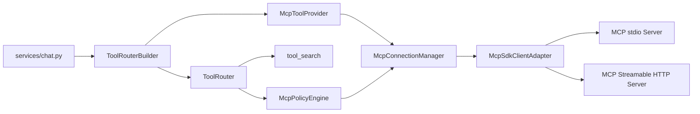

# Automata MCP 调用能力设计

## Status

- 文档状态：Current Scope Implemented
- 目标协议：MCP `2025-11-25`
- 当前范围：MCP tools over stdio and Streamable HTTP
- 依赖前提：现有 `ToolRouter`、deferred exposure 和 `tool_search`
- 实现基线：官方 Python SDK `mcp<2`，当前 lock 为 `1.28.1`

## Summary

本方案在 Automata 已有运行期工具发现与注册框架之上增加 MCP tool 调用能力。MCP 不进入 agent runtime 主循环，而是作为一种异步工具来源接入现有工具路由：

- `McpToolProvider` 通过 MCP `tools/list` 发现工具，并转换成 `ToolDescriptor`。
- `McpAgentTool` 把一次 Automata tool dispatch 适配成 MCP `tools/call`。
- `McpConnectionManager` 管理 MCP client、连接、发现缓存和关闭。
- `McpPolicyEngine` 在调用前根据 server 信任、调用目标和工具风险做 allow/deny/prompt 决策。
- `ToolRouter` 继续负责 direct/deferred/hidden、`tool_search`、plan mode 过滤和统一 dispatch。

当前只实现 tools，不实现 resources、prompts、sampling、elicitation、tasks 和 MCP Apps UI。协议实现优先复用官方 Python SDK，Automata 只维护 adapter、策略和工具路由，不自行维护完整 JSON-RPC/transport 状态机。

### Implementation Map

| 责任 | 当前实现 |
| --- | --- |
| 配置、definition/grant 分离 | `agent/mcp/config.py`、`agent/mcp/trust.py` |
| SDK adapter 与连接生命周期 | `agent/mcp/client.py`、`agent/mcp/manager.py` |
| 策略、schema 与结果边界 | `agent/mcp/policy.py`、`agent/mcp/result.py` |
| 工具发现与 MCP executor | `agent/tools/mcp_provider.py`、`agent/tools/mcp_tool.py` |
| reply-scoped runtime 装配 | `agent/mcp/runtime.py`、`services/chat.py` |
| 用户授权 API | `routers/mcp.py` |

每次 agent reply 重新执行 discovery；同一 reply 内复用 stdio process 或 Streamable HTTP session。当前不规划 `list_changed` 动态刷新和交互式 approval。

## Key Decisions

| 主题 | 决策 |
| --- | --- |
| MCP 在系统中的位置 | ToolProvider，不进入 `runtime.py` 的协议分支 |
| 协议版本 | 首版固定 MCP `2025-11-25`，draft 由后续 adapter 支持 |
| SDK | 使用经过锁定和验证的官方 Python MCP SDK v1.x |
| transport | stdio、Streamable HTTP |
| MCP 工具默认 exposure | deferred |
| workspace 配置 | 只能声明候选 server，不能自行授予执行权限 |
| 工具名称 | 生成不超过模型 provider 限制的稳定 alias |
| `tools/call` 重试 | 默认不重试；只对明确安全的幂等调用开放 |
| plan mode | read-only 是必要条件，但不是唯一安全条件 |
| 工具列表更新 | 每个 agent reply 重新 discovery，不订阅 `list_changed` |
| 连接生命周期 | 与单次 agent reply/loop 同生命周期 |

## Current Baseline

当前 Automata 已经具备：

- `Backend` 提供 local/windows 执行原语。
- `ToolProvider.discover(context)` 贡献 `ToolDescriptor`。
- `ToolDescriptor` 包含 `name`、`spec`、`executor`、`read_only`、`exposure`、`source`、`search_text`。
- `ToolRouter` 在每次模型调用前生成当前可见 tools。
- `tool_search` 能发现并激活 deferred tools。
- `ToolRouter.dispatch()` 在执行前检查 plan mode、hidden 和 deferred 状态。

MCP 必须复用这条路径。`runtime.py` 不识别 server、transport、MCP tool name 或 MCP result。

## Goals

1. 支持配置多个 MCP servers。
2. 支持异步 `tools/list` 和 `tools/call`。
3. MCP tools 默认通过 `tool_search` 延迟激活。
4. MCP server 失败不影响 backend 核心工具。
5. 不可信 workspace 不能通过 MCP 配置静默执行本地进程。
6. 调用策略能够区分 read-only、mutating、destructive、local 和 remote 风险。
7. 工具名称、数量和 schema 满足当前模型 provider 限制。
8. discovery、调用和结果转换都有明确资源上限。
9. stdio 与 Streamable HTTP 使用相同的 discovery、routing、policy 和 result 路径。
10. 未配置 MCP 时，现有行为完全不变。

## Non-Goals

- 不实现 MCP server。
- 不把 MCP resources/prompts 自动注入模型上下文。
- 不实现 sampling、elicitation、tasks 或 MCP Apps UI。
- 不实现 OAuth browser flow。
- 不改变当前 Chat Completions function tool wire shape。
- 不实现跨进程共享连接池。
- 不订阅 `notifications/tools/list_changed`，不在同一 reply 内动态替换工具快照。
- 不实现 WebSocket 交互式 approval；`prompt` 策略返回稳定错误且不发送 MCP request。
- 不信任 MCP annotations 提供安全保证。

## Safety Invariants

以下约束属于实现验收条件，不是可选优化：

1. 读取 workspace MCP 配置本身不得启动进程或发起网络连接。
2. workspace 配置中的 `enabled=true`、`approval=allow` 和 `trusted=true` 不具有授权效力。
3. stdio command 只能来自配置，不能由模型参数拼接。
4. 未受信任 remote server 的调用默认不得静默执行。
5. `readOnlyHint` 只能参与风险分类，不能单独绕过 plan mode 或 approval。
6. 不能因为连接中断自动重复执行可能产生副作用的 `tools/call`。
7. server 返回的 tool schema、description、result 和 URI 都是不可信输入。
8. MCP 失败不能移除或阻塞 backend 核心工具。
9. 任何 tool alias 都必须可逆地映射到原始 server/tool identity。

## Architecture



正常调用流：

1. `services/chat.py` 创建 backend，并读取 MCP definitions 和独立 grants。
2. 未授权的 server 只形成 disabled candidate，不建立连接。
3. `McpConnectionManager` 在 agent reply 生命周期内创建。
4. `ToolRouterBuilder` 收集 backend descriptors 和已授权 MCP descriptors。
5. MCP tools 默认以 deferred 方式注册。
6. 模型调用 `tool_search`，匹配工具被激活。
7. 下一次模型调用前，runtime 重新读取 `router.model_visible_specs()`。
8. 模型调用 MCP tool alias。
9. `McpPolicyEngine` 根据 server grant、tool metadata、mode 和 arguments 决定是否允许。
10. `McpAgentTool` 通过 manager 执行原始 `tools/call`。
11. MCP result 经验证、限长和标准化后转换成 `ToolResult`。

## Trust And Configuration

### 配置与授权分离

MCP server definition 描述“如何连接”，MCP server grant 描述“用户是否允许连接和调用”。二者必须分开存储。

Definition 可来自：

1. `AUTOMATA_MCP_CONFIG` 指向的用户显式配置。
2. Automata 用户数据目录下的 `mcp.json`。
3. workspace 下 `.automata/mcp.json`。
4. 应用随包提供的只读默认配置。

Grant 只能来自 workspace 外的用户状态，例如：

```text
{AUTOMATA_DATA_DIR}/mcp-grants.json
```

workspace 配置只能声明 candidate。即使其中包含 `enabled=true`、`approval=allow` 或 `trusted=true`，loader 也必须忽略这些授权字段并记录 warning。

### Grant Workflow

当前没有交互式 approval UI，因此只执行已经存在于用户 trust store 中的 grant：

1. loader 读取 definitions，但不连接 candidate。
2. trust service 计算 server fingerprint。
3. 已有匹配 grant 的 server 可以进入 discovery。
4. 没有 grant 的 workspace server 只产生 `mcp_server_candidate` 状态。
5. 本地 settings/config service 写入 grant；不得要求用户手工计算 fingerprint。

`McpTrustStore` 是唯一允许写入 grant 的组件。普通 MCP config loader、provider 和模型 tool call 都没有写 grant 的权限。

### Server Fingerprint

授权不能只绑定 server name。grant key 至少包含：

```text
canonical_workspace_path
transport_type
normalized_command_or_url
normalized_args
config_hash
```

配置发生变化后，旧 grant 自动失效，必须重新确认。secret 的实际值不写入 fingerprint，但 secret 引用名称应参与 fingerprint。

### Configuration Model

```python
@dataclass(frozen=True)
class McpServerDefinition:
    name: str
    transport: McpTransportDefinition
    default_exposure: ToolExposure = ToolExposure.DEFERRED
    tool_overrides: Mapping[str, McpToolOverride] = field(default_factory=dict)
    list_timeout_seconds: float = 10.0
    call_timeout_seconds: float = 60.0

@dataclass(frozen=True)
class McpServerGrant:
    server_fingerprint: str
    connection: Literal["allow", "deny"]
    trust: Literal["untrusted", "trusted"]
    default_call_policy: Literal["allow", "deny", "prompt"]
    tool_call_policies: Mapping[str, Literal["allow", "deny", "prompt"]]
```

Definition 示例：

```json
{
  "servers": {
    "filesystem": {
      "transport": {
        "type": "stdio",
        "command": "npx",
        "args": ["-y", "@modelcontextprotocol/server-filesystem", "${workspace}"],
        "cwd": "${workspace}",
        "env": {
          "NODE_OPTIONS": "--no-warnings"
        }
      },
      "exposure": "deferred",
      "tools": {
        "read_file": {
          "read_only": true,
          "exposure": "deferred"
        },
        "write_file": {
          "read_only": false,
          "exposure": "hidden"
        }
      }
    }
  }
}
```

Streamable HTTP definition 示例：

```json
{
  "servers": {
    "remote-search": {
      "transport": {
        "type": "streamable_http",
        "url": "https://mcp.example.com/mcp",
        "headers": {
          "Authorization": "Bearer ${MCP_REMOTE_TOKEN}"
        }
      },
      "exposure": "deferred"
    }
  }
}
```

配置规则：

- secret 只通过环境变量或后续 secret store 引用，不写入日志和错误 payload。
- `${workspace}` 只允许出现在受支持字段中，并替换为规范化 workspace path。
- `command`、`args`、`cwd` 和 `env` 不接受模型输入。
- stdio env 使用经过筛选的父进程环境与显式 override 合并，不能用一小段 config env 完全替换父环境。
- remote URL 必须使用 HTTPS；localhost 可使用 HTTP。
- HTTP redirect 默认关闭，避免 authorization header 被转发到其他 origin。
- server/tool override 不能提升 workspace 自身的 grant 权限。
- 每个 definition 保留 `user | workspace | packaged` provenance。
- workspace definition 不能按同名覆盖 user 或 packaged definition；冲突时拒绝并要求显式重命名。
- grant 可以有 global 或 workspace scope；workspace scope 必须绑定 canonical workspace path。

## Public Interfaces

建议新增文件：

```text
api/automata_api/agent/mcp/config.py
api/automata_api/agent/mcp/trust.py
api/automata_api/agent/mcp/policy.py
api/automata_api/agent/mcp/client.py
api/automata_api/agent/mcp/manager.py
api/automata_api/agent/mcp/schema.py
api/automata_api/agent/mcp/result.py
api/automata_api/agent/tools/mcp_provider.py
api/automata_api/agent/tools/mcp_tool.py
```

### SDK Adapter

`McpClient` 是 Automata 内部接口，首版实现由官方 Python MCP SDK 提供：

```python
class McpClient(Protocol):
    async def list_tools(self) -> McpListToolsResult: ...
    async def call_tool(
        self,
        name: str,
        arguments: dict[str, Any],
    ) -> McpCallToolResult: ...
    async def aclose(self) -> None: ...

class McpSdkClientAdapter(McpClient):
    """Wrap the pinned official SDK ClientSession and transport."""
```

Automata 不直接向 runtime 暴露 SDK types。协议版本变化只修改 adapter 和 schema conversion。

### Async Discovery

现有 backend provider 是同步的，而 MCP discovery 是 I/O。为避免一次性破坏现有 provider，新增异步 provider 接口和 builder：

```python
class AsyncToolProvider(Protocol):
    async def discover(
        self,
        context: ToolDiscoveryContext,
    ) -> tuple[ToolDescriptor, ...]: ...

class ToolRouterBuilder:
    async def build(
        self,
        context: ToolDiscoveryContext,
        sync_providers: Iterable[ToolProvider],
        async_providers: Iterable[AsyncToolProvider],
    ) -> ToolRouter: ...
```

同步 provider 直接执行；异步 providers 并发发现，但每个 provider/server 必须有独立错误隔离。后续如果所有 provider 都迁移为 async，再统一接口。

### Connection Manager

```python
class McpConnectionManager:
    async def __aenter__(self) -> "McpConnectionManager": ...
    async def __aexit__(self, exc_type, exc, tb) -> None: ...
    async def list_tools(self, server_id: str) -> McpListToolsResult: ...
    async def call_tool(
        self,
        server_id: str,
        tool_name: str,
        arguments: dict[str, Any],
    ) -> McpCallToolResult: ...
```

manager 与一次 agent reply/loop 同生命周期，连接只在该 loop 内复用。

### Dynamic MCP Tool

`McpAgentTool` 的 `name` 和 `read_only` 必须是实例属性，因为同一个 adapter class 会表示多个 MCP tools。不能沿用静态 `ClassVar` 作为实现模型：

```python
class McpAgentTool(AgentTool):
    def __init__(
        self,
        *,
        alias: str,
        server_id: str,
        original_name: str,
        read_only: bool,
        spec: dict[str, Any],
        metadata: McpToolMetadata,
        manager: McpConnectionManager,
        policy: McpPolicyEngine,
    ) -> None: ...

    @property
    def name(self) -> str: ...

    async def run(self, arguments: dict[str, Any]) -> ToolResult: ...
```

这要求把 `AgentTool.name/read_only` 从纯 `ClassVar` 约定放宽为“类属性或只读实例属性”。现有 backend tools 不需要改写。

## Tool Identity And Naming

内部身份与模型可见名称分离：

```text
canonical identity = (source="mcp", server_id, original_tool_name)
model alias        = provider-compatible function name
```

当前默认模型 provider 的 function name 最长 64 字符，只允许字母、数字、`_` 和 `-`。MCP tool name 最长可到 128 字符且允许点号，因此不能直接拼接原始名称。

推荐 alias：

```text
mcp__{server_slug[:12]}__{tool_slug[:32]}__{hash8}
```

该格式最长 61 字符。`hash8` 从 canonical identity 生成，保证截断后仍稳定区分。示例：

```text
mcp__filesystem__read_file__8ab91f2c
```

规则：

- alias 生成规则必须确定性且有版本号。
- manager/router 保留 alias 到 canonical identity 的映射。
- 不把 alias 反向解析成原始名称；只能查询映射。
- alias 冲突时扩展 hash；仍冲突则拒绝该 descriptor。
- `ToolDescriptor.source` 使用 `mcp:{server_id}`。
- search result 同时展示 alias、server display name 和原始 tool title。
- 每轮模型可见工具数不得超过 provider limit；默认保留 backend core tools 和 `tool_search`，再按激活顺序加入 MCP tools。
- 超过上限时 `tool_search` 返回 `tool_activation_limit_reached`，不能生成会被 provider 拒绝的请求。

## Discovery And Resource Limits

MCP `tools/list` pagination 同时适用于 stdio 与 Streamable HTTP。每个 server 的完整发现过程必须有总预算：

```python
@dataclass(frozen=True)
class McpDiscoveryLimits:
    total_timeout_seconds: float = 15.0
    max_pages: int = 32
    max_tools: int = 256
    max_tool_schema_bytes: int = 256_000
    max_description_chars: int = 8_000
    max_search_text_chars: int = 16_000
```

发现规则：

- 迭代 `nextCursor` 直到为空。
- 检测重复 cursor，并返回 `mcp_pagination_cycle`。
- 总 timeout 覆盖所有分页请求，不是每页重新获得完整预算。
- 超过 page/tool/schema 限制时停止该 server 的发现并返回明确诊断。
- `inputSchema` 必须是合法 JSON Schema object；无法映射到当前 provider function schema 的工具应跳过。
- description 和 property description 在进入 `search_text` 前限长。
- 单个 server 失败时，其他 MCP servers 和 backend tools 继续可用。
- discovery warning 不包含 secret、完整 environment 或 authorization header。

## Exposure And Search

默认策略：

- backend 核心工具：direct。
- MCP tools：deferred。
- 少量可信、稳定且高频的 MCP tools：用户配置可设 direct。
- 明确禁止模型调用的工具：hidden。

`search_text` 可包含：

- alias
- server display name
- original tool name
- title 和 description
- 限长后的 input schema property names/descriptions

MCP 提供的 description 属于不可信内容。它可以帮助模型选工具，但不能改变 exposure、approval、plan mode 或 server grant。

## Read-Only, Risk And Call Policy

### Read-Only Classification

MCP annotations 是 hint：

- 缺失 `readOnlyHint` 时按 mutating 处理。
- untrusted server 的 `readOnlyHint=true` 不能自动提升为 Automata `read_only=True`。
- trusted server 可使用 annotation 作为默认值。
- 用户 grant/config 可以把工具降级为 mutating。
- 只有 workspace 外的可信用户配置可以把工具显式升级为 read-only。

### Risk Model

`read_only` 只描述是否修改环境，不表示调用安全。策略至少考虑：

```python
@dataclass(frozen=True)
class McpToolRisk:
    read_only: bool
    destructive: bool
    idempotent: bool
    open_world: bool
    remote: bool
    credentialed: bool
    trusted_server: bool
```

默认决策：

| 条件 | 默认策略 |
| --- | --- |
| 未授权 server | deny |
| untrusted remote server | prompt |
| mutating 或 destructive | prompt |
| trusted local read-only | allow |
| hidden tool | deny |
| plan mode 且非 read-only | deny |
| plan mode 且调用策略为 prompt | deny |

remote read-only 工具仍可能通过 arguments 泄露本地数据，因此不能仅凭 read-only 自动 allow。

### Prompt Policy Without Interaction

```python
class McpPolicyEngine(Protocol):
    def evaluate(
        self,
        *,
        server: McpServerIdentity,
        tool: McpToolMetadata,
        arguments: dict[str, Any],
        mode: str,
    ) -> McpPolicyDecision: ...
```

`McpPolicyDecision` 为 `allow | deny | prompt`。当前不实现交互式 approval：

- `allow` 执行。
- `deny` 返回 `mcp_call_rejected`。
- `prompt` 返回 `mcp_approval_required`，不发送 MCP request。

因此需要执行的 server/tool 必须提前写入明确的 `allow` grant 或 tool policy。日志默认不记录完整 arguments。

## MCP Client And Transports

### SDK Strategy

首版选用经过兼容性测试并写入 `uv.lock` 的官方 Python MCP SDK v1.x，以支持 MCP `2025-11-25`。Automata 不直接依赖 SDK 内部类型，所有调用经过 `McpSdkClientAdapter`。

升级到后续 2026 protocol 时：

1. 新增或替换 adapter。
2. 保持 manager/provider/router 接口不变。
3. 通过 contract tests 同时验证旧 server 和新 server。

### stdio

当前支持 stdio：

- 由 SDK transport 负责 framing、request correlation 和 lifecycle。
- command、args、cwd、env 只来自已授权 definition。
- stdout 只用于 MCP protocol。
- stderr 做 bounded capture，不能因 server 不读取 stderr 而阻塞。
- shutdown 依次关闭 session/transport，并由 SDK 或 adapter 处理 terminate/kill fallback。
- manager `__aexit__` 必须在 WebSocket disconnect、LLM error 和 tool error 时都执行。

### Streamable HTTP

当前支持 Streamable HTTP：

- 使用 SDK Streamable HTTP client。
- 支持 JSON 和 SSE response。
- 支持 negotiated protocol version header。
- 由 SDK 管理 `MCP-Session-Id`，同一 agent reply 内复用 session，并在关闭时发送 session DELETE。
- session 失效或 404 不自动重试 `tools/call`；下一次 agent reply 创建新 session。
- localhost 默认允许 HTTP；remote 必须 HTTPS 和显式 grant。
- 默认关闭跨 origin redirect。
- 静态 token 只通过 secret reference 注入。
- OAuth 不在当前范围内，也不在静态 header 逻辑中模拟。

## Client Lifecycle And Ownership

连接生命周期与当前 `services/chat.py` 一致：backend 和 router 都在单次 agent reply 内创建。因此 manager 也必须在同一作用域内关闭：

```python
async with create_backend(...) as backend:
    async with McpConnectionManager(...) as mcp_manager:
        router = await ToolRouterBuilder(...).build(
            context=discovery_context,
            sync_providers=[BackendToolProvider()],
            async_providers=[McpToolProvider(mcp_manager, definitions, grants)],
        )
        response = await forward_agent_events(
            events=stream_agent_loop(..., router=router),
        )
```

这样可以保证：

- 同一个 agent loop 的多次 MCP 调用复用连接。
- loop 完成、异常或 WebSocket 断开时连接被关闭。
- 不把 manager 泄漏到无法管理的全局状态。
- deferred activated set 继续保持 turn/reply scoped。

## Tool Execution

执行顺序：

1. Router 确认 alias 已注册、可见且已激活。
2. 解析并验证 JSON arguments。
3. 使用 tool `inputSchema` 做客户端侧 validation。
4. Policy engine 做最终 allow/deny/prompt 决策。
5. manager 确认 client 已初始化。
6. 发送一次 `tools/call`。
7. 验证并转换 result。

### Retry Semantics

当前 `tools/call` 一律不自动重试：

- request 已发送但未收到 response：返回 `mcp_call_outcome_unknown`，不重试。
- initialize、`tools/list` 也暂不自动重试，只受 timeout 和 discovery 总预算约束。

后续如增加 retry，只有在 request 明确尚未写入 transport，或 trusted server、`idempotentHint=true` 且 policy 明确允许时，才可以发送第二次；同时必须记录 original attempt id 和 retry reason。

这避免在网络断开时重复创建日程、发送消息、写文件或执行交易。

### Stable Errors

稳定错误类型：

- `mcp_config_error`
- `mcp_server_not_granted`
- `mcp_server_unavailable`
- `mcp_tool_timeout`
- `mcp_call_rejected`
- `mcp_approval_required`
- `mcp_approval_required_in_plan`
- `mcp_call_outcome_unknown`
- `mcp_input_schema_error`
- `mcp_output_schema_error`
- `mcp_discovery_limit_exceeded`
- `mcp_pagination_cycle`

Router 自身继续使用 `tool_not_loaded`、`tool_not_available` 和 `blocked_by_plan_mode`。结果过长时返回 bounded preview 和 `truncated=true`，不把完整 payload 放入模型上下文。

## Result Validation And Conversion

MCP result 是不可信输入。转换前执行：

1. 验证 MCP `CallToolResult` 结构。
2. 如果 tool 声明 `outputSchema`，验证 `structuredContent`。
3. 检查 content block type、URI scheme、MIME type 和字段大小。
4. 对 text、JSON 和 diagnostics 应用独立限长。
5. 去除 image/audio base64，只保留 bounded metadata；后续可存入 artifact store。
6. 不自动读取 resource link 指向的内容。

标准 payload：

```json
{
  "simulated": false,
  "ok": true,
  "tool": "mcp__filesystem__read_file__8ab91f2c",
  "source": "mcp:filesystem",
  "server": "filesystem",
  "mcp_tool": "read_file",
  "duration_seconds": 0.153,
  "is_error": false,
  "text": "file content",
  "content": [
    {
      "type": "text",
      "text": "file content"
    }
  ],
  "structured_content": {
    "bytes": 123
  },
  "truncated": false
}
```

转换规则：

- text blocks 合并到顶层 `text`，同时保留限长后的 block 列表。
- `structuredContent` 通过验证后进入 `structured_content`。
- `isError=true` 映射为 `ToolResult.success=False`，并保留 bounded actionable content。
- protocol error 和 tool execution error 使用不同 error code。
- resource link 只保留经过 URI validation 的 metadata。
- tool result 不能修改 exposure、grant、approval 或 router state。

## Runtime And Plan Mode Integration

`runtime.py` 继续只使用 Router：

- 每个模型 step 调用 `router.model_visible_specs(mode=...)`。
- 工具执行走 `router.dispatch(name, args, mode=...)`。
- `tool_search` 激活走 Router。

Plan mode 需要修正当前静态 allowed tool names 提示。现在 `allowed_tool_names` 在 loop 开始前计算，deferred tool 激活后 system prompt 会过期。建议把 plan prompt 改成策略描述：

```text
Only call tools present in the current model-visible tool list. Runtime policy
will reject mutating or unapproved tools in plan mode.
```

最终授权由 Router 和 policy engine 执行，而不是依赖一份写入 system prompt 的固定工具名单。

Plan mode 规则：

- 只搜索和暴露 `read_only=True` 的 deferred tools。
- mutating/destructive tools 始终拒绝。
- read-only remote tool 仍受 server grant 和 call policy 控制。
- `prompt` 在 plan mode 中按 deny 处理，不阻塞 plan loop。

## WebSocket Events

当前使用：

- `tool_call`
- `tool_result`
- `mcp_server_candidate`
- `mcp_server_status`

`mcp_server_candidate` 用于提示用户 workspace 声明了尚未授权的 server，但不得因为发送该事件而自动连接。

## Failure Behavior

发现阶段：

- 未授权 server 跳过连接并产生 candidate status。
- 单个 server startup/list/schema 失败时跳过该 server。
- backend tools 始终继续注册。
- grant 移除后，下一次 agent reply 不再发现对应 descriptors。

调用阶段：

- timeout 返回 `mcp_tool_timeout`。
- initialize/discovery 阶段的 HTTP、authorization 或 protocol 失败返回 `mcp_server_unavailable` 并跳过该 server。
- request 已发送后的断线、HTTP 或 protocol 失败返回 `mcp_call_outcome_unknown`，不自动重试。
- authorization header 不写入日志和错误 payload。
- result validation 失败返回 `mcp_output_schema_error`。

## Observability

记录：

- server id 和 config fingerprint 的短 hash
- original tool name 和 alias
- transport type
- discovery/call duration
- policy decision 和 reason code
- success/failure/error class
- retry count 和 outcome certainty

默认不记录：

- 完整 tool arguments
- tool result 正文
- environment values
- authorization headers、tokens 和 secret values

需要 debug payload 时必须经过显式 debug 配置和 redaction。

## Current Implementation Scope

- definition/grant 分离和 server fingerprint。
- `McpTrustStore` 与本地 settings/config service。
- 使用锁定版本的官方 Python MCP SDK v1.x。
- stdio 与 Streamable HTTP client adapter，共用 async manager context。
- remote HTTPS 强制、loopback HTTP 例外、redirect 禁止和 static header secret reference。
- Streamable HTTP session/protocol headers、JSON/SSE response 和 DELETE shutdown。
- `initialize`、完整 paginated `tools/list`、`tools/call`。
- discovery 总预算和 schema/description/tool count 限制。
- provider-compatible alias 和最大可见工具数。
- deferred exposure 和 `tool_search`。
- policy engine 的 allow/deny/prompt 结果；prompt 返回错误且不发送 request。
- input/output schema validation。
- 默认不重试 `tools/call`。
- plan mode 动态工具提示修正。
- 每个 agent reply 开始重新发现工具。

### Protocol Compatibility

- 评估并适配 MCP 2026 protocol final。
- 保持 Router/Provider/Policy public interfaces 稳定。
- 增加新旧协议 contract test matrix。
- 仅在协议稳定后再评估 stateless metadata、`server/discover` 和 cache hints。

## Test Plan

### Configuration And Trust

- workspace definition 不能自行授予 connection/call 权限。
- workspace config 中 `enabled=true` 不启动进程。
- config 改变后 fingerprint 变化并使旧 grant 失效。
- secret 不进入 fingerprint 明文、日志和错误结果。
- stdio env 正确合并受控父环境。
- remote Streamable HTTP 拒绝明文 HTTP，loopback 允许 HTTP。
- 静态 headers 解析 secret reference，拒绝 CRLF 和受保护协议 headers。
- settings API 正确报告 `stdio | streamable_http`。

### Discovery

- `tools/list` 所有分页被读取。
- 重复 cursor 被拒绝。
- total timeout、max pages、max tools 和 max schema 生效。
- 单 server 失败不影响 backend tools 和其他 MCP servers。
- invalid schema 被跳过并记录 bounded warning。
- descriptions/search text 被限长。

### Naming And Routing

- alias 只包含 provider 支持字符且不超过 64 字符。
- 长 server/tool name 生成稳定 alias。
- 截断后 collision 通过 hash 区分。
- alias 正确映射到原始 server/tool name。
- visible tools 不超过 provider limit。
- deferred tool 初始不可见，搜索后可见。
- hidden tool 不可见且不可直接 dispatch。

### Policy And Plan Mode

- untrusted remote read-only tool 默认不是自动 allow。
- missing `readOnlyHint` 默认 mutating。
- untrusted annotation 不能提升 read-only 权限。
- plan mode 拒绝 mutating tools。
- plan mode 只搜索 read-only deferred tools。
- plan prompt 不持有会过期的静态 deferred tool 名单。
- prompt policy 在无 approval UI 时不发送 MCP request。

### Execution And Results

- fake stdio server 收到原始 tool name 和 arguments。
- fake Streamable HTTP server 完成 initialize、`tools/list` 和 `tools/call`。
- Streamable HTTP 复用 session id、发送 negotiated protocol header，并在关闭时 DELETE session。
- HTTP redirect 不自动跟随。
- request 已发送后断线不会自动重试。
- 当前即使 trusted/idempotent 也不自动重试。
- input schema validation 在发送前执行。
- output schema validation 在返回模型前执行。
- `isError=true` 映射为 `ToolResult.success=False`。
- image/audio base64 不进入模型上下文。
- resource links 不被自动读取。
- timeout、discovery failure、outcome unknown 和 result truncation 具有稳定结果语义。

### Lifecycle

- normal completion、LLM error、tool error、WebSocket disconnect 都关闭 manager。
- 同一 agent loop 内连接复用。

### Runtime Regression

- 未配置 MCP 时，第一轮 tools 与现状一致。
- 存在未激活的已授权 deferred tools 时，第一轮只看到 backend direct tools 和 `tool_search`。
- 搜索后第二轮看到已激活 MCP alias。
- context compression 不破坏 MCP tool call/result message。
- MCP server failure 不导致 agent loop 崩溃。

推荐命令：

```powershell
uv run --directory api --group dev --locked pytest tests/test_agent_mcp_config_unit.py tests/test_agent_mcp_client_unit.py tests/test_agent_mcp_provider_unit.py tests/test_agent_mcp_result_unit.py tests/test_agent_mcp_runtime_unit.py tests/test_agent_mcp_stdio_integration.py tests/test_agent_mcp_http_integration.py tests/test_agent_tool_router_unit.py tests/test_agent_runtime_unit.py tests/test_agent_plan_mode_unit.py
uv run --directory api --group dev --locked pytest
```

## Acceptance Criteria

当前实现完成必须满足：

- 打开包含 `.automata/mcp.json` 的未受信任 workspace 不会启动任何 MCP process。
- 用户 grant 一个 fake stdio server 后，其全部分页工具能被发现。
- 用户 grant 一个 Streamable HTTP server 后，可以发现和调用其工具。
- remote URL 仅允许 HTTPS；loopback HTTP、静态 secret headers、session 复用和 DELETE shutdown 行为经过验证。
- MCP aliases 满足当前模型 provider 的名称和数量限制。
- deferred tool 能通过 `tool_search` 激活并在下一模型 step 可见。
- 调用 alias 会执行原始 MCP `tools/call` 并返回验证后的 `ToolResult`。
- plan mode 和 policy engine 都不能被 MCP annotations 单独绕过。
- 非幂等调用在结果未知时不会自动重试。
- manager 在成功、异常和 WebSocket 断开路径都被关闭。
- MCP server 启动失败、超时、超限或协议错误不影响 backend tools。
- 未配置 MCP 时，现有测试和用户行为不变。

## References

- Official MCP tools specification: https://modelcontextprotocol.io/specification/2025-11-25/server/tools
- Official MCP transports specification: https://modelcontextprotocol.io/specification/2025-11-25/basic/transports
- Official MCP lifecycle specification: https://modelcontextprotocol.io/specification/2025-11-25/basic/lifecycle
- Official MCP Python SDK: https://github.com/modelcontextprotocol/python-sdk
- MCP draft changelog: https://modelcontextprotocol.io/specification/draft/changelog
- DeepSeek Chat Completions function constraints: https://api-docs.deepseek.com/api/create-chat-completion
- Codex local reference: `D:\workspace\projects\codex\codex-rs\core\src\mcp_tool_exposure.rs`
- Codex local reference: `D:\workspace\projects\codex\codex-rs\core\src\tools\handlers\mcp.rs`
- Codex local reference: `D:\workspace\projects\codex\codex-rs\core\src\mcp_tool_call.rs`
- Codex local reference: `D:\workspace\projects\codex\codex-rs\core\src\tools\handlers\tool_search.rs`
