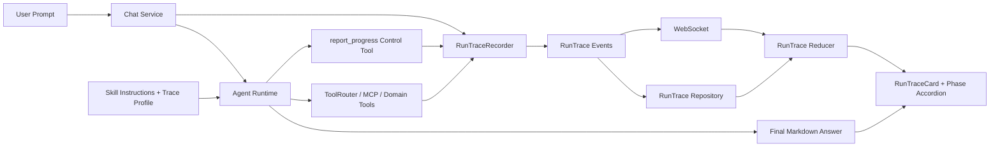

# Agent Run Trace Side Quest 设计方案

## Status

- 文档状态：Draft
- 创建日期：2026-07-15
- 开发分支：`codex/sidequest-run-trace`
- 功能定位：独立 side quest，默认关闭，不阻塞主线开发
- 适配基线：当前 `agent/runtime.py`、`services/chat.py`、skills、ToolRouter、MCP、WebSocket 与 React UI
- 关联文档：`Docs/skills-system-design.md`、`Docs/agent-streaming-refactor-plan.md`、`Docs/runtime-tool-discovery-design.md`

## 背景

目标效果来自一类“领域研究 agent”界面：用户提交问题后，界面除最终回答外，还展示一个可折叠的执行过程，包括：

1. 规划：查询计划、准备步骤、预计使用的数据源。
2. 思考：比较指标、证据判断、追加查询的原因。
3. 执行：工具调用、查询结果、成功和失败计数。
4. 汇总：结论、证据不足说明、最终推荐。

阶段及子项由具体任务动态生成，查询结果和工具明细可以继续展开。最终回答需要支持标题、列表、表格等 Markdown 内容。当关键证据不足时，agent 应明确展示已完成的查询、缺失的数据和无法形成可靠结论的原因。

该效果不是单一 skill 或单一 UI 组件能够完成的，而是以下能力的组合：

- skill 提供领域工作流、质量门槛和可选的轨迹展示模板；
- ToolRouter、MCP 和领域查询工具负责产生事实与外部结果；
- agent runtime 负责生成和约束结构化运行轨迹；
- WebSocket 和数据库负责流式传输、持久化与回放；
- UI 负责渲染固定的数据协议，而不是解释任意模型文本。

## 当前实现基线

Automata 已经具备可复用的底座：

- `api/automata_api/agent/runtime.py` 已输出 `agent_step`、`token`、`tool_call`、`tool_result` 和内部 `final` 事件。
- `api/automata_api/agent/llm.py` 能解析和累积 provider 的 `reasoning_content`，但 runtime 默认不将其发送给 UI。
- `api/automata_api/services/chat.py` 已将 agent 事件转发到 WebSocket，并持久化最终消息和工具运行消息。
- `api/automata_api/agent/tools/router.py` 已统一管理 backend、deferred tool、`tool_search` 和 MCP tool 的暴露与执行。
- `api/automata_api/agent/skills/*` 已支持 skill 发现、摘要注入、显式选择和本回合完整 `SKILL.md` 注入。
- `ui/src/components/conversation/ToolCard.tsx` 已有连续工具调用分组、折叠展开、成功/失败状态和详情展示。
- `ui/src/state/chatReducer.ts` 已能增量处理 token 和工具运行状态。

当前缺口：

- `agent_step` 表示第几次调用模型，不表示一个稳定、用户可见的“思考步骤”。
- `reasoning_content` 没有结构化语义，不应直接成为 UI 或持久化协议。
- WebSocket 没有 run、phase、trace item、artifact 等运行轨迹事件。
- `messages` 只区分普通消息和 `tool_run`，没有可独立回放的 run trace。
- 前端只把 `agent_step` 用作连接状态文字，没有把它放入会话内容。
- 最终回答仍以普通 `<p>` 渲染，不支持 GFM 表格等富 Markdown 结构。
- skills 后端事件尚未完整接入前端，Composer 也没有结构化 skill 选择 UI。

## 核心结论

### 1. 展示“公开运行摘要”，不展示原始思维链

本方案中的“思考”是用户可见的执行摘要，例如：

- 正在比较哪些指标；
- 当前证据支持或不支持什么；
- 为什么要追加某类查询；
- 最终方案选择依据是什么。

它不等于 provider 的原始 `reasoning_content`。原始 reasoning 存在以下问题：

- provider 可选，不同模型格式不一致；
- 内容是自由文本，无法稳定映射为阶段和步骤；
- 可能冗长、重复、包含未验证假设或与最终回答不一致；
- 无法作为长期兼容的产品协议。

因此：

- `reasoning_content` 继续只作为 provider 上下文兼容字段；
- 不把它发送到 WebSocket，不写入 RunTrace，不在 UI 展示；
- 用户可见分析由受约束的 `report_progress` 数据生成；
- 成功数、失败数、工具名、耗时等事实由 runtime 根据真实事件计算，不能由模型填写。

### 2. Skills 只声明工作流和展示模板，不拥有执行权限

延续 `Docs/skills-system-design.md` 的边界：Skills 是上下文指令层，不是工具执行层。

Skill 可以：

- 指导模型何时调用 `report_progress`；
- 声明建议展示的阶段、标签和顺序；
- 说明需要哪些查询工具、MCP 能力和质量门槛；
- 指导证据不足时如何停止推断并形成缺失数据说明。

Skill 不可以：

- 注册或实现任意工具；
- 直接发送 WebSocket 事件；
- 写入 RunTrace 数据库；
- 注入 HTML、React 组件或任意前端代码；
- 绕过 ToolRouter、MCP grant、Plan mode 或其他运行时策略。

### 3. “规划阶段”与现有 Plan mode 必须分离

RunTrace 中的“规划”只是一次 agent reply 内的可观察阶段，不需要用户批准。

Automata 当前 Plan mode 是一套持久化、可批准、批准后执行的业务流程。两者不能共用 `session_plans`、`PlanBubble` 或 plan 状态：

- RunTrace phase：描述一次运行正在做什么。
- Plan mode：用户明确要求先设计并批准实施方案。

MVP 只为普通 act reply 启用 RunTrace。以后如需支持 Plan mode，也使用独立的 trace run，但不改变 plan 审批语义。

## 设计目标

1. 支持类似“规划、思考、执行、汇总”的动态可折叠运行轨迹。
2. 工具状态、成功失败和查询结果引用来自真实运行数据。
3. 模型能够提交结构化、用户可见的公开进度摘要。
4. 轨迹在流式过程中增量更新，刷新页面后可以回放。
5. Skill 可以声明轨迹 profile，但不能扩展执行权限或渲染任意代码。
6. 功能默认关闭；关闭时保持当前事件顺序、数据库写入和 UI 行为。
7. 改动尽量采用新增模块和可选参数，避免重写现有 agent loop。
8. 对事件数量、文本长度和 artifact 大小设置硬限制。

## 非目标

- 不展示或持久化原始 chain-of-thought / `reasoning_content`。
- 不在本 side quest 中实现通用工作流引擎或 DAG 调度器。
- 不改变现有 Plan mode 的审批和执行流程。
- 不让 skills 注册工具、React renderer 或数据库 schema。
- 不实现插件市场、远程 trace renderer 下载或任意 UI DSL。
- 不保证任意 provider 都会主动产生高质量公开摘要；必须有无摘要时的降级路径。
- 不把完整工具输出复制进 RunTrace；轨迹只保存摘要和引用。

## 总体架构



运行时原则：

- Runtime 是轨迹事实的权威来源。
- `RunTraceRecorder` 是单次 reply 生命周期内的状态机和事件序列器。
- `report_progress` 是 runtime extension 提供的 control tool，不是 skill tool。
- ToolRouter 仍是所有模型工具调用的唯一执行入口。
- UI 只消费版本化结构，不解析模型自定义标记或 HTML。

## 领域模型

### Run

一次 prompt 对应一个 run：

```python
RunTraceState = {
    "schema_version": 1,
    "run_id": "uuid",
    "session_id": "uuid",
    "request_message_id": "uuid",
    "response_message_id": None,
    "mode": "act",
    "status": "running",
    "started_at": "iso8601",
    "completed_at": None,
    "phases": [],
}
```

Run 状态：

- `running`
- `completed`
- `failed`
- `cancelled`

### Phase

默认 profile：

| phase id | 默认标签 | 数据来源 |
| --- | --- | --- |
| `planning` | 规划 | `report_progress` 的 query plan / preparation item |
| `analysis` | 思考 | `report_progress` 的公开分析摘要 |
| `execution` | 执行 | runtime 派生的 tool call/result 和 artifact 引用 |
| `summary` | 汇总 | 首个最终回答 token、最终结论和完成状态 |

Phase 状态：

- `pending`
- `running`
- `completed`
- `failed`
- `skipped`

Phase 不要求固定为四个。MVP UI 支持标准四阶段，协议允许 skill profile 增加 `custom` phase，但自定义 phase 仍只能使用核心 item 类型。

### Trace Item

MVP item 类型：

- `public_summary`：公开分析或阶段说明；
- `query_plan`：查询计划中的一个步骤；
- `decision`：阶段性选择或排除理由；
- `warning`：证据不足、降级、部分失败；
- `metric`：runtime 派生的数字，例如成功数、失败数、查询行数；
- `tool_group_ref`：指向现有工具运行消息组；
- `artifact_ref`：指向表格、查询结果等结构化产物。

每个 item 必须包含稳定 `item_id`，更新时使用 upsert，不依赖数组位置：

```json
{
  "item_id": "analysis-conductivity-tradeoff",
  "phase_id": "analysis",
  "kind": "public_summary",
  "title": "比较残留水和离子电导率",
  "summary": "两步法降低残留水，但现有数据表明溶胀度明显上升。",
  "status": "completed",
  "evidence_refs": ["tool-call-17", "artifact-query-3"]
}
```

限制：

- `title` 和 `summary` 使用纯文本；
- 禁止 HTML；
- `summary` 默认最大 2 KiB；
- `evidence_refs` 只能引用当前 run 已知对象；
- 模型不能提交 `success_count`、`failure_count` 或耗时等事实字段。

### Artifact

MVP artifact 类型：

- `table`：有限行列的结构化数据；
- `key_value`：指标摘要；
- `text_excerpt`：查询结果摘要；
- `tool_result_ref`：对现有工具结果的引用。

Artifact 只存储展示所需的小型结构或引用，不复制完整 stdout、数据库响应或文件内容。

默认限制：

- 每个 run 最多 500 个 trace events；
- 每个 run 最多 100 个 items；
- 每个 table 最多 200 行、20 列；
- 每个 cell 最大 1 KiB；
- 单个 event JSON 最大 32 KiB；
- 单个 run 持久化 payload 总量默认最大 2 MiB。

超过限制时，recorder 产生一个 `warning` item 并停止接收新的低优先级内容，但继续维护 run 完成状态。

## WebSocket 事件协议

使用单一 envelope，避免为每种 operation 扩大顶层 SocketPayload union：

```json
{
  "type": "run_trace",
  "schema_version": 1,
  "run_id": "uuid",
  "seq": 12,
  "event": "item_upsert",
  "data": {}
}
```

`event` 初始集合：

- `run_started`
- `phase_upsert`
- `item_upsert`
- `artifact_upsert`
- `run_completed`
- `run_failed`
- `run_cancelled`

协议规则：

1. `seq` 在单个 run 内从 1 单调递增。
2. UI 对重复 `seq` 幂等忽略。
3. 如果出现 sequence gap，UI 将 run 标记为可能不完整，并在连接恢复后从 REST API 刷新。
4. `phase_upsert`、`item_upsert` 和 `artifact_upsert` 依赖稳定 id。
5. WebSocket 事件和数据库事件使用完全相同的 envelope。
6. 未识别的 `event` 在同一 schema major version 内必须安全忽略。

当前 `started` 事件在功能启用时增加可选 `run_id`，关闭时保持原样：

```json
{
  "type": "started",
  "session_id": "uuid",
  "prompt": "...",
  "run_id": "uuid"
}
```

`done` 事件同样可以增加可选 `run_id`。这些字段是向后兼容扩展。

## RunTraceRecorder

新增建议模块：

```text
api/automata_api/agent/trace/
  __init__.py
  model.py
  events.py
  recorder.py
  limits.py
  profile.py
  progress_tool.py
  provider.py
```

职责划分：

- `model.py`：run、phase、item、artifact 和状态类型；
- `events.py`：版本化 event envelope 和序列化；
- `recorder.py`：状态转换、sequence、upsert、限制和事件队列；
- `limits.py`：长度、数量和 payload 预算；
- `profile.py`：默认 profile 与 skill profile 解析结果；
- `progress_tool.py`：`report_progress` control tool；
- `provider.py`：把 control tool 作为 `ToolDescriptor` 提供给 ToolRouter。

Recorder API 示例：

```python
class RunTraceRecorder:
    def start_run(self) -> RunTraceEvent: ...
    def upsert_phase(self, phase: TracePhase) -> RunTraceEvent: ...
    def upsert_item(self, item: TraceItem) -> RunTraceEvent: ...
    def observe_tool_call(self, event: dict) -> tuple[RunTraceEvent, ...]: ...
    def observe_tool_result(self, event: dict) -> tuple[RunTraceEvent, ...]: ...
    def begin_summary(self) -> tuple[RunTraceEvent, ...]: ...
    def complete(self, response_message_id: str) -> tuple[RunTraceEvent, ...]: ...
    def fail(self, public_error: str) -> tuple[RunTraceEvent, ...]: ...
```

Recorder 不依赖 FastAPI、WebSocket、React 或 repository。Service 负责消费 recorder 事件并转发/持久化。

## `report_progress` Control Tool

### 定位

`report_progress` 用于模型提交公开进度摘要。它是 Automata runtime 提供的核心 control tool，而不是外部工具或 skill 注册工具。

建议输入 schema：

```json
{
  "phase": "analysis",
  "item_id": "conductivity-tradeoff",
  "kind": "public_summary",
  "title": "比较离子电导率与溶胀度",
  "summary": "当前数据表明提高电导率的方案同时提高了溶胀度。",
  "status": "completed",
  "evidence_refs": ["call_7"]
}
```

运行规则：

- 只接受当前 trace profile 中存在的 phase；
- 只接受公开 item 类型；
- 验证长度、引用和状态转换；
- 返回紧凑成功结果，不把完整 item 再复制进 tool result；
- tool 自身不计入“执行成功/失败”统计；
- UI 不将其作为普通 ToolCard 显示；
- recorder 产生的 `item_upsert` 才是用户可见结果。

### ToolRouter 接入

扩展 `create_mcp_tool_runtime()`，增加默认空的额外 provider 参数：

```python
create_mcp_tool_runtime(
    ...,
    extra_sync_providers=(),
)
```

功能启用时，service 创建 `RunTraceRecorder` 和 `TraceControlToolProvider`，并将 provider 传入 builder。功能关闭时仍只注册当前 `BackendToolProvider` 和 MCP providers。

Control tool descriptor 需要带有可识别分类，例如：

```python
ToolDescriptor(
    ...,
    source="runtime_trace",
    category="control",
)
```

`category` 默认为 `execution`，因此现有 descriptor 不需要修改调用方。Runtime/Service 根据 category 决定是否持久化为普通 `tool_run`、是否计入执行统计。不要只根据工具名字符串做长期判断。

### 降级行为

模型没有调用 `report_progress` 时：

- run 仍正常完成；
- execution phase 仍由真实工具事件生成；
- summary phase 仍由最终 token/final 生成；
- planning/analysis phase 可以标记为 `skipped`；
- 最终回答不受影响。

因此轨迹增强不能成为 agent 正常回答的前置条件。

## Runtime 与 Service 接入

建议调用链：

```text
chat router
  -> save user message
  -> stream_agent_reply(request_message_id=...)
     -> load feature config
     -> create RunTraceRecorder?           # enabled only
     -> create backend
     -> create MCP/tool runtime(+ trace provider)
     -> create skill turn context
     -> resolve trace profile
     -> start run / send started
     -> stream_agent_loop(..., trace_recorder=...)
        -> observe agent lifecycle
        -> observe tool_call/tool_result
        -> flush trace events
     -> save final agent message
     -> complete run(response_message_id)
     -> send done
```

窄改点：

- `routers/chat.py` 将已保存的 `user_message["id"]` 传给 `stream_agent_reply()`。
- `services/chat.py` 负责 recorder 生命周期、repository 调用和 WebSocket 发送。
- `agent/runtime.py` 只增加可选 `trace_recorder` 或 transport-neutral observer，不导入 service/repository。
- `stream_execute_tool_call()` 在执行前后通知 observer。
- 第一个最终正文 token 出现时启动 summary phase。
- 所有新参数默认 `None`，功能关闭时保持当前行为。

错误处理：

- provider、backend 或工具链抛错：run 标记 `failed`，写入经过清洗的公开错误摘要；
- WebSocket 断开导致取消：在 `finally` 中 best-effort 标记 `cancelled`；
- trace repository 写入失败：记录 warning，停止轨迹持久化，但不使 agent reply 失败；
- trace UI/事件发送失败不能改变工具执行结果和最终回答。

## 持久化设计

新增独立表，不修改 `messages.kind` 约束，也不把 run phase 混入普通消息：

```sql
CREATE TABLE IF NOT EXISTS agent_runs (
    id TEXT PRIMARY KEY,
    session_id TEXT NOT NULL,
    request_message_id TEXT NOT NULL,
    response_message_id TEXT,
    mode TEXT NOT NULL,
    status TEXT NOT NULL,
    schema_version INTEGER NOT NULL,
    started_at TEXT NOT NULL,
    completed_at TEXT,
    FOREIGN KEY (session_id) REFERENCES sessions(id) ON DELETE CASCADE,
    FOREIGN KEY (request_message_id) REFERENCES messages(id) ON DELETE CASCADE,
    FOREIGN KEY (response_message_id) REFERENCES messages(id) ON DELETE SET NULL
);

CREATE TABLE IF NOT EXISTS agent_run_events (
    run_id TEXT NOT NULL,
    sequence INTEGER NOT NULL,
    event_type TEXT NOT NULL,
    payload_json TEXT NOT NULL,
    created_at TEXT NOT NULL,
    PRIMARY KEY (run_id, sequence),
    FOREIGN KEY (run_id) REFERENCES agent_runs(id) ON DELETE CASCADE
);
```

表可以随 schema 初始化以 additive 方式创建；功能关闭时不写入任何 run 数据。不要把启用状态存进 session 数据库，MVP 使用配置即可。

建议 API：

```text
GET /sessions/{session_id}/runs
GET /runs/{run_id}
GET /runs/{run_id}/events?after_sequence=42
```

`GET /runs/{run_id}` 返回 reducer 可直接消费的 snapshot；events endpoint 用于重连补发和调试。第一阶段也可以只返回 events，由后端公共 reducer 物化 snapshot，但 UI 和后端必须共享协议测试 fixture，避免状态重放不一致。

## Skill Trace Profile

在可选 `agents/openai.yaml` 中增加声明式配置：

```yaml
trace:
  profile: research
  phases:
    - id: planning
      label: 规划
      allowed_item_kinds: [query_plan, warning]
    - id: analysis
      label: 思考
      allowed_item_kinds: [public_summary, decision, warning]
    - id: execution
      label: 执行
      allowed_item_kinds: [metric, tool_group_ref, artifact_ref, warning]
    - id: summary
      label: 汇总
      allowed_item_kinds: [public_summary, decision, warning]
```

Loader 扩展：

- 在 `SkillMetadata` 中新增可选 `trace_profile`；
- 校验 phase id、标签长度、item 类型白名单和最大 phase 数；
- 未声明时使用默认 profile；
- 非法 profile 产生 skill warning，回退默认 profile，不阻断 skill 注入。

多 skill 冲突规则：

1. 结构化 payload 中第一个被选择且声明 profile 的 skill 获胜；
2. `$skill-name` 解析顺序随后；
3. 其余 profile 产生 warning，但 skills 本身仍全部注入；
4. 不合并 phase 列表，避免不可预测的 UI 结构。

Skill 正文应指导模型：

- 在形成查询计划后提交 query plan items；
- 在证据判断变化时更新相同 item id，而不是不断新增；
- 在证据不足时提交 warning；
- 不在 progress summary 中声称未由工具结果支持的数字；
- 最终回答仍使用正常正文，不通过 `report_progress` 传输完整答案。

## 前端设计

新增建议结构：

```text
ui/src/types/runTrace.ts
ui/src/state/runTraceReducer.ts
ui/src/api/runTrace.ts
ui/src/components/conversation/RunTraceCard.tsx
ui/src/components/conversation/TracePhase.tsx
ui/src/components/conversation/TraceItem.tsx
ui/src/components/conversation/TraceArtifact.tsx
ui/src/components/conversation/MarkdownMessage.tsx
```

### State

RunTrace 与普通 `ChatMessage` 分开存储：

```typescript
type RunTraceState = {
  runsById: Record<string, RunTrace>;
  runIdsBySession: Record<string, string[]>;
};
```

不要把每个 phase/item 伪装成 `role: "tool"` 的聊天消息，否则会污染消息序列、持久化映射和未来回放。

Reducer 规则：

- 按 `run_id + seq` 幂等应用事件；
- phase/item/artifact 按 id upsert；
- sequence gap 设置 `needsRefresh=true`；
- 未知 event 安全忽略；
- `run_completed` 后仍允许应用较晚到达但 sequence 更大的合法事件，直到 snapshot 刷新；
- session 切换时保留已加载 run，避免来回切换重复请求。

### Render

`RunTraceCard` 默认折叠，streaming 时自动展开当前 running phase。每个 phase header 显示：

- label；
- 状态；
- item count；
- execution phase 的成功/失败计数；
- warning 数量。

现有 `ToolRunGroup` 应抽取为可嵌套的纯内容组件，供 execution phase 通过 `tool_group_ref` 复用。不要复制工具参数和结果格式化逻辑。

### Markdown

最终 agent 消息增加受控 Markdown/GFM 渲染：

- 支持标题、列表、代码块、链接和 GFM table；
- 默认禁止 raw HTML；
- 外部链接使用安全属性；
- 大表格放入横向滚动容器；
- streaming 时允许不完整 Markdown，完成后重新稳定渲染；
- feature flag 关闭时继续使用现有 `<p>` 行为。

推荐使用成熟 Markdown renderer 和 GFM 插件，不自行用正则解析 Markdown。

## Feature Flags 与隔离策略

建议配置：

```text
AUTOMATA_RUN_TRACE_ENABLED=false
AUTOMATA_RUN_TRACE_MODEL_REPORTING_ENABLED=false
AUTOMATA_RUN_TRACE_MAX_EVENTS=500
AUTOMATA_RUN_TRACE_MAX_PAYLOAD_BYTES=2097152
```

语义：

- `RUN_TRACE_ENABLED=false`：不创建 recorder、不注册 control tool、不发送事件、不写 run 表、不改变当前 UI。
- `RUN_TRACE_ENABLED=true` 且 `MODEL_REPORTING_ENABLED=false`：只展示 runtime 派生的 execution/summary 轨迹，用于先验证事件、存储和 UI。
- 两者都为 true：注册 `report_progress` 并允许 skill 驱动 planning/analysis items。

前端不需要单独持久化 flag。收到 `run_trace` 事件或 REST 返回 run 时才显示组件。Markdown renderer 是否启用可由后端 runtime config 暴露，保证关闭时行为不变。

## 兼容性约束

功能关闭时必须满足：

- 当前 WebSocket 关键事件顺序不变；
- 当前 `started` / `done` payload 的必填字段不变；
- ToolRouter 中没有额外 tool；
- skills 加载和注入逻辑不变；
- 不写 `agent_runs` / `agent_run_events`；
- 当前消息、plan 和 tool run API 响应不变；
- 当前 UI 快照和交互不变；
- 全量现有测试通过。

功能启用时仍需满足：

- `report_progress` 不占用执行成功/失败计数；
- trace 失败不导致 agent 主流程失败；
- tool result 内容仍以现有 tool run message 为权威；
- RunTrace 只保存引用，不复制大结果；
- 不改变 MCP grant、tool_search 或 Plan mode 策略。

## 安全与数据质量

1. 不接收和渲染 raw HTML。
2. 所有模型提交字段执行长度、枚举和引用校验。
3. 服务端计算事实型 metric，忽略模型提交的同名字段。
4. 数据库查询或 MCP artifact 必须经过结构化 adapter，不把任意响应直接解释为 table。
5. 错误摘要去除 API key、Authorization header、本地敏感路径等信息。
6. RunTrace REST API 与 session API 使用相同访问边界。
7. 禁止通过 trace profile 指定组件名、JavaScript、CSS 或远程资源。
8. 轨迹内容只用于展示，不作为下一轮模型上下文的权威事实；下一轮仍使用原始工具结果和正常上下文。

## 测试方案

### Recorder 单元测试

- run/phase/item 状态转换；
- sequence 单调性和重复 upsert；
- 非法 phase、item kind、状态转换和 evidence ref；
- event 数量、文本长度和 payload 预算；
- tool call/result 的成功失败统计；
- control tool 不计入执行统计；
- complete、fail、cancel 的幂等性。

### Runtime 与 ToolRouter 测试

- flag 关闭时 model-visible tools 与当前完全一致；
- flag 开启时仅 act mode 出现 `report_progress`；
- control descriptor category 正确；
- report progress 后产生 item event；
- 普通工具调用产生 execution phase 和 tool ref；
- 无 progress tool 调用时正常降级；
- `reasoning_content` 不出现在 trace events。

### Service 与 Repository 测试

- user message id 正确关联 run；
- trace events 按 sequence 持久化并转发；
- final message id 回填 run；
- provider error -> failed；
- cancellation -> cancelled；
- repository 失败不阻断最终回复；
- events endpoint 支持 `after_sequence`；
- 删除 session 级联删除 run 和 events。

### WebSocket 集成测试

- flag 关闭：现有事件数组和保存内容保持兼容；
- flag 开启：`started(run_id)` -> run trace events -> token -> `done(run_id)`；
- tool call/result 与 execution metric 顺序正确；
- report progress item 在最终回答前增量出现；
- sequence gap 可通过 REST 补齐；
- skill profile warning 不阻断回复。

### UI 测试

- reducer 幂等、upsert、gap 和未知事件；
- phase 折叠、streaming 当前阶段自动展开；
- 成功/失败/warning 计数；
- tool group ref 复用现有组件；
- Markdown table、代码块和恶意 HTML；
- session 重载后 run 与最终消息正确配对；
- feature flag 关闭时使用旧消息渲染。

### 回归测试

```powershell
uv run --directory api --group dev --locked pytest
pnpm --dir ui build
```

## 实施阶段

### S0：协议与 feature flag

状态：`TODO`

- 固化本文档和 JSON fixtures；
- 增加 trace config；
- 定义 model/events/limits；
- 编写 reducer contract fixtures；
- 不接入 agent runtime。

退出条件：协议 fixture 和模型测试通过，功能默认关闭。

### S1：Runtime 派生轨迹

状态：`TODO`

- 实现 `RunTraceRecorder`；
- 观察 tool call/result；
- 自动生成 execution 和 summary phase；
- 通过 WebSocket 发送但暂不提供模型 reporting；
- flag 关闭回归测试通过。

退出条件：不依赖模型配合即可显示真实工具执行统计。

### S2：持久化与回放

状态：`TODO`

- 增加 run/event tables 和 repository；
- 增加 runs/events REST API；
- 支持 session reload 和 after_sequence；
- 处理 failed/cancelled。

退出条件：刷新页面后可以恢复与流式时一致的轨迹。

### S3：前端折叠 UI 与 Markdown

状态：`TODO`

- 增加 RunTrace state/reducer/components；
- 复用 ToolRunGroup；
- 增加 feature-gated Markdown/GFM renderer；
- 完成响应式布局和大表格滚动。

退出条件：使用纯 runtime 派生数据即可形成稳定四阶段外观。

### S4：模型公开摘要与 Skill Profile

状态：`TODO`

- 实现 control descriptor/provider 和 `report_progress`；
- 扩展 MCP runtime builder 的额外 provider 参数；
- 扩展 skill loader/profile；
- 增加 profile 冲突和降级规则；
- 编写领域示例 skill。

退出条件：planning/analysis 子项可以随任务动态生成，且不暴露 raw reasoning。

### S5：可靠性与验收

状态：`TODO`

- 重连补发和 sequence gap 恢复；
- 容量限制、敏感信息清洗和错误隔离；
- 全量 API/UI 测试；
- 使用证据充分和证据不足两类任务手工验收；
- 更新本文档实现状态。

退出条件：满足全部验收标准，并形成是否合入主线的独立决策。

## 分支与提交策略

本功能保持在 `codex/sidequest-run-trace` 开发，不要求主线等待。

建议提交边界：

1. `Document run trace side quest design`
2. `Add gated run trace protocol and recorder`
3. `Persist and replay agent run traces`
4. `Render run traces and Markdown replies`
5. `Add public progress reporting and skill profiles`
6. `Harden run trace recovery and limits`

每个提交必须满足：

- feature flag 关闭的回归测试通过；
- 不包含与该阶段无关的重构；
- 文档中的阶段状态同步更新；
- 可以独立 review 或回滚。

分支应定期同步 `origin/main`。在 S3 MVP 稳定前不要求合入主线；如果主线需要复用某个无副作用基础能力，可以单独 cherry-pick 协议或 Markdown 组件，而不合入完整 side quest。

## 验收标准

1. 默认配置下，现有 agent、tools、skills、Plan mode 和 UI 行为不变。
2. 启用 RunTrace 后，每次 act reply 有稳定 `run_id` 和可回放事件序列。
3. 工具成功/失败计数与真实 `tool_result` 完全一致。
4. 模型未调用 `report_progress` 时仍能正常完成并显示降级轨迹。
5. 模型调用 `report_progress` 时，planning/analysis items 动态更新且通过 schema 校验。
6. UI 可以折叠阶段、展开工具明细和展示有限结构化 artifact。
7. 最终回答支持安全的 Markdown/GFM 表格渲染。
8. 证据不足的任务可以显示已查询内容、缺失证据和停止推断原因。
9. 原始 `reasoning_content` 不进入 WebSocket、RunTrace 数据库或 UI。
10. 刷新、重连、失败和取消后，run 状态可恢复且不会影响会话正常使用。
11. 轨迹内容和数量受预算限制，不复制大规模工具输出。
12. 全量 API 测试和 UI build 通过。

## 最终建议

该功能适合作为 side quest：现有 ToolRouter、MCP、真实流式 agent loop、skills context 和可折叠工具卡片都可以复用，技术上不存在根本阻塞；但其核心不是新增一个 skill，而是新增一个独立、版本化、可回放的 RunTrace 子系统。

实施时应优先完成 runtime 派生轨迹，再增加模型 `report_progress`。这样即使模型不配合或 skill 未触发，系统仍有可靠的执行事实；模型生成的公开摘要只负责增强可读性，不成为正确性和可用性的单点依赖。
