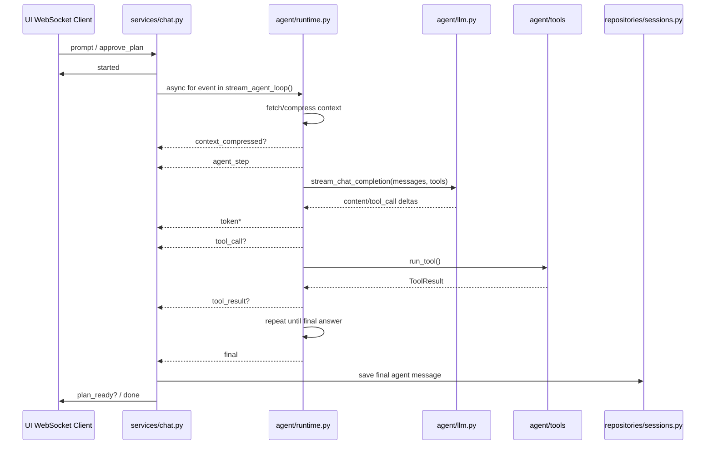

# Agent Loop 异步流式重构方案

## 背景

当前 WebSocket 协议表面上有 `token` 事件，但后端真实链路仍然是“先等待 agent 完整跑完，再把完整文本切片发送”：

- `api/automata_api/services/chat.py` 中 `stream_agent_reply()` 先 `await run_agent_loop()` 得到完整 `response`，再通过 `chunk_text()` 和 `asyncio.sleep()` 模拟流式输出。
- `api/automata_api/agent/runtime.py` 中 `run_model_loop()` 调用的是 `llm.create_llm_response(..., stream=False)`，agent loop 自身不能边生成边产出内容。
- `api/automata_api/agent/llm.py` 虽然已有 `stream_llm_response()`，但它只解析 `delta.content`，没有支持 `tools/tool_choice`、`delta.tool_calls`、`reasoning_content`、结束原因和工具调用参数累积，因此无法驱动完整 agent loop。

因此本次重构的核心不是在 service 层继续切片，而是让 agent runtime 自己成为异步事件源，service 层只负责把事件转发到 WebSocket，并在结束时保存最终消息。

## 目标

1. `agent` 模块提供真正的异步流式 agent loop：`AsyncIterator[AgentLoopEvent]`。
2. LLM 流式客户端支持工具调用模式，能够从 provider SSE 中累积完整 assistant message 和 function call arguments。
3. service 层取消模拟切片和固定 delay，直接消费 agent loop 事件。
4. 保持现有前端协议基本兼容：`started`、`agent_step`、`context_compressed`、`tool_call`、`tool_result`、`token`、`plan_ready`、`done`、`error`。
5. 保持 agent 包边界：`api/automata_api/agent` 不依赖 FastAPI、WebSocket、service 或 router。
6. 保留同步收集式包装器，降低测试和内部调用迁移成本。

## 非目标

- 不改变工具本身的实现方式。
- 不引入后台任务队列或多会话并发调度框架。
- 不在数据库中持久化未完成的 partial token。
- 不强制改造前端 UI；前端当前已经能按 `token` 事件追加文本。

## 总体架构



## 新的 agent 事件模型

在 `api/automata_api/agent/types.py` 中新增 transport-neutral 事件类型。可以先用 `TypedDict`，后续如事件增长再迁移到 dataclass/pydantic。

```python
from typing import Any, Literal, TypedDict

class AgentStepEvent(TypedDict):
    type: Literal["agent_step"]
    step: int
    mode: Literal["act", "plan"]
    message: str

class AgentTokenEvent(TypedDict):
    type: Literal["token"]
    content: str

class AgentToolCallEvent(TypedDict):
    type: Literal["tool_call"]
    tool: str
    arguments: str

class AgentToolResultEvent(TypedDict):
    type: Literal["tool_result"]
    tool: str
    success: bool
    content: str

class AgentFinalEvent(TypedDict):
    type: Literal["final"]
    content: str
    mode: Literal["act", "plan"]

AgentLoopEvent = (
    AgentStepEvent
    | AgentTokenEvent
    | AgentToolCallEvent
    | AgentToolResultEvent
    | AgentFinalEvent
    | dict[str, Any]  # context_compressed 先复用现有结构
)
```

`final` 是 agent 内部事件，不直接暴露给前端。service 收到后负责保存消息，再发送现有的 `done` 或 `plan_ready`。

## LLM 层改造

### 现状问题

当前 `stream_llm_response(messages)` 只支持无工具的文本流：

- payload 没有 `tools` 和 `tool_choice`。
- `parse_stream_chunk()` 只返回 content 字符串。
- 无法解析 OpenAI/DeepSeek 兼容流式工具调用中的 `delta.tool_calls[index].function.arguments` 分片。

### 目标接口

将 `stream_llm_response()` 扩展为可处理工具调用的结构化流，或新增 `stream_chat_completion()`，避免破坏旧测试。

```python
async def stream_chat_completion(
    messages: list[dict[str, Any]],
    tools: list[dict[str, Any]] | None = None,
) -> AsyncIterator[LLMStreamDelta]:
    ...
```

建议 `LLMStreamDelta` 至少包含：

```python
class LLMToolCallDelta(TypedDict, total=False):
    index: int
    id: str
    type: str
    function: dict[str, str]  # name / arguments fragments

class LLMStreamDelta(TypedDict, total=False):
    content: str
    reasoning_content: str
    tool_calls: list[LLMToolCallDelta]
    finish_reason: str | None
```

payload 规则：

```python
payload = {
    "model": config.model,
    "messages": messages,
    "stream": True,
    "temperature": config.temperature,
}
if tools:
    payload["tools"] = tools
    payload["tool_choice"] = "auto"
```

### 工具调用累积器

新增 `AssistantStreamAccumulator`，负责把 delta 合并成当前 assistant message：

```python
class AssistantStreamAccumulator:
    def add(self, delta: LLMStreamDelta) -> None: ...
    def message(self) -> dict[str, Any]: ...
```

累积规则：

- `content` 按顺序拼接。
- `reasoning_content` 按顺序拼接，但默认不向 UI 输出。
- `tool_calls` 按 `index` 聚合。
- 同一 index 下：
  - `id` 取第一次非空值。
  - `function.name` 按 provider delta 拼接或取第一次非空值，需兼容不同 provider 行为。
  - `function.arguments` 按顺序拼接，最终仍保持字符串，让现有 `run_tool()` 继续解析。
- 缺失 id 时沿用现有规范生成 `call_{index}`。
- 最终输出继续复用 `normalize_tool_calls()` 的校验逻辑。

### 内容与工具混合时的策略

provider 理论上可能在同一个 assistant turn 中同时流出 `content` 和 `tool_calls`。推荐策略：

- 如果先收到 `tool_calls`，本轮不向 UI 发送 `token`，只累积到 provider message。
- 如果先收到 `content`，立即发送 `token`，实现真实用户可见流式输出。
- 如果随后又出现 `tool_calls`，保留已经发送的文本，将其作为工具前的 assistant 说明文本，并继续执行工具。为降低这种情况，系统提示中补充约束：调用工具的 assistant turn 不输出用户可见正文。

这个策略的优点是保持真正流式；缺点是极少数 provider 混合输出时，UI 会看到工具前说明文本。相比等整轮结束后再补发 token，这更符合本次“真实流式”的目标。

## Runtime 层改造

### 新增公开流式入口

在 `api/automata_api/agent/runtime.py` 新增：

```python
async def stream_agent_loop(
    *,
    session_id: str,
    store: AgentContextStore,
    approved_plan_content: str | None = None,
) -> AsyncIterator[AgentLoopEvent]:
    ...

async def stream_plan_loop(
    *,
    session_id: str,
    store: AgentContextStore,
) -> AsyncIterator[AgentLoopEvent]:
    ...
```

这两个函数替代 service 曾经直接调用的收集式 agent loop API。

### 移除非流式包装器

流式 API 稳定后，agent runtime 不再保留收集式 wrapper。对外 agent loop
入口只保留 `stream_agent_loop()` / `stream_plan_loop()` / `stream_model_loop()`
和 `stream_execute_tool_call()`。服务层负责消费事件、转发 `token`、拦截
内部 `final` 并持久化最终消息。

### `stream_model_loop()` 伪代码

```python
async def stream_model_loop(...):
    for step in range(1, MAX_AGENT_STEPS + 1):
        yield {
            "type": "agent_step",
            "step": step,
            "mode": mode,
            "message": f"Calling model {model}",
        }

        accumulator = AssistantStreamAccumulator()
        tool_call_started = False
        emitted_text = False

        async for delta in llm.stream_chat_completion(messages, tools=tools):
            accumulator.add(delta)

            if delta.get("tool_calls"):
                tool_call_started = True

            content = delta.get("content")
            if content and (emitted_text or not tool_call_started):
                emitted_text = True
                yield {"type": "token", "content": content}

        assistant_message = accumulator.message()
        tool_calls = assistant_message.get("tool_calls")

        if isinstance(tool_calls, list) and tool_calls:
            messages.append(assistant_message_for_provider(assistant_message))
            for tool_call in tool_calls:
                async for event in stream_execute_tool_call(...):
                    yield event
            messages, events = await compress_loop_context_collecting_events(...)
            for event in events:
                yield event
            continue

        content = assistant_message.get("content")
        if isinstance(content, str) and content.strip():
            yield {"type": "final", "content": content, "mode": mode}
            return

        raise llm.AgentProviderError("LLM provider returned an empty response.")

    raise llm.AgentProviderError(
        f"Agent reached the maximum step limit ({MAX_AGENT_STEPS}) before finishing."
    )
```

### 事件收集与 context compression

`fetch_agent_context()` 和 `compress_loop_context_if_needed()` 当前依赖 `emit_event`。为了减少改动，可以先引入小型事件收集器：

```python
class EventCollector:
    def __init__(self) -> None:
        self.events: list[dict[str, Any]] = []

    async def emit(self, event: dict[str, Any]) -> None:
        self.events.append(event)
```

使用方式：

```python
collector = EventCollector()
messages = await fetch_agent_context(..., emit_event=collector.emit)
for event in collector.events:
    yield event
```

后续可以把 context 函数进一步重构为返回 `(messages, events)`，但第一阶段不必扩大改动面。

### 工具执行流式化

工具调用只通过流式 helper 输出 `tool_call` / `tool_result`：

```python
async def stream_execute_tool_call(...) -> AsyncIterator[AgentLoopEvent]:
    yield {"type": "tool_call", ...}
    result = await run_tool(...)
    yield {"type": "tool_result", ...}
    messages.append(tool_result_for_provider(tool_call, result))
```

## Service 层改造

### 执行模式

`api/automata_api/services/chat.py` 中 `stream_agent_reply()` 改为直接消费 `stream_agent_loop()`：

```python
response_parts: list[str] = []
final_content = ""

async for event in stream_agent_loop(...):
    if event["type"] == "token":
        response_parts.append(event["content"])
        await websocket.send_json(event)
        continue

    if event["type"] == "final":
        final_content = event["content"]
        continue

    await websocket.send_json(event)

response = final_content or "".join(response_parts)
message = save_message(session_id=session_id, role="agent", content=response)
await websocket.send_json({"type": "done", "message": message})
```

同时删除：

- `TOKEN_CHUNK_SIZE`
- `TOKEN_STREAM_DELAY_SECONDS`
- `chunk_text()`
- service 层对完整 response 的模拟切片循环

### Plan 模式

`stream_plan_reply()` 同样消费 `stream_plan_loop()`，但结束时仍需创建 plan：

```python
plan_parts: list[str] = []
final_content = ""

async for event in stream_plan_loop(...):
    if event["type"] == "token":
        plan_parts.append(event["content"])
        await websocket.send_json(event)
    elif event["type"] == "final":
        final_content = event["content"]
    else:
        await websocket.send_json(event)

response = final_content or "".join(plan_parts)
message = save_message(...)
plan = create_plan(...)
await websocket.send_json({
    "type": "plan_ready",
    "session_id": session_id,
    "plan_id": plan["id"],
    "status": plan["status"],
    "content": response,
})
await websocket.send_json({"type": "done", "message": message})
```

当前 UI 在 `plan_ready` 时会把同一个 streaming message 的 `text` 设置为完整 plan 内容，因此即使 plan token 已经提前显示，`plan_ready.content` 也能作为最终权威内容，不会重复追加。

### 错误与取消

- `AgentConfigurationError`、`AgentProviderError`、`httpx.RequestError` 继续映射为 `error`。
- 若 WebSocket 断开，`async for` 被取消时应让 cancellation 传播，provider stream 的 `async with client.stream(...)` 会关闭连接。
- 保持当前行为：失败时不保存 partial agent message，只保存用户 prompt。
- 如果后续需要断点恢复，再单独设计 partial message 持久化，不放入本次重构。

## 前端影响

前端 `ui/src/App.tsx` 已经支持：

- `token`：追加到当前 streaming message。
- `tool_call` / `tool_result`：显示运行事件。
- `plan_ready`：把当前 streaming message 标记为 plan。
- `done`：结束流式状态并刷新会话。

因此第一阶段无需前端协议变更。唯一行为变化是：plan 和最终回答会在 LLM 生成时就逐步出现，而不是等待 agent loop 完成后再模拟出现。

## 测试计划

### LLM 单元测试

新增或调整 `api/tests/test_agent_llm_unit.py`：

- `stream_chat_completion()` payload 带 `tools` 时包含 `tools` 和 `tool_choice=auto`。
- 解析普通文本 SSE：多个 `delta.content` 按顺序产出。
- 解析 `reasoning_content`，但 runtime 默认不透传给 UI。
- 解析工具调用 SSE：
  - 分片 `function.arguments` 能被拼接为完整 JSON 字符串。
  - 缺失 id 时生成 `call_{index}`。
  - 多个 tool call index 能分别累积。
- provider 错误仍抛出 `AgentProviderError`。

### Runtime 单元测试

调整 `api/tests/test_agent_runtime_unit.py`：

- `stream_agent_loop()` content-only 响应按 provider chunk 产出 `token`，最后产出 `final`。
- 工具调用响应能流式累积完整 tool call，发出 `tool_call`、执行工具、发出 `tool_result`，再进入下一轮。
- plan mode 只暴露 `PLAN_TOOL_NAMES`，并继续阻止越权工具。
- 超过 `MAX_AGENT_STEPS` 仍抛错。
- context compression 事件仍然出现在正确位置。
- 非流式 agent loop wrapper 已删除，测试直接消费 `stream_*` API。

### WebSocket 集成测试

调整 `api/tests/test_chat.py`：

- 不再依赖 service 层固定 chunk 大小。
- fake LLM 改为 fake async stream，断言 `token_content(events)` 等于完整回答。
- 对纯文本响应，确认 `token` 在 `done` 之前出现，且不是 `chunk_text()` 切出来的固定 32 字符块。
- plan mode 中可接收 `token`，随后接收 `plan_ready` 和 `done`。
- provider 报错时，不保存 agent 消息。

### 边界测试

保留 `api/tests/test_agent_boundaries.py`，确保 agent 包没有导入：

- `automata_api.services`
- `automata_api.routers`
- `fastapi`

## 阶段管理

### 进度状态定义

每个阶段和任务都使用同一套状态，便于在 PR、commit message 或后续执行记录中引用：

- `TODO`：尚未开始。
- `DOING`：正在实现。
- `REVIEW`：实现完成，等待代码审查或人工确认。
- `BLOCKED`：存在明确阻塞，需要记录阻塞原因和恢复条件。
- `DONE`：代码、测试、文档和验收证据均完成。

建议在每次阶段推进后更新本节状态。任务编号保持稳定，不随实现顺序变化。

### 阶段总览

| 阶段 | 名称 | 状态 | 依赖 | 主要产出 | 退出证据 |
| --- | --- | --- | --- | --- | --- |
| `S0` | 基线与迁移准备 | `DONE` | 无 | 当前假流式行为和测试基线记录 | 记录现有事件顺序、测试结果、风险清单 |
| `S1` | LLM 结构化流式基础设施 | `DONE` | `S0` | 支持 content、reasoning、tool_calls 的 SSE 解析 | `test_agent_llm_unit.py` 相关测试通过 |
| `S2` | Runtime 事件源改造 | `DONE` | `S1` | `stream_agent_loop()` / `stream_plan_loop()` | runtime/context 测试通过 |
| `S3` | Service WebSocket 适配 | `DONE` | `S2` | service 直接转发 agent 事件，删除模拟切片 | chat WebSocket 测试通过 |
| `S4` | 端到端验证与文档更新 | `DONE` | `S3` | API README、手工验证记录、完整测试结果 | 全量 API 测试通过，手工验证完成 |
| `S5` | 清理与兼容策略收口 | `DONE` | `S4` | 决定旧 wrapper 保留周期，清理无用代码 | 无遗留模拟流式代码，兼容说明明确 |

### `S0` 基线与迁移准备

目标：在动代码前固定当前行为和风险边界，避免重构过程中丢失 plan mode、工具调用或上下文压缩语义。

状态：`DONE`

改动文件：

- `Docs/agent-streaming-refactor-plan.md`
- 可选：测试 fixture 或临时验证记录文件

任务清单：

- [x] `S0.1` 记录当前假流式位置：`services/chat.py` 中 `chunk_text()`、`TOKEN_CHUNK_SIZE`、`TOKEN_STREAM_DELAY_SECONDS` 和完整 response 后置发送逻辑。
- [x] `S0.2` 记录当前 WebSocket 事件顺序基线：普通回答、工具调用回答、plan mode、approve_plan。
- [x] `S0.3` 运行当前测试，记录通过/失败结果：`uv run --directory api --group dev --locked pytest`。
- [x] `S0.4` 标记需要重点保护的行为：plan mode 工具白名单、blocked tool result、context compression event、agent 包边界测试。
- [x] `S0.5` 确认前端无需协议升级，只依赖既有 `token`、`plan_ready`、`done` 事件。

退出标准：

- [x] 当前行为和测试基线已记录。
- [x] 后续阶段的风险点已经明确。
- [x] 没有修改运行时代码。

### `S1` LLM 结构化流式基础设施

目标：把 LLM 层从“只流式文本”升级为“可驱动 agent loop 的结构化 SSE 解析器”。

状态：`DONE`

依赖：`S0`

改动文件：

- `api/automata_api/agent/llm.py`
- `api/tests/test_agent_llm_unit.py`

任务清单：

- [x] `S1.1` 定义结构化 delta：`LLMStreamDelta`、`LLMToolCallDelta`，包含 `content`、`reasoning_content`、`tool_calls`、`finish_reason`。
- [x] `S1.2` 新增或扩展 SSE parser，支持 OpenAI-compatible `choices[0].delta` 中的 content、reasoning 和 tool call fragments。
- [x] `S1.3` 实现 `stream_chat_completion(messages, tools=None)`，payload 在有工具时包含 `tools` 和 `tool_choice=auto`。
- [x] `S1.4` 实现 assistant stream accumulator，按 tool call `index` 合并 `id`、`function.name`、`function.arguments`。
- [x] `S1.5` 保留 `create_llm_response()`，context compression 继续使用非流式路径。
- [x] `S1.6` 保留或改造 `stream_llm_response()` 为 content-only 兼容包装器，避免旧调用方瞬间失效。
- [x] `S1.7` 增加单元测试：普通 content 分片、reasoning 分片、单工具调用分片、多工具调用分片、缺失 id、provider error。

退出标准：

- [x] `api/tests/test_agent_llm_unit.py` 通过。
- [x] 工具调用 arguments 分片能合并成完整 JSON 字符串。
- [x] 无 runtime/service 行为改动。

验证命令：

```powershell
uv run --directory api --group dev --locked pytest tests/test_agent_llm_unit.py
```

### `S2` Runtime 事件源改造

目标：让 agent runtime 自己成为异步事件源，负责按真实 provider stream 产出 `token`、工具事件和最终 `final`。

状态：`DONE`

依赖：`S1`

改动文件：

- `api/automata_api/agent/types.py`
- `api/automata_api/agent/runtime.py`
- `api/tests/test_agent_runtime_unit.py`
- `api/tests/test_context_compression.py`

任务清单：

- [x] `S2.1` 在 `types.py` 中定义 `AgentLoopEvent` 及主要事件 TypedDict。
- [x] `S2.2` 增加 `EventCollector` 或等价机制，桥接现有 `fetch_agent_context()` / `compress_loop_context_if_needed()` 的 `emit_event` 模型。
- [x] `S2.3` 实现 `stream_model_loop()`，使用 `llm.stream_chat_completion()` 边接收边 yield `token`。
- [x] `S2.4` 实现 `stream_execute_tool_call()`，按顺序 yield `tool_call`、执行工具、yield `tool_result`、追加 provider tool result message。
- [x] `S2.5` 实现 `stream_agent_loop()`，注入 approved plan 后调用 `stream_model_loop(mode="act")`。
- [x] `S2.6` 实现 `stream_plan_loop()`，使用 plan system prompt 和 `PLAN_TOOL_NAMES`。
- [x] `S2.7` 删除 `run_agent_loop()`、`run_plan_loop()`、`run_model_loop()`、`execute_tool_call()` 非流式 wrapper。
- [x] `S2.8` 更新 runtime 测试：纯文本 token 流、工具调用两轮、plan mode 白名单、blocked tool、max steps、empty response、context compression。
- [x] `S2.9` 运行 agent 边界测试，确认 runtime 没有引入 service/FastAPI 依赖。

退出标准：

- [x] `stream_agent_loop()` 可以直接被 `async for` 消费。
- [x] agent runtime 不再暴露非流式 `run_*_loop()` wrapper。
- [x] 工具调用回合完整维护 provider message：assistant tool_calls -> tool result -> 下一轮 model call。
- [x] runtime/context/boundary 测试通过。

验证命令：

```powershell
uv run --directory api --group dev --locked pytest tests/test_agent_runtime_unit.py tests/test_context_compression.py tests/test_agent_boundaries.py
```

### `S3` Service WebSocket 适配

目标：service 层从“模拟 token 发送者”改为“agent event 转发者和最终持久化协调者”。

状态：`DONE`

依赖：`S2`

改动文件：

- `api/automata_api/services/chat.py`
- `api/tests/test_chat.py`
- 可选：`ui/src/App.tsx`，仅当发现现有事件处理无法覆盖真实流式时修改

任务清单：

- [x] `S3.1` 将 `stream_agent_reply()` 改为消费 `stream_agent_loop()`。
- [x] `S3.2` 将 `stream_plan_reply()` 改为消费 `stream_plan_loop()`。
- [x] `S3.3` 收到 `token` 时立即转发给 WebSocket，同时在 service 内累积最终文本。
- [x] `S3.4` 收到 agent 内部 `final` 时不转发给前端，只作为保存消息的权威内容。
- [x] `S3.5` 对非内部事件直接 `websocket.send_json(event)`，保持前端协议兼容。
- [x] `S3.6` 删除 `TOKEN_CHUNK_SIZE`、`TOKEN_STREAM_DELAY_SECONDS`、`chunk_text()` 和人为 sleep。
- [x] `S3.7` 保持错误语义：配置错误、provider 错误、HTTP 请求错误发 `error`，不保存 partial agent message。
- [x] `S3.8` 保持 plan approval 语义：执行成功后 `mark_plan_executed()`，重复 approval 仍返回 `plan_error`。
- [x] `S3.9` 更新 WebSocket 集成测试，断言 token 来自 fake stream，而不是固定 32 字符切片。

退出标准：

- [x] `services/chat.py` 中不存在模拟流式常量、切片函数或固定 token delay。
- [x] 普通执行、工具调用、plan mode、approve_plan 的 WebSocket 测试通过。
- [x] 前端无需修改即可显示真实 `token` 增量。

验证命令：

```powershell
uv run --directory api --group dev --locked pytest tests/test_chat.py
```

### `S4` 端到端验证与文档更新

目标：确认重构后的行为不仅通过单元测试，也能在实际后端/UI 链路中按预期工作。

状态：`DONE`

依赖：`S3`

改动文件：

- `api/README.md`
- `Docs/agent-streaming-refactor-plan.md`
- 可选：验证记录或 PR 描述

任务清单：

- [x] `S4.1` 更新 `api/README.md`，说明 `token` 现在由 provider SSE 真实驱动。
- [x] `S4.2` 运行全量 API 测试。
- [x] `S4.3` 启动后端：使用 `.\run.ps1 headless` 与真实 Automata API ASGI server + 本地 fake LLM SSE provider 验证。
- [x] `S4.4` 发送无需工具的 prompt，确认首个 token 在完整回答结束前出现。
- [x] `S4.5` 发送需要 `read_file` 的 prompt，确认工具事件出现在两轮模型调用之间，最终回答继续流式。
- [x] `S4.6` 发送 plan mode prompt，确认 plan 内容逐步出现，随后 `plan_ready` 内容与最终保存内容一致。
- [x] `S4.7` approve plan，确认执行 token 流、`done` 和 plan 状态更新为 `executed`。
- [x] `S4.8` 记录手工验证结果和任何剩余风险。

退出标准：

- [x] 全量 API 测试通过。
- [x] 手工验证覆盖普通回答、工具调用、plan、approve_plan。
- [x] README 和本方案中的实现状态已更新。

验证命令：

```powershell
uv run --directory api --group dev --locked pytest
```

### `S5` 清理与兼容策略收口

目标：在真实流式链路稳定后，清理过渡代码并明确 wrapper 的保留周期。

状态：`DONE`

依赖：`S4`

改动文件：

- `api/automata_api/agent/runtime.py`
- `api/automata_api/agent/llm.py`
- `api/tests/*`
- `api/README.md`

任务清单：

- [x] `S5.1` 搜索并确认仓库中没有 service 层模拟流式输出：`rg -n "chunk_text|TOKEN_CHUNK_SIZE|TOKEN_STREAM_DELAY_SECONDS|sleep\\(" api`。
- [x] `S5.2` 搜索旧 API 使用点：`rg -n "run_agent_loop|run_plan_loop|run_model_loop|execute_tool_call" api`。
- [x] `S5.3` 决定兼容 wrapper 保留策略：不再保留 agent loop 非流式 wrapper。
- [x] `S5.4` 若保留 wrapper，补充注释说明它们只用于测试或非流式调用场景。当前选择删除 wrapper，因此无需保留注释。
- [x] `S5.5` 若删除 wrapper，同步删除旧测试路径并更新所有调用方。
- [x] `S5.6` 最后运行全量测试和边界测试。

退出标准：

- [x] 无假流式实现残留。
- [x] wrapper 删除策略已记录。
- [x] 全量测试通过。

验证命令：

```powershell
rg -n "chunk_text|TOKEN_CHUNK_SIZE|TOKEN_STREAM_DELAY_SECONDS|sleep\\(" api
rg -n "run_agent_loop|run_plan_loop|run_model_loop|execute_tool_call" api
uv run --directory api --group dev --locked pytest
```

### 阶段更新模板

每推进一个阶段，建议在 PR 描述或本文件追加如下记录：

```text
阶段：S2 Runtime 事件源改造
状态：<TODO|DOING|REVIEW|BLOCKED|DONE>
完成任务：S2.1, S2.2, S2.3
阻塞：无
验证：uv run --directory api --group dev --locked pytest tests/test_agent_runtime_unit.py
下一步：S2.4 stream_execute_tool_call
```

当前进度记录：

```text
阶段：S5 清理与兼容策略收口
状态：DONE
完成任务：S0.1-S0.5, S1.1-S1.7, S2.1-S2.9, S3.1-S3.9, S4.1-S4.8, S5.1-S5.6
阻塞：无
验证：uv run --directory api --group dev --locked pytest -> 118 passed
端到端：本地 fake LLM SSE provider + Automata API WebSocket -> plain/tool/plan/approve 均出现 provider-driven token 后 done
启动方式：.\run.ps1 headless + fake LLM SSE provider -> started/agent_step/token/token/done, token_text=headless stream ok
残留检查：rg -n "chunk_text|TOKEN_CHUNK_SIZE|TOKEN_STREAM_DELAY_SECONDS|sleep\(" api -> no matches
兼容策略：删除 agent runtime 的 run_*_loop/execute_tool_call 非流式 wrapper；仅保留 LLM 层 stream_llm_response 纯文本 helper
下一步：无
```

## 兼容性与风险

- **工具调用流式解析复杂度**：最大风险在 provider 的 `delta.tool_calls` 兼容细节。需要用单元测试覆盖常见 OpenAI-compatible 格式。
- **content 与 tool_calls 混合输出**：采用“先出现 content 就流式输出”的策略。系统提示应要求工具调用 turn 不输出正文，以减少混合事件。
- **错误后的 partial token**：本方案保持当前持久化语义，失败不保存 agent 消息。UI 可能已经看过 partial token，随后显示 error，这是流式系统的正常行为。
- **旧测试对事件顺序的假设**：plan mode 会新增真实 `token` 事件，测试需要从“精确事件数组”改为“关键事件顺序 + token 拼接内容”。
- **上下文压缩仍用非流式总结**：`create_context_summary()` 可继续使用 `create_llm_response()`，因为这是内部压缩任务，不需要用户可见 token。

## 验收标准

1. service 层不存在 `chunk_text()`、固定 chunk size 或人为 token delay。
2. 普通回答的 `token` 事件由 provider SSE 直接驱动。
3. agent loop 在工具调用前后仍能正确维护 provider messages。
4. plan mode 和 approve_plan 现有业务语义不变。
5. 所有 API 测试通过。
6. `api/automata_api/agent` 仍不依赖 FastAPI/service/router。
