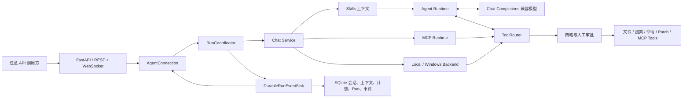

# Automata 通用智能体后端介绍

> - 文档状态：Current Implementation Overview
> - 代码基线：`main` @ `22edc04`（2026-07-20）
> - 范围：仅介绍 `api/` 下的后台智能体、运行时和服务接口，不包含任何前端 UI

## 一句话定义

Automata 是一个运行在本地工作区中的、由大语言模型驱动的通用任务智能体后端。它把持续会话、模型推理、工具调用、执行审批、计划工作流、MCP 外部能力、Skills 专业知识和可恢复的 Run 生命周期组合为一套 FastAPI 服务，使调用方能够用自然语言驱动真实的文件、搜索、命令和外部工具操作。

从当前代码看，Automata 最准确的定位是：**以本地工作区自动化为核心、以软件工程任务为默认工作面、可通过 Backend、MCP 和 Skills 扩展到更多领域的通用智能体执行内核。**

这里的“通用”不表示系统已经内置所有行业能力，而是表示核心运行时不绑定某个固定业务流程：模型负责理解任务和选择动作，工具提供可执行能力，Skills 提供领域方法，MCP 接入外部系统，会话和 Run 层负责让整个过程可管理、可追踪、可恢复。

## 它能解决什么问题

在不修改后端主循环的前提下，Automata 可以承载以下类型的任务：

- 理解一个本地项目，搜索代码和文档，读取文件并形成有依据的结论；
- 按用户要求创建或修改文本文件，应用补丁，执行构建、测试、脚本或其他命令；
- 先进行只读调查并产出可持久化计划，再由调用方批准计划后进入执行；
- 通过 MCP 调用数据库、内部服务、自动化平台或其他工具服务；
- 通过 `SKILL.md` 为特定仓库、团队或领域注入可复用的操作规范和知识；
- 在长会话中保留上下文，并在上下文过大时生成独立摘要；
- 在连接中断后查询 Run 和事件并按序补取，而不是把一次任务完全绑定在单个 WebSocket 连接上。

当前内置工具明显偏向代码与本地工作区，因此它已经是一套可用的工程智能体；若要把它用于数据分析、运维、内容生产或企业流程，主要扩展点是 MCP 工具、Skills 和 Backend，而不是重写 agent loop。

## 后端整体结构



主要边界如下：

| 层 | 当前职责 | 主要代码 |
| --- | --- | --- |
| API 与连接 | HTTP 鉴权、会话/Run/MCP/Skills 路由、WebSocket 消息分发与事件恢复 | [`main.py`](../api/automata_api/main.py)、[`services/connection.py`](../api/automata_api/services/connection.py) |
| Run 协调 | 创建后台任务、限制同会话并发、取消、审批、结束状态和启动恢复 | [`execution/coordinator.py`](../api/automata_api/agent/execution/coordinator.py) |
| 应用编排 | 为每次回复装配 Backend、MCP、Skills、上下文和工具执行器 | [`services/chat.py`](../api/automata_api/services/chat.py) |
| Agent 循环 | 调用模型、累积流式响应、执行工具调用、回填工具结果、控制最大步数 | [`agent/runtime.py`](../api/automata_api/agent/runtime.py) |
| 工具路由 | 工具发现、直接/延迟/隐藏暴露、`tool_search` 激活和统一 dispatch | [`tools/router.py`](../api/automata_api/agent/tools/router.py) |
| 执行安全 | 风险分类、审批、取消令牌和子进程树终止 | [`execution/`](../api/automata_api/agent/execution/) |
| 持久化 | SQLite schema、会话、消息、上下文摘要、计划、Run 和顺序事件 | [`db/`](../api/automata_api/db/)、[`repositories/`](../api/automata_api/repositories/) |

## 一次任务如何运行

1. 调用方先创建 Session。Session 固定保存 `working_directory` 和 `backend`，因此不同会话可以面向不同工作区和执行环境。
2. 调用方通过 `/ws/chat` 发送 `prompt`。后端把用户消息和 Run 在同一个数据库事务中创建，并将执行交给 `RunCoordinator` 的后台 task。
3. Chat Service 根据 Session 配置创建 `local` 或 `windows` Backend，发现已经授权的 MCP servers，并加载当前工作区可用的 Skills。
4. Runtime 组合系统提示、历史上下文、上下文摘要、可用 Skill 清单、显式选中的 Skill 正文和当前可见工具，然后调用 Chat Completions 兼容的模型接口。
5. 如果模型请求工具，Runtime 发出 `tool_call`，执行编排器先做策略判断；需要审批时，Run 进入 `waiting_approval`，收到允许后才真正 dispatch。
6. 工具结果作为 `tool_result` 事件返回，同时以 provider tool message 追加到模型上下文，模型据此继续下一步推理。
7. 模型给出最终文本后，Run 进入终态。当前单个 agent loop 最多执行 6 个模型步骤，超限会以 provider error 结束，而不会无限循环。
8. 运行期间的事件先写入 SQLite，再广播给已连接的调用方。连接断开不会直接取消 Run；调用方可以随后通过 REST 查询，或使用 `resume_run` 从指定 `seq` 继续补取事件。

## 核心能力

### 1. 可执行，而不只是对话

默认 Backend 提供真实的本地工作区工具：

| 工具 | 能力 | 关键边界 |
| --- | --- | --- |
| `read_file` | 按行读取 UTF-8 文本 | 路径必须位于工作区；单次内容最多返回 120,000 字符 |
| `rg` / `grep` | 在工作区搜索 | `rg` 会按 `ripgrep -> grep -> bash` 回退；有超时和输出上限 |
| `write_file` | 创建、覆盖或追加 UTF-8 文件 | 路径必须位于工作区；属于写入操作，需要审批 |
| `apply_patch_preview` | 校验并预览补丁 | 只读，不写文件，可在 Plan 模式使用 |
| `apply_patch` | 添加、修改、移动或删除文件 | 支持 Codex-style patch 和 unified diff；删除会升级为 destructive 风险 |
| `exec_command` | 以 Bash 或 PowerShell 执行一次性命令 | cwd 限制在工作区；默认超时 30 秒、最大 120 秒；输出默认上限 20,000 字符、最大 60,000 字符 |
| `run_bash` | Bash 兼容命令工具 | 保留用于兼容；有超时、输出截断和进程树终止 |
| `run_powershell` | Windows 专用 PowerShell 命令 | 仅由 `windows` Backend 额外提供，使用非交互模式 |

这些工具返回结构化的成功状态、真实路径、退出码、stdout/stderr、超时和截断信息。Runtime 不会仅根据模型措辞认定动作成功，而是把真实工具结果交回模型继续判断。

### 2. Act 与 Plan 两种运行模式

- **Act 模式**：模型可以使用当前策略允许的读、写、命令和外部工具来完成任务。
- **Plan 模式**：后端只暴露并允许只读工具。内置可用项为 `read_file`、`rg`、`grep`、`apply_patch_preview`，符合条件的只读 deferred 工具可通过 `tool_search` 激活；写入和命令即使被模型直接请求，也会被运行时以 `blocked_by_plan_mode` 拒绝。

Plan 不是临时聊天文本，而是保存到 `session_plans` 的持久化对象。新计划会 supersede 同 Session 中旧的 pending 计划。批准后，计划正文作为系统上下文进入正常 Act loop。失败的计划执行可以重试，但调用方必须明确确认“可能产生重复副作用”；`request_id` 用于避免相同请求重复创建执行尝试。

### 3. 会话记忆与上下文压缩

Automata 分开保存三类信息：

- 面向调用方展示的 `messages`；
- 供模型继续推理的 `agent_context_messages`，其中保留 assistant tool call 和 tool result 协议消息；
- 独立的 `session_context_summaries`，用于压缩较早的历史，而不改写可见消息。

默认只直接装载最近 24 条上下文消息。上下文压缩默认开启，基于配置的模型上下文规模、触发比例和字符估算计算阈值；超过阈值时使用同一个模型生成隐藏摘要。Runtime 也会在工具循环过大时压缩最近的工具活动。压缩失败会被记录并跳过，不会伪造摘要。

### 4. 持久化 Run、事件和恢复

Run 是独立于消息的一级对象，类型包括普通执行、计划生成和计划执行。状态机覆盖：

`queued -> running -> waiting_approval -> running -> completed/failed/cancelled/interrupted`

当前实现保证：

- 同一个 Session 同时最多只有一个非终态 Run，约束同时存在于代码和 SQLite 唯一索引；
- 每个事件都有单调递增的 `seq`、`run_id`、`session_id` 和 `schema_version=1`；
- token 事件会按默认 4,096 字符或 100 ms 聚合后持久化，单事件默认不超过 65,536 bytes；
- 调用方可以按 cursor 查询事件，或在 WebSocket 中请求 replay；
- 用户取消会传播到 agent loop、审批等待和受监管的子进程树；
- API 重启后，旧实例遗留的非终态 Run 会被标记为 `interrupted`，不会被错误地当作仍在运行；
- 终态 Run 的历史事件默认保留 30 天，最后一个终态事件保留。

这里的“恢复”是状态与事件恢复，不是进程重启后自动继续未完成的模型推理。被标记为 `interrupted` 的任务需要调用方决定后续操作。

### 5. MCP 外部工具扩展

Automata 已实现 MCP `tools/list` 和 `tools/call`，支持：

- stdio transport；
- Streamable HTTP transport；
- 多 server 工具发现；
- server/tool 稳定别名；
- JSON Schema 校验、分页和发现上限；
- 调用超时、结果大小限制和错误归一化；
- direct、deferred、hidden 三种工具暴露方式；
- 通过 `tool_search` 按需发现并激活 deferred tools。

MCP 配置与授权是分离的：工作区中的 `.automata/mcp.json` 可以声明候选 server，但不能自行获得连接或调用权限。授权记录按 server fingerprint 保存，可限制到工作区，并为整个 server 或单个 tool 设置 `allow`、`deny`、`prompt`。远程非 loopback Streamable HTTP 必须使用 HTTPS，敏感 header 必须引用环境变量。

当前 MCP 范围仅是 tools；resources、prompts、sampling、elicitation、tasks、OAuth 和 `list_changed` 动态刷新尚未实现。

### 6. Skills 领域知识扩展

Skills 是以 `SKILL.md` 表达的本地可复用指令包。系统会从以下位置发现 Skill：

- 从项目根到当前工作区各级目录中的 `.automata/skills`；
- `AUTOMATA_DATA_DIR` 下的用户 Skills；
- 后端包内的 system Skills；
- `AUTOMATA_SKILL_ROOTS` 指定的额外目录。

每轮任务都会把可用 Skill 摘要加入 system prompt。调用方可以在 payload 中结构化选择 Skill，或在 prompt 中使用 `$skill-name`；被选中的完整 `SKILL.md` 只注入当前轮的内存上下文。Skills 可以声明适用模式和工具依赖元数据，但当前实现中它们只负责指导和上下文构建：不会注册工具、不会自动安装依赖、不会绕过 Plan 模式或审批策略，也不会把 Skill 正文持久化到 Session 历史。

### 7. 可替换的执行后端与模型端点

`Backend` 抽象定义文件、搜索和命令执行原语。当前实现包括：

- `local`：跨平台本地工作区能力；
- `windows`：继承本地能力并增加原生 PowerShell 工具。

模型侧使用 `/chat/completions`、streaming、function tools 和 `tool_choice=auto`，默认配置指向 DeepSeek。`AUTOMATA_LLM_BASE_URL`、`AUTOMATA_LLM_MODEL`、温度和超时均可配置，因此可以连接满足当前 Chat Completions 请求/流式响应约定的兼容服务。它不是一个已经适配任意模型协议的通用 provider 抽象；不同 wire protocol 仍需要新增 adapter。

## 安全模型

Automata 的当前安全边界由多层共同实现：

| 边界 | 当前行为 |
| --- | --- |
| 网络暴露 | API 启动时强制 host 为 loopback 地址 |
| API 鉴权 | 除 `/health` 外，HTTP 使用 Bearer token；WebSocket 使用 header 或 3 秒内的首帧认证；token 至少 32 字符 |
| 工作区隔离 | 文件、搜索和命令 cwd 都必须解析到 Session 工作区内部 |
| 模式隔离 | Plan 模式在 ToolRouter 和 policy 层拒绝非只读工具，不只依赖 prompt |
| 风险分类 | 工具被分为 read、write、command、destructive、external |
| 人工审批 | read 默认允许；write、command、destructive 和需要 prompt 的 external 调用在执行前发出审批请求 |
| 审批完整性 | 审批绑定 Run、tool call 和参数 hash；参数变化时原审批失效；支持 allow once、按可用 scope allow for run、deny |
| 进程治理 | 命令在独立进程组中执行；取消或失败时终止进程树，Windows 优先使用 Job Object 并带有 `taskkill /T` fallback |
| 事件脱敏 | 持久化事件会递归遮蔽 authorization、token、password、secret 等字段 |
| 外部工具信任 | MCP definition 与 grant 分离，未授权 server 不建立连接，workspace 配置不能自授信 |

这些机制降低了误操作和越权风险，但没有构成 OS 级沙箱。已批准命令仍以 API 进程的系统权限执行，也可能访问工作区之外的系统资源；若用于多租户或高风险环境，还需要容器、低权限账户、文件系统隔离、网络策略和更细粒度的命令策略。

## 对外服务接口

后端可以完全以 headless 方式运行，不依赖任何 UI。当前接口分为：

- `GET /health`：无需鉴权的存活与 agent 配置状态；
- `/sessions`：创建、列出、重命名、删除 Session 和读取消息；
- `/runs`、`/sessions/{session_id}/runs/...`：查询 Run、顺序事件和计划执行尝试；
- `/mcp/servers`、`/mcp/grants/...`：查看候选 server、授予或撤销 MCP 权限；
- `GET /skills`：列出工作区可用 Skills 和解析错误；
- `WS /ws/chat`：提交 Act/Plan prompt、批准或重试计划、回答工具审批、取消 Run、恢复事件流。

典型调用顺序是：

```text
POST /sessions
  -> WS authenticate
  -> WS prompt (mode=act 或 mode=plan)
  -> 接收 started / agent_step / token / tool_call / tool_result / approval / done
  -> 断线时通过 REST events 或 WS resume_run 补取
```

## 数据与部署

持久化数据库是 SQLite：

- 设置 `AUTOMATA_DATA_DIR` 时使用 `${AUTOMATA_DATA_DIR}/automata.db`；
- 未设置时，本地开发使用 `api/.data/automata.db`；
- MCP grants 保存为同一 data dir 下的 `mcp-grants.json`；
- 用户 Skills 默认位于同一 data dir 下的 `skills/`。

后端要求 Python 3.11+，核心依赖是 FastAPI、httpx、websockets、jsonschema 和 MCP Python SDK。最小 headless 启动方式：

```powershell
$env:AUTOMATA_API_TOKEN = '<至少 32 个字符的随机值>'
$env:AUTOMATA_LLM_API_KEY = '<模型服务 API Key>'
.\run.ps1 headless
```

默认监听 `127.0.0.1:8765`。开发环境也可以直接运行：

```powershell
uv run --directory api uvicorn main:app --host 127.0.0.1 --port 8765
```

## 当前能力边界

为了准确理解现状，以下内容目前没有实现或不应被表述为已有能力：

- 没有 OS/容器级 sandbox；工作区路径限制不等于完整系统隔离；
- 没有交互式 PTY、持续 shell session 或 `write_stdin`，命令工具是有界的一次性执行；
- 单个 agent loop 最多 6 个模型步骤，不适合不拆分的超长自主任务；
- API 重启只会把旧 Run 标记为 interrupted，不会自动续跑模型和工具；
- 同一 Session 不支持并行 Run；不同 Session 可以各自启动 Run；
- 模型集成只覆盖当前 Chat Completions 兼容协议，不是任意 provider 协议适配层；
- MCP 当前只覆盖 tools，不覆盖 resources、prompts、sampling、elicitation、tasks 或 OAuth；
- Skills 当前是上下文注入系统，不是插件执行器或依赖安装器；
- Run events 已经可用于恢复和审计，但独立的高层 Trace/阶段/Artifact 子系统仍处于规划状态；
- 内置能力以文本文件和命令为主，不直接处理二进制文档、图像或浏览器；这类能力需要 MCP 或新增工具。

## 为什么它可以作为通用智能体基础

Automata 的通用性来自几个已经落在代码中的稳定边界：

1. **任务与能力解耦**：Runtime 只理解模型消息和 ToolRouter，不需要理解每个具体工具的业务语义。
2. **内置与外部工具统一**：Backend tools 和 MCP tools 都转换为 `ToolDescriptor`，共享发现、暴露、Plan 过滤、策略和 dispatch 路径。
3. **知识与执行解耦**：Skills 负责告诉模型“如何做”，工具负责“实际做”，二者不会互相绕过安全边界。
4. **对话与运行解耦**：Session 保存长期上下文，Run 保存一次执行状态和事件，因此客户端连接不是任务生命周期的唯一载体。
5. **规划与执行解耦**：Plan 可独立生成、持久化、批准、执行和重试，适合需要人在回路中的任务。
6. **执行环境可替换**：Backend 抽象允许未来接入容器、SSH、远程工作区或更严格的 sandbox，而不改变上层 agent loop。

因此，Automata 不是“一个写死了流程的聊天机器人”，而是一套已经具备执行、扩展、安全决策和生命周期管理的智能体后端。当前产品重点是本地工程自动化；继续向通用任务平台演进时，最自然的方向是补充新的 Backend、MCP servers、领域 Skills 和模型 adapter，同时保持现有 Runtime、ToolRouter、Policy 与 Run 边界不变。

## 代码核对与验证入口

本介绍以当前生产代码而不是设计意图为依据。继续核对或修改能力时，建议从以下测试切入：

- agent loop、Plan 和上下文：[`test_agent_runtime_unit.py`](../api/tests/test_agent_runtime_unit.py)、[`test_agent_plan_mode_unit.py`](../api/tests/test_agent_plan_mode_unit.py)、[`test_context_compression.py`](../api/tests/test_context_compression.py)；
- 工具与执行安全：[`test_tools.py`](../api/tests/test_tools.py)、[`test_execution_safety.py`](../api/tests/test_execution_safety.py)；
- MCP：[`test_agent_mcp_runtime_unit.py`](../api/tests/test_agent_mcp_runtime_unit.py)、[`test_agent_mcp_stdio_integration.py`](../api/tests/test_agent_mcp_stdio_integration.py)、[`test_agent_mcp_http_integration.py`](../api/tests/test_agent_mcp_http_integration.py)；
- Skills：[`test_agent_skills_unit.py`](../api/tests/test_agent_skills_unit.py)；
- API、持久化和恢复：[`test_chat.py`](../api/tests/test_chat.py)、[`test_run_lifecycle.py`](../api/tests/test_run_lifecycle.py)、[`test_runs.py`](../api/tests/test_runs.py)、[`test_security.py`](../api/tests/test_security.py)。

后端全量验证命令：

```powershell
uv run --directory api --group dev --locked pytest
```

本文档基线复核结果：`253 passed`（2026-07-21）。
