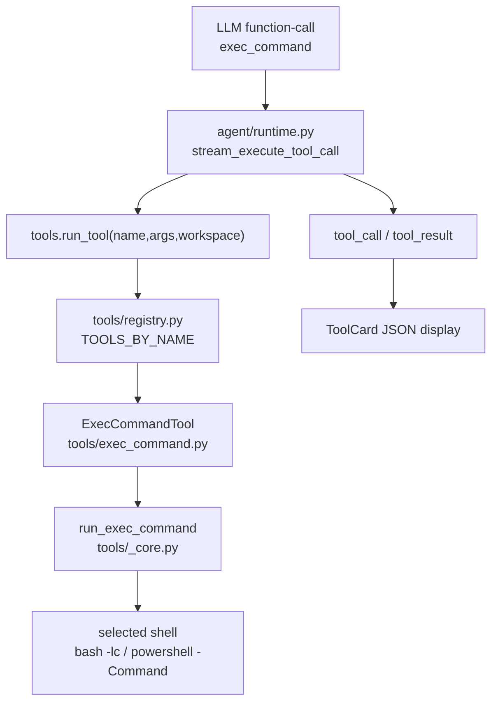

# exec_command MVP 落地设计文档

本文档基于 `Docs/exec_command_design.md` 的完整设计，裁剪出一版适配当前 Automata 项目架构、可以在本仓库内小步落地的 `exec_command` MVP。

MVP 的核心目标不是复刻完整 Codex 终端子系统，而是在当前 `AgentTool` + function-call + WebSocket `tool_call/tool_result` 框架内，提供一个语义更接近 Codex `exec_command` 的真实命令执行工具。

## 当前项目事实

当前后端工具系统具备以下约束：

- 工具基类是 `api/automata_api/agent/tools/base.py` 中的 `AgentTool`，工具通过 `spec()` 暴露 function-call schema，通过 `run(arguments, workspace)` 执行。
- 工具清单是 `api/automata_api/agent/tools/registry.py` 中的模块级 `REGISTERED_TOOLS`，运行入口是 `api/automata_api/agent/tools/__init__.py` 的 `run_tool(name, raw_arguments, workspace)`。
- Agent runtime 只发通用事件：`tool_call` 和 `tool_result`。前端 `ToolCard` 展示工具名、参数和最终 JSON 结果，不识别命令输出 delta。
- 当前真实 shell 执行能力是 `run_bash`，实现集中在 `api/automata_api/agent/tools/_core.py`，已经具备 cwd 限制、超时上限、stdout/stderr 捕获和输出截断。
- `Docs/backend-abstraction-plan.md` 中的 Backend 抽象还没有落地，因此本设计不能假设 `ToolRegistry` 实例化、Backend 原语或 per-session tool set 已存在。

因此，MVP 必须贴合当前代码形态：新增一个普通 function-call 工具，复用现有工具注册、运行时事件和结果持久化路径。

## 目标

1. 新增模型可见工具 `exec_command`。
2. 支持在当前会话 workspace 内执行一次性 shell 命令。
3. 使用 workspace-relative `workdir` 解析 cwd，并拒绝越界路径。
4. 捕获 stdout、stderr、exit code、timeout 和耗时。
5. 对命令耗时和输出大小设置硬上限，避免无限等待或过大 tool result。
6. 保持现有 WebSocket、前端和消息持久化协议不变。
7. 允许后续平滑迁移到 Backend 抽象和完整 `exec_command` 设计。

## 非目标

MVP 暂不实现以下能力：

- `write_stdin`。
- live session / `session_id`。
- PTY / TTY 交互式进程。
- 运行中 output delta 流式推送。
- sandbox permission、approval、network policy。
- 多 environment / 远程 exec server。
- pre/post tool hooks。
- shell snapshot、login shell、zsh-fork。
- 对 `run_bash` 的删除或行为改变。

这些能力需要 runtime、event layer 和进程生命周期管理的更大改造，不适合作为当前仓库的第一步。

## MVP 对外工具形状

模型可见工具名：

```text
exec_command
```

Function-call schema：

```json
{
  "cmd": "string",
  "shell": "bash",
  "workdir": "string",
  "timeout_seconds": 30,
  "max_output_chars": 20000
}
```

字段说明：

- `cmd`：必填，要执行的 shell 脚本。
- `shell`：可选，命令脚本的解释器方言。MVP 使用枚举而不是任意 binary path，建议支持 `"bash"` 与 `"powershell"`；缺省为 `"bash"`，以保持现有 `run_bash` 兼容语义。
- `workdir`：可选，workspace-relative 工作目录。缺省为 workspace 根目录。
- `timeout_seconds`：可选，默认 30 秒，最大 120 秒。沿用当前 `run_bash` 的超时语义。
- `max_output_chars`：可选，默认 20000，最大 60000。分别应用到 stdout、stderr 和合并后的 `output`。

刻意不在 MVP 暴露的字段：

- `yield_time_ms`：当前 runtime 等待工具执行完成后才发 `tool_result`，没有中途 yield 的事件通道。
- 自由形式 `shell` binary path：MVP 只暴露受控枚举，不允许模型指定任意可执行文件路径，避免把平台探测、安全边界和 quoting 细节混进第一版。
- `sandbox_permissions` / `additional_permissions` / `justification` / `prefix_rule`：当前项目没有审批和 sandbox 层。
- `tty`：没有 PTY 和 `write_stdin` 时，暴露该字段会产生误导。

## 工具结果 JSON

`ToolResult.content` 仍是 JSON 字符串，兼容当前 UI 和 provider tool result 协议。

成功示例：

```json
{
  "simulated": false,
  "ok": true,
  "tool": "exec_command",
  "cmd": "printf hello",
  "shell": "bash",
  "workdir": ".",
  "cwd": "D:\\workspace\\projects\\automata",
  "shell_path": "C:\\Program Files\\Git\\bin\\bash.exe",
  "timeout_seconds": 30.0,
  "duration_seconds": 0.04,
  "exit_code": 0,
  "timed_out": false,
  "stdout": "hello",
  "stderr": "",
  "output": "hello",
  "stdout_truncated": false,
  "stderr_truncated": false,
  "output_truncated": false
}
```

失败示例：

```json
{
  "simulated": false,
  "ok": false,
  "tool": "exec_command",
  "cmd": "sleep 10",
  "shell": "bash",
  "workdir": ".",
  "cwd": "D:\\workspace\\projects\\automata",
  "shell_path": "C:\\Program Files\\Git\\bin\\bash.exe",
  "timeout_seconds": 0.1,
  "duration_seconds": 0.11,
  "exit_code": null,
  "timed_out": true,
  "stdout": "",
  "stderr": "",
  "output": "",
  "stdout_truncated": false,
  "stderr_truncated": false,
  "output_truncated": false
}
```

字段约定：

- `ok` 等价于 `exit_code == 0` 且 `timed_out == false`。
- `exit_code == null` 表示进程没有正常给出退出码，常见于超时或启动失败。
- `shell` 是模型请求或默认选择后的 shell 方言；`shell_path` 是后端解析出的实际可执行文件。
- `output` 是面向模型阅读的合并输出。优先保留 stdout；当 stderr 非空时追加一个 `stderr:` 段。
- MVP 永远不返回 `session_id`。

## 架构位置



设计原则：

- `runtime.py` 不为 MVP 增加特殊分支。
- `services/chat.py` 不改 WebSocket 协议。
- 前端不改类型，不新增命令专属组件。
- `exec_command` 与 `run_bash` 在 MVP 中可以共存；提示词引导模型优先使用 `exec_command`。

## 文件改动清单

| 文件 | 动作 |
| --- | --- |
| `api/automata_api/agent/tools/exec_command.py` | 新增 `ExecCommandTool`，定义 schema 并调用 `_core.run_exec_command`。 |
| `api/automata_api/agent/tools/_core.py` | 新增 `run_exec_command`、`shell_argument`、`resolve_exec_shell`、`resolve_powershell_executable`、`max_output_chars_argument`、`build_exec_output` 等 helper；复用 `resolve_tool_cwd`、`resolve_bash_executable`、`decode_output`、`json_response`。 |
| `api/automata_api/agent/tools/registry.py` | 注册 `exec_command_tool`。 |
| `api/automata_api/agent/prompts.py` | 提示词改为优先使用 `exec_command` 运行 shell 命令；保留 `run_bash` 作为兼容工具。 |
| `api/README.md` | 更新内置工具列表与命令执行说明。 |
| `api/tests/test_tools.py` | 增加 `exec_command` 执行、cwd 越界、超时、输出截断测试。 |
| `api/tests/test_agent_tools_unit.py` | 更新工具清单断言，覆盖 `exec_command` schema。 |
| `api/tests/test_agent_runtime_unit.py` | 不需要结构性改动；如果断言工具集合，加入 `exec_command`。 |

## 核心实现设计

### 工具类

`api/automata_api/agent/tools/exec_command.py`：

```python
from typing import Any

from ._core import ToolResult, run_exec_command
from .base import AgentTool


class ExecCommandTool(AgentTool):
    name = "exec_command"

    def spec(self) -> dict[str, Any]:
        return {
            "type": "function",
            "function": {
                "name": self.name,
                "description": (
                    "Run a real shell command in the local workspace. "
                    "Choose shell=bash for POSIX shell scripts and "
                    "shell=powershell for PowerShell scripts. Cwd is restricted "
                    "to the workspace and output is bounded."
                ),
                "parameters": {
                    "type": "object",
                    "properties": {
                        "cmd": {"type": "string"},
                        "shell": {
                            "type": "string",
                            "enum": ["bash", "powershell"],
                            "description": (
                                "Shell dialect used to interpret cmd. Defaults to bash. "
                                "Use powershell for PowerShell-specific scripts."
                            ),
                        },
                        "workdir": {"type": "string"},
                        "timeout_seconds": {"type": "number"},
                        "max_output_chars": {"type": "integer"},
                    },
                    "required": ["cmd"],
                },
            },
        }

    async def run(self, arguments: dict[str, Any], workspace: str) -> ToolResult:
        return await run_exec_command(arguments, workspace)


exec_command_tool = ExecCommandTool()
```

### `_core.run_exec_command`

MVP 可以先复用 `run_bash` 的大部分实现，但不要只把参数改名后直接调用 `run_bash`，因为 `exec_command` 需要自己的 `tool` 字段、`cmd` 字段、`workdir` 字段、`duration_seconds` 和 `output` 字段。

伪代码：

```python
async def run_exec_command(arguments: dict[str, Any], workspace: str) -> ToolResult:
    cmd = string_argument(arguments, "cmd", "")
    shell_name = shell_argument(arguments)
    timeout_seconds = timeout_argument(arguments)
    max_output_chars = max_output_chars_argument(arguments)
    workspace_path = Path(workspace).expanduser().resolve()
    cwd_result = resolve_tool_cwd(workspace_path, arguments.get("workdir"))

    if not cmd:
        return exec_command_error_result(..., error="Missing required cmd.")
    if isinstance(cwd_result, str):
        return exec_command_error_result(..., error=cwd_result)

    shell_resolution = resolve_exec_shell(shell_name)
    if shell_resolution.error:
        return exec_command_error_result(..., error=shell_resolution.error)

    start = time.monotonic()
    try:
        process = await asyncio.create_subprocess_exec(
            *shell_resolution.argv(cmd),
            cwd=str(cwd_result),
            stdout=asyncio.subprocess.PIPE,
            stderr=asyncio.subprocess.PIPE,
        )
    except OSError as error:
        return exec_command_error_result(..., error=f"Failed to start command: {error}")

    timed_out = False
    try:
        stdout_bytes, stderr_bytes = await asyncio.wait_for(
            process.communicate(),
            timeout=timeout_seconds,
        )
        exit_code = process.returncode
    except TimeoutError:
        timed_out = True
        process.kill()
        stdout_bytes, stderr_bytes = await process.communicate()
        exit_code = None

    duration_seconds = round(time.monotonic() - start, 3)
    stdout, stdout_truncated = truncate_content(
        decode_output(stdout_bytes),
        max_output_chars,
    )
    stderr, stderr_truncated = truncate_content(
        decode_output(stderr_bytes),
        max_output_chars,
    )
    output, output_truncated = truncate_content(
        build_exec_output(stdout, stderr),
        max_output_chars,
    )

    payload = {...}
    return ToolResult(
        name="exec_command",
        arguments=arguments,
        content=json_response(payload),
        success=payload["ok"],
    )
```

### 参数校验

`cmd`：

- 必须是非空字符串。
- 不做命令级白名单，保持与当前 `run_bash` 等价。

`shell`：

- 必须是受控枚举，不接受任意路径。
- MVP 建议支持 `"bash"` 和 `"powershell"`：
  - `bash` 使用现有 `resolve_bash_executable()`，argv 为 `[bash_path, "-lc", cmd]`。
  - `powershell` 新增 `resolve_powershell_executable()`，优先找 `pwsh`，其次找 Windows PowerShell；argv 为 `[powershell_path, "-NoProfile", "-NonInteractive", "-Command", cmd]`。
- 如果请求的 shell 不受支持，返回结构化失败 JSON，并包含 `supported_shells`。
- 如果 shell 受支持但当前机器找不到对应 executable，返回启动前失败，不回退到另一种 shell。模型应显式换 shell 重试，避免脚本方言被错误解释。

`workdir`：

- 使用现有 `resolve_tool_cwd(workspace_path, arguments.get("workdir"))`。
- 相对路径基于 workspace。
- 绝对路径必须仍在 workspace 内。
- 路径必须存在且是目录。

`timeout_seconds`：

- 复用当前 `timeout_argument()`。
- 默认 30 秒。
- 最大 120 秒。

`max_output_chars`：

- 新增 helper。
- 默认 20000。
- 小于等于 0 时回退默认值。
- 最大 60000，避免单个 tool result 过大。

建议实现：

```python
DEFAULT_EXEC_OUTPUT_CHARS = OUTPUT_LIMIT
MAX_EXEC_OUTPUT_CHARS = 60_000


def max_output_chars_argument(arguments: dict[str, Any]) -> int:
    raw_value = arguments.get("max_output_chars", DEFAULT_EXEC_OUTPUT_CHARS)
    if isinstance(raw_value, bool):
        return DEFAULT_EXEC_OUTPUT_CHARS
    if isinstance(raw_value, int):
        value = raw_value
    elif isinstance(raw_value, float):
        value = int(raw_value)
    elif isinstance(raw_value, str):
        try:
            value = int(raw_value)
        except ValueError:
            return DEFAULT_EXEC_OUTPUT_CHARS
    else:
        return DEFAULT_EXEC_OUTPUT_CHARS
    if value <= 0:
        return DEFAULT_EXEC_OUTPUT_CHARS
    return min(value, MAX_EXEC_OUTPUT_CHARS)
```

建议的 shell helper：

```python
SUPPORTED_EXEC_SHELLS = {"bash", "powershell"}


def shell_argument(arguments: dict[str, Any]) -> str:
    value = arguments.get("shell", "bash")
    if not isinstance(value, str) or not value.strip():
        return "bash"
    return value.strip().lower()


def resolve_exec_shell(shell: str) -> ExecShellResolution:
    if shell == "bash":
        path = resolve_bash_executable()
        if path is None:
            return ExecShellResolution.error_result(
                "Could not find bash. Install Git Bash on Windows or bash on PATH."
            )
        return ExecShellResolution(shell="bash", path=path, argv=lambda cmd: [path, "-lc", cmd])

    if shell == "powershell":
        path = resolve_powershell_executable()
        if path is None:
            return ExecShellResolution.error_result(
                "Could not find PowerShell. Install PowerShell or ensure it is on PATH."
            )
        return ExecShellResolution(
            shell="powershell",
            path=path,
            argv=lambda cmd: [path, "-NoProfile", "-NonInteractive", "-Command", cmd],
        )

    return ExecShellResolution.error_result(
        f"Unsupported shell: {shell}. Supported shells: bash, powershell."
    )
```

## 与 `run_bash` 的关系

MVP 不删除 `run_bash`，原因：

- 现有提示词、测试和文档已经围绕 `run_bash` 建立。
- `rg` 的 bash fallback 目前直接调用 `run_bash`。
- 小步落地可以降低回归风险。

推荐策略：

1. 第一阶段共存：`exec_command` 是新的首选工具，`run_bash` 保留。
2. 提示词中写明：普通命令优先 `exec_command`；只有兼容旧行为或工具内部 fallback 时使用 `run_bash`。
3. Backend 抽象落地后，把二者共同依赖的执行逻辑下沉为 Backend `exec_shell` 原语。
4. 未来可将 `run_bash` 标记为兼容工具，或在工具清单中按 Backend 决定是否暴露。

## Runtime 与 UI 兼容性

MVP 不改 `stream_execute_tool_call`：

- 调用前仍发：

```json
{
  "type": "tool_call",
  "tool_call_id": "...",
  "tool": "exec_command",
  "arguments": "{\"cmd\":\"pytest -q\"}"
}
```

- 命令完成后发：

```json
{
  "type": "tool_result",
  "tool_call_id": "...",
  "tool": "exec_command",
  "success": true,
  "content": "{\"simulated\":false,\"ok\":true,...}"
}
```

这样当前前端 `ToolCard` 可以无改动展示执行状态。

需要接受的 MVP 限制：

- 长命令运行中，UI 只显示 Running，不显示实时 stdout。
- 命令必须完成或超时后，模型才能看到输出。
- 因为没有 `session_id`，模型不能继续与同一个进程交互。

## Plan 模式策略

`exec_command` 是写能力工具，MVP 不允许在 Plan 模式使用。

当前 Plan 模式使用 `PLAN_TOOL_NAMES`：

```python
PLAN_TOOL_NAMES = {
    "read_file",
    "rg",
    "grep",
    "apply_patch_preview",
}
```

新增 `exec_command` 时不加入该集合。若模型在 Plan 模式调用它，现有 `blocked_tool_result` 会返回：

```json
{
  "simulated": false,
  "ok": false,
  "tool": "exec_command",
  "mode": "plan",
  "error": "blocked_by_plan_mode",
  "allowed_tools": ["apply_patch_preview", "grep", "read_file", "rg"]
}
```

## 测试计划

新增或更新以下测试：

1. `test_exec_command_executes_command_in_workspace`
   - 调用 `tools.run_tool("exec_command", {"cmd": "printf hello"}, tmp_path)`。
   - 断言 `ok=true`、`exit_code=0`、`stdout="hello"`、`output="hello"`、`tool="exec_command"`。

2. `test_exec_command_rejects_workdir_outside_workspace`
   - workspace 为临时子目录，传 `workdir=".."`。
   - 断言失败，错误包含 `cwd must stay inside workspace`。

3. `test_exec_command_times_out`
   - 调用 `{"cmd": "sleep 2", "timeout_seconds": 0.1}`。
   - 断言 `ok=false`、`timed_out=true`、`exit_code is None`。

4. `test_exec_command_respects_max_output_chars`
   - 输出超过 `max_output_chars`。
   - 断言 `stdout_truncated=true`、`output_truncated=true`。

5. `test_tool_specs_include_expected_tool_names`
   - 工具集合加入 `exec_command`。

6. `test_exec_command_rejects_unsupported_shell`
   - 调用 `{"cmd": "echo hi", "shell": "cmd"}`。
   - 断言失败，错误包含 `Unsupported shell`，并返回 `supported_shells`。

7. `test_exec_command_powershell_executes_when_available`
   - Windows 或存在 `pwsh` 时执行 `{"shell": "powershell", "cmd": "Write-Output hello"}`。
   - 断言 `stdout` 包含 `hello`；不可用时 skip。

8. `test_stream_execute_tool_call_blocks_exec_command_in_plan_mode`
   - 可选。复用现有 plan block 测试结构，确认不会执行 `run_tool`。

运行命令：

```powershell
uv run --directory api --group dev --locked pytest tests/test_tools.py tests/test_agent_tools_unit.py tests/test_agent_runtime_unit.py
```

## 分阶段落地

### 阶段 1：新增 MVP 工具

- 新增 `ExecCommandTool`。
- 在 `_core.py` 新增 `run_exec_command` 和少量 helper。
- 注册工具。
- 添加 tests。

验收：

- `exec_command` 出现在 `tool_specs()`。
- 测试命令可以执行并返回 bounded JSON。
- Plan 模式不会允许该工具。

### 阶段 2：提示词与文档切换首选工具

- `agent_system_prompt()` 将命令执行说明从 `run_bash` 优先改为 `exec_command` 优先。
- `api/README.md` 更新内置工具列表和说明。
- 保留 `run_bash` 说明为兼容能力。

验收：

- 现有 agent runtime 单测更新后通过。
- 用户可在 UI 中看到 `exec_command` tool card。

### 阶段 3：为 Backend 抽象预留迁移点

当 `Docs/backend-abstraction-plan.md` 落地后：

- 将 `run_exec_command` 的 subprocess 逻辑下沉为 `LocalBackend.exec_shell`。
- `ExecCommandTool` 改为注入 Backend。
- `max_output_chars`、timeout、结果 JSON 仍留在工具层，保证 provider-facing 形状稳定。

## 后续扩展路线

完整 `exec_command_design.md` 中的能力可以按以下顺序扩展：

1. **流式 output delta**：runtime 支持工具执行期间发 `tool_output_delta` 或复用新事件类型，前端 ToolCard 支持增量 append。
2. **ProcessManager**：引入 per-process id、live process store、进程上限和关闭清理。
3. **`write_stdin`**：新增配套工具，只允许作用于 live session。
4. **PTY**：为交互式命令提供 TTY；非交互命令继续使用 pipe。
5. **Backend/Environment**：将本地执行、Windows PowerShell、远程执行统一到 Backend 原语。
6. **审批和 sandbox**：在工具 handler 与进程启动之间增加 Orchestrator，而不是把策略写入 `ExecCommandTool`。

## 关键取舍

- MVP 使用 `max_output_chars` 而不是 `max_output_tokens`，因为当前项目没有 token 计数和 per-turn truncation policy。字段名保持实现诚实，避免给调用方错误承诺。
- MVP 不实现 `yield_time_ms`，因为当前 runtime 没有工具运行中返回模型的机制。先暴露该字段只会产生无效参数。
- MVP 暴露 `shell`，但只接受受控枚举，不接受任意 executable path。这样模型能选择脚本方言，后端仍能控制实际解析、平台差异和错误格式。
- MVP 中 PowerShell 支持可以直接复用当前 subprocess 框架实现；后续 Backend 抽象落地后，再把 bash/PowerShell 的启动细节下沉到 Backend。
- MVP 保持通用 `tool_call/tool_result` 事件，这使前端零改动可用，但牺牲了实时终端体验。

## 实现检查清单

- `exec_command` schema 与实际参数一致。
- `cmd` 缺失时返回失败 JSON，而不是抛未捕获异常。
- `shell` 缺省为 `bash`；未知 shell 返回失败 JSON，不静默回退。
- 结果 JSON 同时包含 `shell` 方言和 `shell_path` 实际可执行文件。
- `workdir` 解析不能逃出 workspace。
- `timeout_seconds` 有默认值和上限。
- stdout、stderr、output 都有截断上限。
- 启动失败、超时、非零退出码都能返回结构化 JSON。
- `ToolResult.name == "exec_command"`。
- `payload["tool"] == "exec_command"`。
- Plan 模式不允许 `exec_command`。
- 不改变 `run_bash` 既有行为和测试语义。
