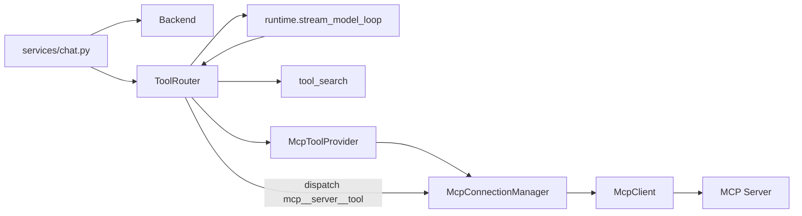

# Automata MCP 调用能力设计

## Summary

本方案在已经落地的运行期工具发现与注册框架之上，为 Automata 增加 MCP server 工具调用能力。核心原则是不让 MCP 协议细节进入 agent runtime 主循环，而是把 MCP 当成一种新的工具来源：

- `McpToolProvider` 从配置的 MCP servers 执行 `tools/list`，把 MCP tools 转换成 `ToolDescriptor`。
- `McpAgentTool` 作为 `AgentTool` 适配器，在被 `ToolRouter.dispatch()` 调用时执行 MCP `tools/call`。
- `McpConnectionManager` 负责 MCP client 生命周期、连接复用、工具列表缓存、超时和关闭。
- `ToolRouter` 继续负责 direct/deferred/hidden、plan mode read-only 过滤、`tool_search` 激活和统一 dispatch。

首阶段只支持 MCP 的 tools 能力，不实现 resources、prompts、sampling、elicitation 和 MCP Apps UI。这样可以先把“外部 MCP 工具能被发现、搜索、路由、调用，并以稳定 `ToolResult` 返回给模型”打通。

## Current Baseline

当前 Automata 已经具备以下基础：

- `Backend` 提供 local/windows 执行原语。
- `ToolProvider.discover(context)` 贡献 `ToolDescriptor`。
- `ToolDescriptor` 包含 `name`、`spec`、`executor`、`read_only`、`exposure`、`source`、`search_text`。
- `ToolRouter` 生成每次模型调用的可见工具列表，并通过 `dispatch()` 执行工具。
- `tool_search` 能发现 deferred 工具，并让命中的工具在下一次模型调用中可见。

MCP 设计应复用这条路径：MCP server 不直接改 `runtime.py`，而是通过 provider 注册成工具。

## Protocol Baseline

Automata 首版 MCP client 以 MCP `2025-11-25` 稳定规范为目标：

- 协议层使用 JSON-RPC。
- 工具发现使用 `tools/list`，工具执行使用 `tools/call`。
- 传输层首选支持 stdio，随后支持 Streamable HTTP。
- 连接生命周期包含 `initialize`、`notifications/initialized`、正常操作和 transport-level shutdown。

截至 2026-07-09，MCP draft 中已经提出 2026-07-28 方向的 breaking changes，包括 stateless core、移除 protocol-level session 和移除 initialize handshake 等变化。Automata 不应在首版绑定 draft-only 形态，而应把协议版本和传输实现封装在 `McpClient` 内，后续用 adapter 扩展。

## Goals

1. 支持配置多个 MCP servers。
2. 支持从 MCP server 动态发现 tools，并注册为 Automata tools。
3. 支持通过 `tool_search` 延迟加载 MCP tools，避免上下文中塞入大量外部工具。
4. 支持调用 MCP tools，并把 MCP result 转成稳定的 Automata `ToolResult`。
5. 支持 plan mode read-only 过滤。
6. MCP server 失败不影响 backend 核心工具可用性。
7. 不新增 DB migration；连接、工具列表缓存和激活状态都属于 runtime state。

## Non-Goals

- 不实现 MCP server。
- 不实现 MCP resources/prompts 进入上下文。
- 不实现 MCP sampling/elicitation。
- 不实现 MCP Apps UI 或 connector 市场。
- 不在首阶段实现完整 OAuth 授权流。
- 不改变现有 Chat Completions function tool wire shape。

## Architecture



核心调用流：

1. WebSocket session 创建 backend。
2. `services/chat.py` 构建 `ToolDiscoveryContext`。
3. `ToolRouter` 从 `BackendToolProvider` 和 `McpToolProvider` 收集 descriptors。
4. MCP tools 按配置注册为 direct/deferred/hidden。
5. 模型调用 `tool_search` 后，deferred MCP tools 被激活。
6. 下一次模型调用前，`runtime` 重新读取 `router.model_visible_specs()`。
7. 模型调用 `mcp__server__tool`。
8. `McpAgentTool.run()` 经 `McpConnectionManager` 执行 MCP `tools/call`。
9. MCP result 转换成 `ToolResult.content` JSON 字符串并回传给模型。

## Public Interfaces

建议新增文件：

```text
api/automata_api/agent/mcp/config.py
api/automata_api/agent/mcp/client.py
api/automata_api/agent/mcp/transport.py
api/automata_api/agent/mcp/manager.py
api/automata_api/agent/mcp/schema.py
api/automata_api/agent/tools/mcp_provider.py
api/automata_api/agent/tools/mcp_tool.py
```

建议新增或调整接口：

```python
@dataclass(frozen=True)
class McpServerConfig:
    name: str
    enabled: bool
    transport: McpTransportConfig
    exposure: ToolExposure
    tools: dict[str, McpToolConfig]
    list_timeout_seconds: float
    call_timeout_seconds: float

class McpClient(Protocol):
    async def initialize(self) -> McpInitializeResult: ...
    async def list_tools(self) -> McpListToolsResult: ...
    async def call_tool(self, name: str, arguments: dict[str, Any]) -> McpCallToolResult: ...
    async def close(self) -> None: ...

class McpConnectionManager:
    async def list_tools(self, server_name: str) -> tuple[McpToolInfo, ...]: ...
    async def call_tool(self, server_name: str, tool_name: str, arguments: dict[str, Any]) -> McpCallToolResult: ...
    async def close_all(self) -> None: ...
```

`ToolProvider.discover()` 当前是同步接口，但 MCP discovery 需要 I/O。实现时建议把工具发现升级为 async：

```python
class ToolProvider(Protocol):
    async def discover(self, context: ToolDiscoveryContext) -> tuple[ToolDescriptor, ...]:
        ...
```

`BackendToolProvider` 可以直接返回 tuple，不引入实际等待；`ToolRouter.from_backend()` 增加 async 版本供正式 WebSocket 路径使用。低层测试如需保留同步构造，可提供 `ToolRouter.from_static_descriptors()`。

## Configuration

首版不把 MCP 配置放进 SQLite。建议读取顺序：

1. `AUTOMATA_MCP_CONFIG` 指定的 JSON 文件。
2. workspace 下 `.automata/mcp.json`。
3. `api/mcp.json`。

示例：

```json
{
  "servers": {
    "filesystem": {
      "enabled": true,
      "transport": {
        "type": "stdio",
        "command": "npx",
        "args": ["-y", "@modelcontextprotocol/server-filesystem", "${workspace}"],
        "env": {
          "NODE_OPTIONS": "--no-warnings"
        },
        "cwd": "${workspace}"
      },
      "exposure": "deferred",
      "list_timeout_seconds": 10,
      "call_timeout_seconds": 60,
      "tools": {
        "read_file": {
          "read_only": true,
          "exposure": "deferred"
        },
        "write_file": {
          "read_only": false,
          "exposure": "hidden"
        }
      }
    },
    "sentry": {
      "enabled": false,
      "transport": {
        "type": "streamable_http",
        "url": "https://example.com/mcp",
        "headers": {
          "Authorization": "Bearer ${SENTRY_TOKEN}"
        },
        "allow_remote": true
      },
      "exposure": "deferred"
    }
  }
}
```

配置规则：

- secrets 只允许通过环境变量插值，不建议明文写入配置文件。
- stdio command 必须是显式配置，不从模型输入中拼接。
- Streamable HTTP 默认只允许 localhost；远程 URL 必须显式 `allow_remote=true`。
- server name 和 tool name 转成模型可见函数名时必须做规范化与冲突检测。
- server 级 `exposure` 是默认值，tool 级配置可以覆盖。
- 未配置 `read_only` 时，优先使用 MCP tool annotations 的 `readOnlyHint`；没有 hint 时按 mutating 处理。

## Tool Naming

Automata 当前使用 Chat Completions function tool，不支持 Codex Responses API 的 namespace tool shape。因此 MCP 工具需要被压平成单个 function name。

命名规则：

```text
mcp__{server_name}__{tool_name}
```

示例：

```text
mcp__filesystem__read_file
mcp__sentry__search_issues
```

规范化要求：

- 只保留 provider 支持的 function name 字符集，例如字母、数字、`_`、`-`。
- 空白、点号、斜杠等替换为 `_`。
- 多个 `_` 合并。
- 保留原始 `server_name` 和原始 MCP `tool.name` 在 `McpAgentTool` 内部，用于 `tools/call`。
- 如果规范化后冲突，provider 应拒绝该 server 的冲突工具并记录 warning，不能静默覆盖。

`ToolDescriptor.source` 使用：

```text
mcp:{server_name}
```

`search_text` 应包含：

- flattened tool name
- original server name
- original tool name
- tool title
- tool description
- input schema property names
- input schema property descriptions

## Exposure Policy

推荐默认策略：

- backend 核心工具继续 direct。
- MCP tools 默认 deferred。
- 少量、可信、稳定的 MCP tools 可通过配置显式 direct。
- 高风险或内部工具配置为 hidden。

原因：

- MCP server 可能贡献大量工具，全部 direct 会增加上下文成本。
- MCP tools 可能来自外部系统，deferred 默认更符合 least exposure。
- `tool_search` 已经能让模型按需加载外部工具。

示例：

```json
{
  "servers": {
    "calendar": {
      "exposure": "deferred",
      "tools": {
        "list_events": { "read_only": true, "exposure": "direct" },
        "create_event": { "read_only": false, "exposure": "deferred" },
        "delete_event": { "read_only": false, "exposure": "hidden" }
      }
    }
  }
}
```

## Read-Only And Plan Mode

MCP annotations 是 hint，不应盲目信任。Automata 的策略：

- `readOnlyHint == true` 可以把工具标为 `read_only=True`。
- `readOnlyHint == false` 或缺失时，默认 `read_only=False`。
- 用户配置可以把工具降级为 mutating。
- 用户配置只有在明确可信 server 时才允许把工具升级为 read-only。
- plan mode 下 `ToolRouter` 继续只暴露 read-only direct/activated tools。
- plan mode 下 `tool_search` 只搜索 read-only deferred tools。

对于 read-only 缺失但实际安全的工具，应通过配置显式声明：

```json
{
  "tools": {
    "lookup_issue": {
      "read_only": true
    }
  }
}
```

## MCP Client Lifecycle

`McpConnectionManager` 管理 client 生命周期：

- 按 server name 和配置 fingerprint 缓存 client。
- 第一次 `list_tools()` 或 `call_tool()` 时懒初始化。
- stdio server 启动后执行 `initialize`，成功后发送 `notifications/initialized`。
- Streamable HTTP 后续请求携带协议版本 header。
- `tools/list` 支持 pagination，直到没有 cursor。
- `notifications/tools/list_changed` 到来时标记工具列表缓存失效。
- 每个 JSON-RPC request 有独立 timeout。
- session 结束或 API 关闭时调用 `close_all()`。

stdio shutdown：

1. 关闭 stdin。
2. 等待进程退出。
3. 超时后 terminate。
4. 再超时后 kill。

首阶段可以不做长期 background 监听，只在请求期间读取响应；但如果要支持 `listChanged` 和 progress/logging，manager 需要有 per-client reader task，把 response、notification 和 stderr 分流。

## Transports

### stdio

首阶段优先实现 stdio，因为它适合本地桌面工具和本地开发：

- 使用 `asyncio.create_subprocess_exec`。
- stdout 只接受 newline-delimited JSON-RPC message。
- stderr 作为日志，做 bounded capture。
- 进程 stdout 写入非 JSON 内容时视为 protocol error。
- command、args、cwd、env 只来自配置。
- 默认 cwd 是 workspace。

### Streamable HTTP

第二阶段实现 Streamable HTTP：

- HTTP POST 发送 JSON-RPC request。
- `Accept` 包含 `application/json` 和 `text/event-stream`。
- 支持 JSON response 和 SSE response。
- 默认拒绝非 localhost URL。
- 远程 URL 需要显式 allow。
- 认证先支持静态 headers 和 env var token。
- OAuth 授权流作为后续阶段。

## Tool Execution

`McpAgentTool` 实现现有 `AgentTool`：

```python
class McpAgentTool(AgentTool):
    name: ClassVar[str]
    read_only: ClassVar[bool]

    def spec(self) -> dict[str, Any]:
        ...

    async def run(self, arguments: dict[str, Any]) -> ToolResult:
        result = await manager.call_tool(server_name, original_tool_name, arguments)
        return mcp_result_to_tool_result(self.name, arguments, result)
```

MCP `tools/call` request：

```json
{
  "jsonrpc": "2.0",
  "id": 12,
  "method": "tools/call",
  "params": {
    "name": "read_file",
    "arguments": {
      "path": "README.md"
    }
  }
}
```

稳定错误：

```json
{
  "simulated": false,
  "ok": false,
  "tool": "mcp__filesystem__read_file",
  "source": "mcp:filesystem",
  "server": "filesystem",
  "mcp_tool": "read_file",
  "error": "mcp_server_unavailable",
  "message": "MCP server failed to start within 10 seconds."
}
```

错误分类：

- `mcp_config_error`
- `mcp_server_unavailable`
- `mcp_protocol_error`
- `mcp_tool_not_found`
- `mcp_tool_timeout`
- `mcp_auth_required`
- `mcp_call_rejected`
- `mcp_result_too_large`

## Result Conversion

Automata `ToolResult.content` 当前是字符串，MCP result 需要序列化为 JSON 字符串。

建议 payload：

```json
{
  "simulated": false,
  "ok": true,
  "tool": "mcp__filesystem__read_file",
  "source": "mcp:filesystem",
  "server": "filesystem",
  "mcp_tool": "read_file",
  "duration_seconds": 0.153,
  "is_error": false,
  "text": "file content",
  "content": [
    {
      "type": "text",
      "text": "file content"
    }
  ],
  "structured_content": {
    "bytes": 123
  },
  "truncated": false
}
```

转换规则：

- text content 合并进顶层 `text`，便于模型阅读。
- structuredContent 原样进入 `structured_content`。
- resource links 保留 `uri`、`name`、`mimeType`、`description`。
- image/audio 等二进制内容首阶段只返回 metadata，默认不把大段 base64 塞入模型上下文。
- 所有 text 和 JSON serialization 都走 bounded truncation。
- `isError=true` 时 `success=False`，但仍把 server 返回内容放进 payload。

## Approval And Safety

首阶段安全策略：

- MCP servers 默认 disabled，必须显式启用。
- remote Streamable HTTP 默认禁用。
- plan mode 阻止所有 mutating MCP tools。
- mutating 工具只有在配置允许时才执行。
- 未明确允许的 mutating 工具返回 `mcp_call_rejected`。

建议配置：

```json
{
  "tools": {
    "create_event": {
      "read_only": false,
      "approval": "allow"
    },
    "delete_event": {
      "read_only": false,
      "approval": "deny"
    }
  }
}
```

`approval` 取值：

- `allow`：允许执行。
- `deny`：稳定拒绝。
- `prompt`：需要用户确认。

Automata 当前 WebSocket 工具事件没有完整 approval round-trip。首阶段可以把 `prompt` 视为拒绝并返回 `mcp_approval_required`；后续增加 `mcp_approval_requested` / `mcp_approval_response` 后再真正阻塞等待用户选择。

后续 approval event：

```json
{
  "type": "mcp_approval_requested",
  "tool_call_id": "call_123",
  "server": "calendar",
  "tool": "create_event",
  "arguments": {
    "title": "Demo"
  },
  "options": ["allow_once", "allow_session", "deny"]
}
```

## Runtime Integration

正式路径：

```text
services/chat.py
  -> create_backend(...)
  -> load_mcp_config(...)
  -> McpConnectionManager(...)
  -> await ToolRouter.from_backend_async(
         backend,
         providers=[
           BackendToolProvider(),
           McpToolProvider(manager, mcp_config),
         ],
       )
  -> stream_agent_loop(..., router=router)
```

`runtime.py` 不需要知道 MCP：

- 模型可见工具仍来自 `router.model_visible_specs(mode=...)`。
- 工具执行仍走 `router.dispatch(name, args, mode=...)`。
- plan mode read-only 过滤仍由 `ToolRouter` 完成。
- `tool_search` 激活仍由 `ToolRouter` 完成。

## WebSocket Events

MVP 可以不新增事件，继续使用已有：

- `tool_call`
- `tool_result`

建议后续增加调试事件：

- `mcp_server_status`
- `mcp_tools_discovered`
- `mcp_tool_list_changed`
- `mcp_tool_call_progress`
- `mcp_approval_requested`

调试事件不应作为首阶段验收条件；否则前端协议会成为 MCP 工具调用的阻塞项。

## Failure Behavior

发现阶段：

- 单个 MCP server 失败时跳过该 server，并记录 warning。
- 后端核心工具仍必须可用。
- `tool_search` 不展示失败 server 的工具。
- 如果 server 曾经可用但本轮不可用，工具应从本轮 router descriptors 移除。

调用阶段：

- server disconnected 时尝试一次 reconnect。
- reconnect 失败返回 `mcp_server_unavailable`。
- request timeout 返回 `mcp_tool_timeout`。
- protocol error 返回 `mcp_protocol_error`，并关闭对应 client。
- JSON schema 不可转换时跳过对应工具并记录 warning。

## Observability

每次 MCP 调用记录：

- server name
- original MCP tool name
- flattened Automata tool name
- transport type
- duration
- success/failure
- error class

`ToolResult.content` 中保留 `duration_seconds`、`server`、`mcp_tool`，便于前端和测试断言。

## Implementation Phases

### Phase 1: stdio tools MVP

- MCP config loader。
- stdio transport。
- `McpClient.initialize()`、`tools/list`、`tools/call`。
- `McpConnectionManager` 懒连接和关闭。
- `McpToolProvider` 转换 MCP tools 为 deferred descriptors。
- `McpAgentTool` 调用 `tools/call`。
- result conversion。
- plan mode read-only 过滤。
- stable error payloads。

### Phase 2: HTTP and cache invalidation

- Streamable HTTP transport。
- env var token/header 支持。
- `tools/list` pagination。
- `listChanged` notification cache invalidation。
- server status/debug events。

### Phase 3: approvals and richer content

- WebSocket approval round-trip。
- session-level remembered approvals。
- image/audio/resource richer rendering。
- OAuth flow。
- resources/prompts/provider 扩展。

### Phase 4: Protocol evolution

- 增加 2026 draft/final protocol adapter。
- 支持 stateless request metadata。
- 支持 `server/discover`。
- 使用 list result cache hints。

## Test Plan

单元测试：

- MCP config loader 支持 stdio 和 Streamable HTTP 配置。
- secret 插值只从环境变量读取。
- invalid server/tool name 被规范化或拒绝。
- duplicate flattened tool names 被拒绝并记录 warning。
- MCP `tools/list` schema 转换成 Chat Completions function spec。
- `readOnlyHint` 正确映射到 `read_only`。
- 缺失 `readOnlyHint` 默认 mutating。
- tool 级 exposure 覆盖 server 级 exposure。
- deferred MCP tool 初始不可见，`tool_search` 命中后可见。
- plan mode 只暴露 read-only MCP tools。
- MCP `isError=true` 转成 `ToolResult.success=False`。
- text/structured/resource result 正确转换。
- image/audio result 不把大段 base64 放入模型上下文。
- timeout/protocol error/startup failure 返回稳定错误。

Runtime 测试：

- 第一轮只看到 backend direct tools 和 `tool_search`。
- 模型调用 `tool_search` 后，第二轮看到 MCP tool。
- 模型调用 MCP tool 后，fake MCP server 收到 `tools/call`。
- MCP server 失败不影响 backend core tools。
- plan mode 搜索不到 mutating MCP deferred tool。
- context compression 不破坏 MCP tool call/result message。

集成测试：

- fake stdio MCP server：支持 `initialize`、`tools/list`、`tools/call`。
- fake HTTP MCP server：返回 JSON response。
- fake HTTP MCP server：返回 SSE response。
- list pagination。
- reconnect after stdio crash。

推荐回归命令：

```powershell
uv run --directory api --group dev --locked pytest tests/test_agent_mcp_config_unit.py tests/test_agent_mcp_client_unit.py tests/test_agent_mcp_provider_unit.py tests/test_agent_runtime_unit.py tests/test_agent_plan_mode_unit.py
uv run --directory api --group dev --locked pytest
```

## Acceptance Criteria

首阶段完成后应满足：

- 未配置 MCP 时，现有工具和测试行为不变。
- 配置一个 fake stdio MCP server 后，其工具能通过 `tool_search` 被发现。
- 被激活的 MCP tool 能在下一次模型调用中出现。
- 调用 MCP tool 会执行 server 的 `tools/call` 并返回稳定 `ToolResult`。
- plan mode 不允许 mutating MCP tool。
- MCP server 启动失败、超时或协议错误不会导致整个 agent loop 崩溃。

## References

- Official MCP tools spec: https://modelcontextprotocol.io/specification/2025-11-25/server/tools
- Official MCP transports spec: https://modelcontextprotocol.io/specification/2025-11-25/basic/transports
- Official MCP lifecycle spec: https://modelcontextprotocol.io/specification/2025-11-25/basic/lifecycle
- MCP draft changelog for future compatibility: https://modelcontextprotocol.io/specification/draft/changelog
- Codex local reference: `D:\workspace\projects\codex\codex-rs\core\src\mcp_tool_exposure.rs`
- Codex local reference: `D:\workspace\projects\codex\codex-rs\core\src\tools\handlers\mcp.rs`
- Codex local reference: `D:\workspace\projects\codex\codex-rs\core\src\mcp_tool_call.rs`
- Codex local reference: `D:\workspace\projects\codex\codex-rs\core\src\tools\handlers\tool_search.rs`
