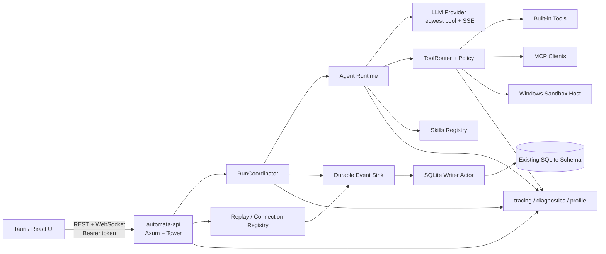

# Automata Rust 后台迁移路线

## 文档状态

- 状态：Draft / Migration Roadmap
- 基线：`codex/sandbox-system-upgrade @ 42764b3`
- 核对日期：2026-09-01
- 适用范围：当前 Tauri 桌面端、本地 headless API、SQLite 数据、Windows Sandbox Host
- 目标后台：Rust stable + Tokio + Axum/Tower
- 迁移方式：保持外部协议不变的渐进式替换，不做一次性重写

本文描述的是迁移顺序、兼容边界、阶段门槛与回滚方案。现有源码是当前行为的最终依据；`Docs/Archived/` 中的文档用于解释既有设计决策，不覆盖已经变化的实现。

## 1. 决策摘要

目标后台采用 Rust，首个目标形态仍然是与 Tauri 分离的 sidecar，而不是立即把后台链接进 Tauri 主进程。

推荐技术栈：

| 领域 | 选择 | 说明 |
| --- | --- | --- |
| 异步运行时 | Tokio | 网络、定时器、进程、取消和并发任务的统一运行时 |
| HTTP / WebSocket | Axum + Tower | 保持现有 REST 与 `/ws/chat` 协议，Tower 负责中间件与超时 |
| HTTP / LLM 客户端 | reqwest | 进程级连接池、SSE 流式读取、统一代理和超时策略 |
| 序列化 / Schema | Serde + serde_json + Schemars | 复用协议类型并生成/校验 JSON Schema |
| 本地存储 | rusqlite + 专用写入 actor | 初期保持 SQLite 文件和 schema；明确单写者语义 |
| 可观测性 | tracing + tracing-subscriber | 结构化 span、低开销诊断与显式 profile 模式 |
| MCP | 官方 Rust SDK `rmcp` | 在保留现有安全策略的前提下接入 stdio 与 Streamable HTTP |
| 错误建模 | thiserror，边界处使用 anyhow | 领域错误可匹配，二进制入口保留上下文链 |
| 测试 | cargo test + insta/proptest（按需） | 契约快照、状态机性质测试与差分测试 |

这次迁移的第一目标不是“把 Python 翻译成 Rust”，而是：

1. 保留现有产品行为与安全边界；
2. 让冷启动、内存、流式转发、JSON 处理、SQLite 写入和进程管理具有可重复的性能基线；
3. 通过协议夹具和双实现差分测试降低语义漂移；
4. 每个阶段均可独立验收和回滚；
5. 在确认收益后才删除 Python 运行时与 PyInstaller 打包链。

## 2. 为什么采用渐进式 Rust sidecar

### 2.1 性能收益主要来自长期运行路径

当前 Python 后台承担：

- FastAPI REST 与 WebSocket；
- LLM HTTP/SSE 流式调用；
- Agent 多步循环与上下文压缩；
- 工具路由、审批和 Plan 模式；
- 子进程会话、取消与输出增量；
- SQLite Run/Event 持久化和断线回放；
- MCP stdio/HTTP 客户端；
- Skills 扫描、缓存与注入；
- Sandbox 控制面与可观测性采集。

Rust 对冷启动、常驻内存、细粒度异步任务、字节流解析、进程控制和大 JSON 数据处理有明确的优化空间。但端到端响应时间仍可能主要受模型首 token 延迟、外部 MCP 服务、磁盘与被执行命令支配，所以必须按分层指标验收，不能只比较一个聊天请求的总耗时。

### 2.2 sidecar 是兼容边界

当前 Tauri 已把 `automata-api` 和 `automata-sandbox-host` 当作外部二进制管理。Rust 后台继续使用同一个 `automata-api` sidecar 身份，可以：

- 保持 UI 连接方式、loopback 地址和 Bearer token 不变；
- 保持 API 崩溃与桌面主进程隔离；
- 独立分析 CPU、RSS、线程、事件循环延迟和崩溃；
- 在发布包中按构建开关选择 Python 或 Rust 实现；
- 避免第一阶段同时重构 Tauri IPC、后台协议和业务逻辑。

等 Rust sidecar 稳定后，是否改成进程内 Tauri command 属于另一项架构决策，不纳入本路线。

## 3. 目标与非目标

### 3.1 目标

- Rust 后台完整承接当前 Python 后台的可观察行为。
- UI 不因迁移而改写核心会话、运行、审批、断线恢复逻辑。
- 已有 SQLite 数据可安全读取，迁移前后 Run/Event 顺序与状态一致。
- 保持 headless API 能力，不把后台限定为只能由桌面端启动。
- 保持 Windows Sandbox Host 的权限模型、重试协议和进程树清理语义。
- 保持 Skills 和 MCP 的信任边界。
- 建立可在 CI 与发布候选包上重复执行的性能测试。
- 切换后至少保留一个发布周期的可恢复 Python fallback。

### 3.2 非目标

- 不在首轮迁移中重做前端交互或 WebSocket 协议。
- 不同时迁移到 PostgreSQL、消息队列或微服务。
- 不把本地桌面应用直接改造成多租户云服务。
- 不在没有测量数据时承诺固定的百分比性能提升。
- 不借迁移改变工具 JSON 结果、错误码或审批策略。
- 不在 Rust 与 Python 之间对同一 SQLite 文件做双写。
- 不以 `unsafe` 或不受控原生代码换取微小性能收益；默认 `#![forbid(unsafe_code)]`，例外需单独评审。

## 4. 当前基线与需验证的性能假设

### 4.1 代码和打包基线

当前后台位于 `api/`，采用 Python 3.11、FastAPI、Uvicorn、httpx、websockets、Python MCP SDK 与 PyInstaller。`run.ps1` 使用 PyInstaller `--onefile` 产出 `automata-api`，Tauri 通过 `ui/src-tauri/tauri.conf.json` 将其作为 external binary 打包。

当前仓库约有：

- 114 个 Python 源文件，约 22.2k 行；
- 34 个 Python 测试文件，约 11.1k 行；
- 现有 Rust Tauri 壳和 `native/windows-sandbox` 原生组件。

这些数字只用于估计迁移表面积，不作为工作量或完成度指标。

### 4.2 已观察的方向性数据

对现有 PyInstaller sidecar 做过一次冷启动探测：从启动到 `/health` 可用约 2.93 秒，二进制约 21.29 MB，三个相关进程合计工作集约 104 MB、Private Memory 约 72 MB。

该数据是单机、单次、旧构建产物的方向性样本，不是正式基线。R0 必须在固定机器、固定电源策略和重复轮次下重测，并记录中位数、p95、离散程度、构建参数与 commit。

### 4.3 当前值得优先验证的热点

| 假设 | 当前迹象 | 如何验证 |
| --- | --- | --- |
| 冷启动主要受 PyInstaller 解包/解释器初始化影响 | 当前使用 `--onefile` sidecar | 比较 Python 源码模式、PyInstaller onedir/onefile、Rust release 三组启动曲线 |
| LLM 请求未充分复用连接 | `agent/llm.py` 的调用路径会创建新的 `httpx.AsyncClient` | 先在 Python 基线中改为进程级客户端，再比较 reqwest 连接池，避免把可修复配置误算成语言收益 |
| Run/Event 写入受全局锁和线程切换影响 | SQLite 连接层有全局 `threading.Lock`，异步路径使用 `asyncio.to_thread` | 记录锁等待、事件 append 延迟、checkpoint 时间；对比 Rust 单写 actor |
| token 事件合并影响 CPU 与 UI 延迟 | 当前按约 4096 字符或 100 ms 刷新 | 固定相同合并规则，比较事件数、CPU、首批 token 与尾部 flush 延迟 |
| 大上下文 JSON 复制和解析会放大内存 | Agent 循环、工具参数/结果、持久化均经过 JSON | 使用 20 KB、1 MB、3.2 MB 夹具测峰值 RSS、分配次数和端到端延迟 |
| 子进程/取消的尾延迟由 OS 行为主导 | 工具支持 live process session、stdin、超时和进程树终止 | 分平台测 spawn、首输出、cancel ack、tree cleanup，不只测函数返回 |

## 5. 必须冻结的兼容契约

R0 必须把下列行为变成可执行契约。Rust 实现只有在契约测试通过后才允许替代对应 Python 路径。

### 5.1 部署与认证

- 默认只监听 loopback；不得因迁移扩大监听范围。
- 桌面端生成并传入至少 32 字符的 API token；除 `/health` 和 CORS `OPTIONS` 外，REST 使用 Bearer token，失败返回当前 `401` envelope。
- WebSocket 保留两种认证入口：Authorization header，或连接 accept 后 3 秒内发送首条 `authenticate` 消息；同时保持 Origin allowlist 以及当前 `4401`/`4403` close code。
- `/health` 的成功条件必须代表服务已经能安全接收请求，而不只是 socket 已绑定。
- Tauri 仍负责 sidecar 启停，并在窗口/应用退出时清理后台进程。
- headless 启动仍支持既有环境变量、数据目录和端口配置。

### 5.2 REST 路由

至少冻结以下接口的 method、path、状态码、字段、默认值和错误 JSON：

```text
GET    /health
GET    /sessions
POST   /sessions
PATCH  /sessions/{session_id}
DELETE /sessions/{session_id}
GET    /sessions/{session_id}/messages
GET    /runs
GET    /sessions/{session_id}/runs
GET    /sessions/{session_id}/runs/{run_id}
GET    /sessions/{session_id}/runs/{run_id}/events
GET    /sessions/{session_id}/plans/{plan_id}/attempts
GET    /mcp/servers
PUT    /mcp/grants/{server_name}
DELETE /mcp/grants/{fingerprint}
GET    /skills
PUT    /skills/{skill_id}/enabled
GET    /skills/{skill_id}/diagnostics
GET    /sandbox/status
POST   /sandbox/setup
```

需要特别锁定：

- 会话存在活动 Run 时，删除返回 `409` 和 `session_busy` 结构；
- Event 游标非法时返回 `400` 和 `event_cursor_invalid`；
- `after_sequence`、分页 `limit` 及上限行为不变；
- 数据校验失败的 `422` 细节必须由 UI 可兼容消费；
- 时间戳格式、空字段序列化、枚举大小写和未知字段策略不变。

### 5.3 WebSocket 输入与输出

现有输入消息至少包含：

```text
authenticate
prompt
approve_plan
retry_plan
tool_approval_response
cancel_run
resume_run
```

现有输出事件至少包含：

```text
ready
started
agent_step
context_compressed
token
final
tool_call
tool_result
tool_output_delta
plan_ready
plan_approved
plan_error
plan_execution_attached
plan_execution_created
approval_error
tool_approval_required
tool_approval_resolved
run_cancel_requested
run_cancelled
run_interrupted
run_resume_started
run_resume_complete
run_error
error
done
mcp_server_status
mcp_server_candidate
skills_loaded
skills_warning
skill_injected
sandbox_retry_blocked
sandbox_retry_requested
sandbox_retry_resolved
sandbox_retry_started
sandbox_selected
sandbox_attempt_started
sandbox_denied
```

契约不只比较 `type`，还必须比较字段存在性、可空性、序列化形状、事件先后顺序以及断线后的重放行为。

### 5.4 Run 状态机与事件一致性

Run 是应用级事实，不属于某一条 WebSocket 连接。Rust 实现必须保持：

- 非终态：`queued`、`running`、`waiting_approval`、`cancelling`；
- 终态：`completed`、`failed`、`cancelled`、`interrupted`；
- 同一 session 同时最多一个活动 Run；不同 session 可并发；
- 事件先持久化，再广播给在线连接；
- 每个 Run 的 `sequence` 单调递增且不重复；
- 事件使用当前 `schema_version=1`；
- 重连先建立 replay watermark，回放到 watermark，再合并期间缓冲的 live event；
- 连接数变为零不构成 Run 终止条件；
- 服务重启后按现有规则恢复事实状态，不擅自续跑无法证明幂等的动作；
- Plan 重试产生新的历史，不覆盖旧尝试。

### 5.5 Agent、工具与审批

- Agent package/core 不依赖 Axum、WebSocket 或具体路由对象。
- Backend/Provider 负责模型与工具装配，公共工具行为不得在不同 backend 中复制分叉。
- Tool descriptor 的 `read_only` 与 `direct | deferred | hidden` exposure 保持一致。
- Plan 模式继续阻止非只读工具；Act 模式仍按 permission profile 和审批策略判定。
- `tool_call`、`tool_result`、审批事件以及工具结果 JSON 形状保持稳定。
- 输出、参数、错误和 MCP 结果仍有大小上限；截断语义与提示信息可被契约测试覆盖。
- 取消、超时、stdin、进程会话和进程树清理必须有确定的所有权模型。

### 5.6 MCP 安全不变量

- 配置 MCP server 不等于授予信任；grant 与 config 分离。
- server fingerprint、transport、command/URL 变化后的授权失效规则保持一致。
- 支持 stdio 和 Streamable HTTP，但 server 故障不能破坏内置工具。
- `tools/list` 和 `tools/call` 的输入/输出 schema、数量、尺寸和超时受限。
- 非幂等调用出现“结果未知”时不得自动重试。
- 敏感 header、参数、结果和环境变量不得进入普通日志。
- HTTP 地址、重定向、DNS/IP 与本地网络访问继续执行现有安全检查。

### 5.7 Skills 不变量

- `skill_id` 不依赖机器上的绝对路径，跨启动保持稳定。
- repo、user、packaged 和额外 root 的发现优先级保持一致。
- enabled/disabled 状态持久化且兼容当前 API。
- Skill body 只对当前 turn 注入，不污染后续 turn。
- Skill 不能注册工具、自动授予 MCP、绕过审批或扩大 Plan 权限。
- 解析警告与依赖诊断不得阻塞其他合法 Skill。

### 5.8 可观测性不变量

- 默认诊断模式保持低开销；profile 必须在启动时显式开启。
- 采集失败降级但不阻塞 Run。
- 敏感 body 捕获只能在显式敏感模式下启用。
- 结构化日志/数据库/JSONL 继续执行脱敏、大小上限和保留策略。
- 同一请求的 request、session、run、step、tool 和 process 标识可跨层关联。

## 6. 目标架构



关键边界：

1. HTTP/WS 适配层只负责认证、输入校验、协议映射和连接生命周期；
2. Core 使用 typed command/event，不依赖 Axum 类型；
3. RunCoordinator 拥有 live execution，SQLite 保存 durable facts；
4. Event Sink 保证“事务提交成功后才可广播”；
5. ToolRouter 是所有工具的统一策略入口；
6. Provider、MCP、Sandbox 和 Store 都通过窄 trait 接入，测试可替换为确定性 fake。

## 7. 建议仓库结构

迁移期间新增 `backend-rs/`，与现有 `api/` 并行；在 Python 实现退出前不重命名 `api/`，避免构建脚本和历史文档混淆。

```text
backend-rs/
  Cargo.toml                    # workspace
  rust-toolchain.toml           # 固定 stable toolchain
  crates/
    automata-api/               # binary；配置、Axum、启动/关闭
    automata-contracts/         # REST/WS DTO、枚举、schema、golden fixtures
    automata-core/              # RunCoordinator、Agent Runtime、状态机
    automata-store/             # SQLite schema、repository、writer actor
    automata-provider/          # LLM provider、SSE、重试/超时
    automata-tools/             # ToolRouter、内置工具、process supervisor
    automata-mcp/               # MCP 生命周期、授权和结果约束
    automata-skills/            # 发现、稳定 ID、缓存、诊断、注入
    automata-sandbox/           # Sandbox 控制面和 host 协议适配
    automata-observability/     # tracing、diagnostics、profile
  tests/
    contract-fixtures/
    protocol/
    performance/
```

拆分原则：

- crate 按稳定业务边界拆分，不按每个 Python 文件机械拆分；
- `automata-contracts` 不依赖网络、数据库或 OS；
- `automata-core` 不依赖 Axum；
- `automata-api` 是 composition root，负责装配具体实现；
- 只有 Store crate 了解 SQLite schema；
- 平台专属代码收敛在 process/sandbox 适配层；
- 初期避免过多 feature flag，运行时选择只保留明确的 `python | rust` 后台开关。

## 8. 数据库与双栈运行规则

### 8.1 初期继续使用 SQLite

本地桌面产品的第一阶段继续使用现有 SQLite，原因是：

- 避免把语言迁移和数据架构迁移叠加；
- 保留现有数据与离线能力；
- SQLite WAL 对当前本地单用户模式仍合适；
- 可以直接验证 Python 创建的数据库是否被 Rust 正确读取。

Rust 侧采用“一个专用 writer actor + 受控 read connection/pool”：

- 所有 Run/Event 写请求进入有界队列；
- writer 在单一 OS thread/任务所有权内顺序执行事务；
- 读连接不跨线程共享可变 connection；
- backpressure、队列深度和事务耗时可观测；
- shutdown 时停止接收新请求、排空已接受事务并 checkpoint；
- 任意写入失败不得先广播成功事件。

### 8.2 禁止同库双写

迁移期间 Python 和 Rust 可以并行运行，但不得同时写同一个数据库文件。允许的测试模式只有：

1. **协议镜像**：复制输入到 Rust fake/store-isolated 环境，比较输出，不碰生产数据；
2. **数据库副本**：启动前复制数据库到临时目录，Rust 在副本上执行；
3. **只读影子**：Rust 只读打开稳定快照，不执行写事务；
4. **单实现接管**：通过启动配置只选择一个 writer，另一个进程不启动。

即使 SQLite 能串行化两个进程的写入，也不能把它当作安全的业务双写方案，因为两个实现的 Run ownership、事件序号和状态迁移会互相竞争。

### 8.3 schema 策略

- R2 前不增加不可逆 schema 变更。
- Rust 首先实现当前 schema 的读取、约束和事务语义。
- 对代表性历史数据库生成脱敏 fixture 和 schema fingerprint。
- 第一次由 Rust 写生产数据前自动创建可验证备份。
- migration 必须可重复执行；失败时保持原库可打开。
- 在 fallback 周期内，Rust 写出的数据必须仍能由冻结版 Python 后台读取。
- 必须验证 `PRAGMA integrity_check`、foreign key、WAL checkpoint 和异常退出恢复。

### 8.4 PostgreSQL 决策点

如果产品转向多用户服务器、多个 API 实例或跨机器 worker，应在 Rust 功能对等后另立项目评估 PostgreSQL 和队列。不要在本次迁移中预先引入：本地 sidecar 的性能问题与多实例数据一致性是两个不同问题。

## 9. 迁移阶段

所有阶段都遵循：先添加可验证的新路径，再切换默认值，最后删除旧路径。任何阶段未满足退出门槛，不进入下一阶段的生产接管。

### R0：冻结基线与契约

**目的**：先明确“迁移后必须一样的行为”和“期望改善的指标”。

交付物：

- 当前 REST OpenAPI 快照和人工补充的错误响应夹具；
- WebSocket command/event JSON golden fixtures；
- Run 状态转移表和非法转移用例；
- 断线回放、审批、Plan 重试、取消、Sandbox retry 的场景脚本；
- 脱敏 SQLite fixture、schema fingerprint 和兼容性检查器；
- fake LLM SSE、fake MCP stdio/HTTP 与 fake process 工具；
- 可重复的 Python 性能基线报告；
- 把 Python LLM 客户端连接复用等低风险问题先纳入“优化后基线”。

退出门槛：

- 所有 golden fixture 能由当前 Python 实现稳定重放；
- 三次完整基线运行的测试环境、commit、构建模式和结果可追溯；
- 指标定义已确定，但性能阈值来自测量结果而不是主观数字；
- 已列出所有 UI 实际消费的字段和错误码。

回滚：无生产行为切换；删除测试脚手架即可。

### R1：Rust workspace、协议类型与服务骨架

**目的**：建立可持续开发、构建与发布的 Rust 基础，不接管业务数据。

交付物：

- `backend-rs/` workspace、锁文件、toolchain 和依赖策略；
- `automata-contracts` 的 DTO、枚举、JSON schema 和 fixture runner；
- Axum `/health`、认证中间件、统一错误 envelope、graceful shutdown；
- loopback 监听与 API token 配置；
- tracing 基础字段、panic hook 和敏感字段过滤；
- CI 执行 `fmt`、`clippy`、单测、依赖审计和 release build。

退出门槛：

- `/health`、REST `401`、WebSocket `4401/4403`、404、422/400 映射通过契约测试；
- 默认不允许非 loopback 暴露；
- Ctrl+C、Tauri stop 和父进程退出时无遗留后台进程；
- release 二进制可以在干净机器启动，不依赖 Python。

回滚：Tauri 和 `run.ps1` 仍默认使用 Python sidecar。

### R2：SQLite Store 与数据兼容

**目的**：实现 durable facts 层，先证明数据安全再承接运行时。

交付物：

- 当前 schema 和 migration 的 Rust 实现；
- Session、Message、Run、Event、PlanAttempt、MCP grant、Skill preference repository；
- 有界 writer actor、只读连接策略、transaction helper 和 shutdown drain；
- Python 数据库 → Rust 读取 → Rust 数据库 → Python 读取的双向兼容测试；
- 数据库备份、integrity check、WAL/异常退出恢复测试；
- event append 的原子 seq 分配与并发性质测试。

退出门槛：

- 所有脱敏历史 fixture 可读取且记录数、主键、状态、序列和关键 JSON 一致；
- 同一 Run 并发 append 不出现重复或跳序；
- 事务失败时没有半写状态，事件未被错误广播；
- fallback Python 版本可以读取 Rust 写入的数据；
- 性能报告包含 p50/p95、吞吐、锁/队列等待、峰值 RSS 和 checkpoint 时间。

回滚：Rust 只操作副本或专用测试数据目录；生产继续由 Python 写入。

### R3：REST、WebSocket、RunCoordinator 与回放

**目的**：让 Rust 服务在 fake Agent 下完整实现会话和运行控制面。

交付物：

- 全部 REST 路由和 WebSocket command parser；
- connection registry、RunCoordinator 和每 session 单活动 Run 约束；
- typed event → durable event → broadcast 流水线；
- watermark + live buffer 的无缝回放；
- cancel/resume/approval/Plan retry 控制命令骨架；
- 使用确定性 fake Agent 的端到端协议测试。

退出门槛：

- REST 与 WebSocket golden tests 全部通过；
- 并发断线/重连测试无事件丢失、重复或乱序；
- 关闭最后一个连接不会终止 Run；
- 服务异常退出后的 Run 状态处理与 Python 一致；
- 1000 次随机状态机序列不出现非法终态回退或双活动 Run。

回滚：Rust 只在隔离端口和隔离数据库运行。

### R4：Provider、Agent Runtime 与上下文管理

**目的**：接通真实模型调用前，先用 fake provider 复现 Agent 多步循环。

交付物：

- 进程级 reqwest client、连接池、代理、DNS、TLS、超时和取消策略；
- provider adapter、SSE 增量解析、错误分类和受限重试；
- Agent step loop、最大步数、tool-call accumulator、token 合并与 final flush；
- message/context builder、压缩触发条件和保真测试；
- provider fake 覆盖分片 JSON、UTF-8 边界、断流、慢流、空流和错误响应；
- 对一个真实 provider 的人工 smoke test，不把在线服务作为 CI 硬依赖。

退出门槛：

- 相同 fake 响应在 Python/Rust 产生等价事件序列和最终消息；
- 取消能中断网络读取和后续 Agent step，不产生迟到写入；
- 连接复用、TTFT 代理开销、CPU、RSS 与大上下文数据均有对比报告；
- 错误分类不会把“结果未知”的请求自动重放；
- 不在日志中输出 token、Authorization header 或完整敏感 body。

回滚：真实桌面会话仍由 Python 运行；Rust 仅用于实验 runtime。

### R5：ToolRouter、审批、进程工具与 Sandbox

**目的**：迁移风险最高的本地执行边界。

交付物：

- Tool descriptor、direct/deferred/hidden discovery 与 `tool_search`；
- Plan/Act、permission profile、ApprovalBroker 和策略判定；
- filesystem/search/patch/shell/process 等内置工具的协议等价实现；
- `tokio::process` ProcessSupervisor、live session、stdin、超时、取消和 tree cleanup；
- Windows Sandbox Host 的现有 JSON/IPC 协议适配；
- Sandbox setup/status/retry 事件与 attempt 数据兼容；
- 分平台测试：Windows 完整路径，其他平台明确拒绝或使用对应 backend。

退出门槛：

- 工具输入 schema、结果 JSON、截断、错误码与 Python fixture 等价；
- Plan 模式无法通过别名、deferred tool 或 MCP 间接执行非只读动作；
- 审批拒绝、超时、客户端断连和重复响应均有确定结果；
- 进程取消后没有遗留子进程或未关闭 pipe；
- Sandbox retry 不扩大原始 permission profile；
- 对工作区外路径、符号链接/reparse point、命令注入和环境变量泄漏有负向测试。

回滚：该阶段采用整 Run 级 runtime 选择，不能在一次 Run 中混用两套工具执行器。

### R6：MCP 与 Skills

**目的**：恢复扩展能力，同时保持信任、生命周期和上下文边界。

交付物：

- 基于 `rmcp` 的 stdio 和 Streamable HTTP client adapter；
- 锁定已完成安全公告核对的 `rmcp` 版本；SDK 只处理协议与 transport，不替代 Automata 自有的 SSRF、重定向、授权和结果上限策略；
- config/grant/fingerprint、server lifecycle、工具 discovery/exposure/search；
- 参数与结果 schema 校验、bounded result、超时和 outcome-unknown 状态；
- MCP fake server 的故障、重连、畸形 payload 和安全测试；
- Skills root discovery、稳定 ID、缓存失效、enable/disable 与 diagnostics；
- turn-scoped 注入和 `skills_*` 事件协议。

退出门槛：

- 现有 MCP 单元/集成场景在 Rust 等价通过；
- 未授权或 fingerprint 改变的 server 不可调用；
- MCP server 崩溃不影响内置工具与其他 server；
- 非幂等 tool call 的未知结果不会自动重试；
- 同一组 Skills 在不同绝对根路径下产生相同 ID 和优先级结果；
- Skill 内容不跨 turn 残留且不能改变审批/授权边界。

回滚：可以分别关闭 MCP 或 Skills 功能，但不能把授权失败降级成自动允许。

### R7：可观测性、打包与 Tauri 集成

**目的**：让 Rust sidecar 具备可诊断、可发布、可选择的产品形态。

交付物：

- 与现有字段可关联的 tracing span 和诊断记录；
- 显式 profile 模式：CPU、RSS、线程/任务、event-loop lag、队列深度和慢事务；
- 失败降级、保留策略、JSONL/数据库写入与敏感数据保护；
- `run.ps1` 的 Rust build/package 路径；
- 产物仍命名为 Tauri 所需的 `automata-api-<target-triple>`；
- 开发与 beta 构建可通过明确配置选择 `python | rust`；
- Windows 安装包、升级、卸载、退出和 crash recovery 测试。

退出门槛：

- UI 不改核心协议即可连接 Rust sidecar；
- 开发、release、安装包三种启动方式都能完成 smoke suite；
- sidecar 被 Tauri 正确清理，崩溃信息可诊断且不泄密；
- Rust 发布候选包完成与 Python 相同的完整功能测试和性能套件；
- 诊断关闭时的性能开销在 R0 定义的预算内。

回滚：构建/启动开关恢复 Python sidecar；产物与数据目录不混淆。

### R8：影子验证、Canary、默认切换与退役

**目的**：在真实工作负载上证明正确性，最后才移除 Python。

建议顺序：

1. CI 差分：固定输入分别运行 Python/Rust，比较规范化结果；
2. 内部影子：使用数据库副本或独立数据目录，不对生产库双写；
3. 开发者 opt-in：Rust 执行真实 Run，启动前备份数据；
4. beta 默认 Rust：UI 保留显式 fallback 开关并上报版本/实现标识；
5. 稳定版默认 Rust：Python 作为一个发布周期的紧急 fallback；
6. 冻结 Python：只修数据兼容与严重安全问题；
7. 删除 PyInstaller/API 运行依赖，并归档最终兼容报告。

最终切换门槛：

- 功能、协议、数据、安全、打包、性能验收全部通过；
- beta 周期没有无法解释的数据损坏、事件缺口或权限扩大；
- 所有 P0/P1 差分已关闭，允许保留的差分有书面决议；
- 回退演练已在 Rust 写过数据的副本上成功完成；
- 支持文档能区分 Python/Rust 日志、版本和数据路径；
- 团队明确指定 Rust backend owner 与应急处理流程。

退役条件：

- fallback 周期结束；
- 不再存在只由 Python 测试覆盖的协议行为；
- `api/`、uv/PyInstaller 依赖和旧构建分支可一起删除；
- 删除后重新执行 UI、Tauri、数据库升级和安装包完整验证。

## 10. 阶段依赖与关键路径


关键路径是 `R0 → R1 → R2/R3 → R4 → R5 → R6 → R7 → R8`。其中 R2 的数据安全、R3 的事件回放和 R5 的执行权限是三个硬门槛，不应因已有界面“看起来能用”而跳过。

## 11. 测试与验证矩阵

| 层级 | 主要内容 | 通过标准 |
| --- | --- | --- |
| 静态检查 | fmt、clippy、依赖许可/漏洞、禁用 unsafe | CI 无错误，例外有审查记录 |
| 单元测试 | DTO、状态机、序号、策略、SSE parser、截断、Skill ID | 确定性、无网络、可并行 |
| 契约测试 | REST、WS、错误、事件、工具 JSON | Python/Rust 规范化输出相同 |
| 数据兼容 | 历史 DB、migration、异常退出、WAL、fallback | 无丢失、无半写、双向可读 |
| 集成测试 | fake LLM、fake MCP、fake process、Sandbox Host | 生命周期和故障路径可重现 |
| 并发/性质测试 | 多 session、单 session 互斥、append、重连、取消竞态 | 无死锁、丢事件、重复 seq、非法转移 |
| 安全测试 | auth、路径逃逸、命令/环境注入、MCP trust、Plan 绕过 | 权限不扩大，敏感数据不记录 |
| 性能测试 | 启动、内存、REST/WS、SSE、SQLite、进程 | 达到 R0 决议阈值且无正确性回退 |
| 产品测试 | Tauri 启停、安装升级、真实会话、fallback | 用户数据可恢复，sidecar 无残留 |

Rust 阶段的基础命令预期为：

```powershell
cargo fmt --manifest-path backend-rs/Cargo.toml --all -- --check
cargo clippy --manifest-path backend-rs/Cargo.toml --workspace --all-targets --all-features -- -D warnings
cargo test --manifest-path backend-rs/Cargo.toml --workspace --all-features
cargo build --manifest-path backend-rs/Cargo.toml --release -p automata-api
```

迁移期间现有回归仍必须执行：

```powershell
uv run --directory api --group dev --locked pytest
npm --prefix ui test
npm --prefix ui run build
```

命令是否进入根级 task runner 可在 R1 决定；文档不预设尚不存在的脚本。

## 12. 性能基准设计

### 12.1 测试环境规则

- 固定 CPU、电源计划、内存、操作系统版本和杀毒扫描例外；
- release 构建，记录编译器、target triple、feature 和链接方式；
- 冷启动与热启动分开统计，每项至少多轮；
- 清楚区分进程自身与整个进程树的 RSS/Private Memory；
- 在线 provider 结果只作体验参考，正式比较使用本地 fake SSE；
- 每个样本保存原始结果，不只保存平均值；
- 同一 commit 上运行正确性测试后才接纳性能数字。

### 12.2 必测场景

| 场景 | 主要指标 |
| --- | --- |
| 冷启动到 `/health` ready | p50/p95、进程数、峰值 RSS、二进制大小 |
| 空闲 5 分钟 | RSS/Private Memory、CPU、线程/任务数、handle 数 |
| `/health` 与 session CRUD | p50/p95/p99、吞吐、分配与错误率 |
| WebSocket 建连/鉴权 | connect latency、ready latency、失败关闭码 |
| 1k/100k Event 回放 | events/s、首事件、完成时间、RSS、顺序正确性 |
| fake LLM SSE | 首 token 转发、每 token CPU、尾部 flush、连接复用率 |
| 1/4/16 并发 session | 吞吐、p95、RSS、Run 公平性、DB 队列深度 |
| 20 KB/1 MB/3.2 MB JSON 上下文 | parse/serialize 时间、峰值 RSS、复制量 |
| SQLite Event append | events/s、commit p95、checkpoint、崩溃恢复 |
| 进程工具 | spawn、首输出、stdin、cancel ack、tree cleanup |
| MCP stdio/HTTP | discovery、call、超时、断线与重连开销 |
| diagnostics/profile 开关 | 关闭/开启后的 CPU、延迟和磁盘增量 |

### 12.3 验收原则

R0 结束时基于“优化后的 Python 基线”确定具体阈值。至少遵守：

- Rust 不能以更差的正确性、安全性或恢复能力换性能；
- 冷启动和 idle memory 应有明确、稳定、可重复的改善，否则重新审视迁移收益；
- fake LLM 场景必须单独呈现本地框架开销，不能被网络延迟掩盖；
- 回放、SQLite 写入和取消路径的 p95 不能只看平均值；
- 性能回归预算应按子系统设定，而不是只设一个全局总耗时。

## 13. 发布、回滚与数据恢复

### 13.1 运行时选择

迁移期只允许在 sidecar 启动时选择实现：

```text
AUTOMATA_API_IMPLEMENTATION=python | rust
```

变量名需在 R7 与现有配置命名统一后最终确定；这里刻意避免使用 `backend`，因为当前 Session 的 `backend` 字段表示 Agent provider。不要在同一 Run 内动态切换，也不要把单个 REST 请求分流到另一个实现。

### 13.2 首次 Rust 写入前

1. 停止 Python sidecar 并确认没有遗留 writer；
2. 记录应用、backend、schema 和 migration 版本；
3. checkpoint WAL；
4. 创建数据库备份及 checksum；
5. 对备份运行 integrity check；
6. 启动 Rust 并完成只读预检；
7. 预检通过后才开放写请求。

### 13.3 回退步骤

1. 阻止新 Run 创建；
2. 等待或显式取消活动 Run，记录未完成状态；
3. 正常关闭 Rust writer，排空已接受事务并 checkpoint；
4. 复制当前数据库作为故障证据，不覆盖它；
5. 使用冻结版 Python 做只读兼容检查；
6. 若兼容则直接用当前库回退；若不兼容则恢复首次切换前备份并单独保留增量库；
7. 切换 runtime 并启动 Python；
8. 验证 `/health`、session 列表、最近 Run/Event 和新建测试 Run；
9. 记录触发原因、数据选择和丢失/保留范围。

在 fallback 周期内禁止引入“Rust 写入后 Python 无法读取”的不可逆 schema；若确实需要，必须先结束 fallback 并单独发布迁移决议。

## 14. 风险登记

| 风险 | 后果 | 控制措施 |
| --- | --- | --- |
| 机械翻译导致语义漂移 | UI 偶发错误、历史行为改变 | golden fixture、差分测试、按领域重建而非按文件翻译 |
| 两套实现竞争同一 Run/DB | 重复 seq、状态覆盖、数据损坏 | 启动级单 writer 选择、DB 锁/owner 标记、禁止双写 |
| SQLite Rust/Python 事务细节不同 | 旧库不兼容或崩溃恢复错误 | 双向 fixture、故障注入、WAL/integrity/fallback 演练 |
| SSE/JSON 边界处理不同 | token 丢失、tool call 拼接错误 | 任意分片、UTF-8、断流和尾 flush fixture |
| async 取消只停止 future，不停止 OS 子进程 | 后台残留命令和 pipe | ProcessSupervisor 所有权、job/process group、tree cleanup 测试 |
| Sandbox 迁移扩大权限 | 安全回退 | 保持 host 协议和 permission profile，专门负向测试与人工审查 |
| MCP SDK 行为与 Python 不同 | 授权、重试或 schema 变化 | adapter 隔离、信任逻辑自有实现、fake server 故障矩阵 |
| 错误文本/422 形状变化 | 前端分支失效 | UI 消费清单、错误 contract fixture、typed error mapping |
| Rust crate 过度拆分或抽象 | 编译慢、开发效率下降 | 按业务稳定边界拆分，R4 前不抽象未出现的第二实现 |
| Profile/日志成为新开销或泄密源 | 性能下降、敏感数据暴露 | 默认低开销、bounded channel、脱敏测试、显式 sensitive mode |
| Windows 构建和签名链变化 | 安装包不可用 | R7 前持续生成 unsigned 测试包，正式切换前做签名/升级矩阵 |
| 团队 Rust 经验不足 | unsafe shortcut、review 盲区 | clippy deny、关键 crate owner、状态机/并发 review checklist |

## 15. 首批变更建议

首批 PR 应按风险从低到高拆分：

### PR 1：只增加契约与基准资产

- 导出 OpenAPI；
- 收集 REST/WS/工具/Event golden fixtures；
- 增加 fake LLM 与性能 runner；
- 建立脱敏数据库 fixture；
- 不改变生产默认行为。

### PR 2：Rust 骨架

- 创建 workspace 和 contracts crate；
- 实现配置、认证、`/health`、统一错误和 graceful shutdown；
- 接入 CI；
- 不读写用户数据库。

### PR 3：Store 只读兼容

- 读取 Python fixture；
- 校验 schema、枚举、JSON 和 timestamps；
- 输出兼容报告；
- 不开放写路由。

### PR 4：Store writer 与状态机

- writer actor、事务、Run/Event seq；
- fault injection 和 Python fallback test；
- 仅操作隔离数据库。

### PR 5：fake runtime 端到端

- REST/WS、Coordinator、replay 与 fake Agent；
- 首次让 UI 在开发开关下连接 Rust；
- 仍不执行真实模型或本地命令。

后续再按 R4-R8 接入真实 provider、工具、Sandbox、MCP/Skills 和发布切换。不要把“Rust 项目初始化”和“执行本地命令”放在同一个首次接管 PR 中。

## 16. 完成定义

只有同时满足以下条件，才认为后台迁移完成：

- Rust sidecar 是开发、beta、stable 和 headless 的唯一默认后台；
- REST、WebSocket、Event、数据库和工具契约有自动化覆盖；
- Run 状态机、persist-before-broadcast、watermark replay 和单活动 Run 不变量已验证；
- Provider、Tools、Sandbox、MCP、Skills 和 observability 功能对等；
- 当前用户数据库可安全升级，备份、回退和异常恢复完成演练；
- 发布包无需 Python 解释器、uv、Python wheels 或 PyInstaller；
- 性能达到 R0 确定的阈值，报告可从 CI/发布候选产物复现；
- Python fallback 周期结束且没有未解决的 P0/P1 差分；
- `api/` 删除后仍通过 Rust、UI、Tauri、安装包和数据升级全套测试；
- 运维/支持能从日志中识别版本、运行时、Run、工具、进程和失败阶段。

## 17. 已确定与待决策事项

### 17.1 已确定

- 使用 Rust 作为目标后台语言。
- 先迁移 sidecar，保持 REST/WebSocket 外部边界。
- 采用渐进式替换，不做 big-bang rewrite。
- 初期保持 SQLite 和现有 schema。
- 双实现可以并行验证，但同一数据库禁止双写。
- 性能目标以优化后的 Python 基线为参照。
- PostgreSQL/队列/多实例不与本次迁移绑定。

### 17.2 R0/R1 需要形成 ADR 的事项

- Rust MSRV 与 toolchain 升级节奏；
- `rusqlite` 与 SQLx 的最终选择；本路线偏向 `rusqlite + writer actor`；
- TLS backend、代理兼容与证书存储策略；
- 契约 fixture 的规范化规则，例如时间戳、随机 ID 和错误文本；
- beta runtime 开关的最终配置名和 UI 暴露方式；
- 诊断数据是否继续复用现有 observability DB/JSONL 形状；
- Python fallback 保留的具体发布周期；
- Linux/macOS process/sandbox 能力是保持当前拒绝语义还是新增平台实现。

## 18. 源码核对入口

迁移实现应优先从下列位置核对当前行为：

- `api/automata_api/main.py`：应用生命周期、路由装配与中间件；
- `api/automata_api/routers/`：REST 与 WebSocket 对外协议；
- `api/automata_api/services/connection.py`：WebSocket command、回放与 live buffer；
- `api/automata_api/agent/execution/coordinator.py`：Run 所有权与 live execution；
- `api/automata_api/agent/execution/events.py`：事件持久化、token 合并与广播；
- `api/automata_api/agent/runtime.py`：Agent step loop；
- `api/automata_api/agent/llm.py`：LLM HTTP/SSE；
- `api/automata_api/agent/tools/router.py`：工具发现与 exposure；
- `api/automata_api/db/`：schema、repository 和事务；
- `api/automata_api/agent/mcp/`：MCP 配置、信任、生命周期和调用；
- `api/automata_api/agent/skills/`：Skills 发现、缓存、身份和注入；
- `api/automata_api/agent/execution/sandbox/`：Sandbox 控制面；
- `native/windows-sandbox/`：Windows 原生 Sandbox Host；
- `ui/src-tauri/src/lib.rs`：sidecar 启停与环境传递；
- `ui/src-tauri/tauri.conf.json`：external binary 与 CSP；
- `run.ps1`：开发、打包与 sidecar 产物流程；
- `Docs/agent-observability-collection.md`：当前观测模式与数据边界；
- `Docs/Archived/agent-run-persistence-recovery-design.md`：Run/Event/恢复历史决策；
- `Docs/Archived/mcp-tool-calling-design.md`：MCP 安全与协议历史决策；
- `Docs/Archived/skills-system-design.md`：Skills 不变量；
- `Docs/Archived/sandbox-system-design.md`：Sandbox 威胁模型与实现边界。

## 19. 外部技术参考

- [Tokio](https://tokio.rs/)
- [Axum](https://docs.rs/axum/)
- [Tower](https://docs.rs/tower/)
- [reqwest](https://docs.rs/reqwest/)
- [Serde](https://serde.rs/)
- [rusqlite](https://docs.rs/rusqlite/)
- [SQLite WAL](https://sqlite.org/wal.html)
- [Rust MCP SDK](https://github.com/modelcontextprotocol/rust-sdk)
- [Tauri sidecar](https://v2.tauri.app/develop/sidecar/)
